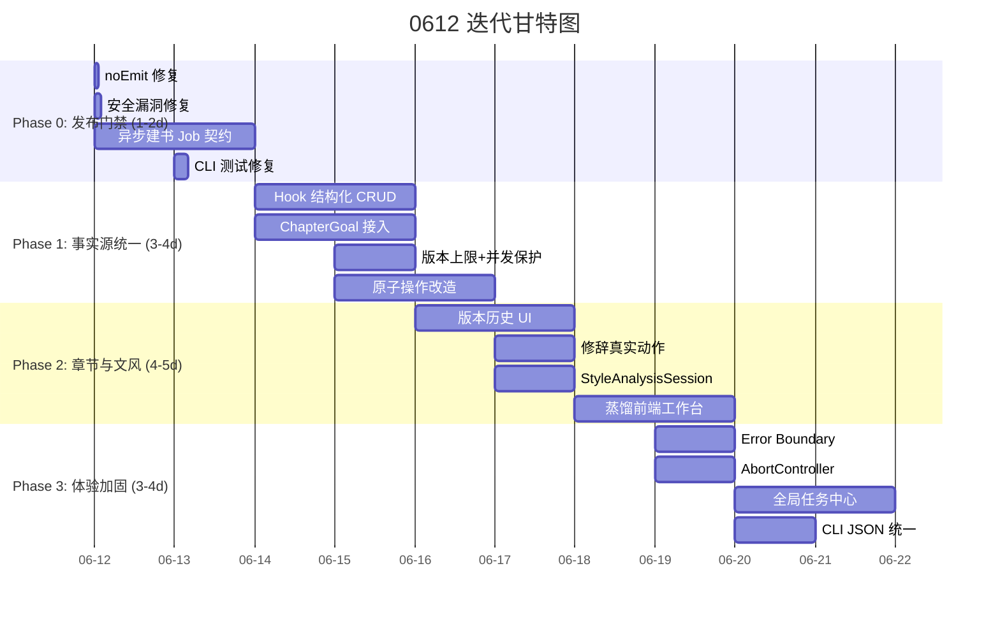

# NoFusion 0612 功能与执行预期报告（完整版）

> 生成日期：2026-06-12  
> 基线版本：`@actalk/inkos` v1.4.1（commit `0bca161` + 工作区全部修改）  
> 前置文档：DS/0612报告、GPT/0612报告、KM/0612报告，0611 系列状态/核验/链路报告，当前代码及实测  
> 综合方式：三份独立报告去重合并，冲突数据以代码和实际执行为准

---

## 一、报告来源与数据裁决

### 1.1 三份报告定位

| 来源 | 侧重 | 独特贡献 |
|------|------|----------|
| **DS** | 0611→0612 增量修复追踪、当前编译/测试/构建基线 | 细粒度 P0/P1/P2 清单、已修复项的逐条验证 |
| **GPT** | 整体质量评估、闭环节点分析、模块完成度估算和 4-Phase 迭代策略 | 全局把握（完成度 74%）、旧结论裁决、包体性能分析 |
| **KM** | 全功能逐项盘点、阻塞项优先级、4-Milestone 路线图 | 功能矩阵（2.1-2.11）、Phase 的资源和风险分析 |

### 1.2 数据冲突裁决

以下三份报告存在数据不一致，以当前代码和实际执行为准：

| 数据项 | DS 报告 | GPT 报告 | KM 报告 | 裁决 |
|--------|:-------:|:--------:|:-------:|:----:|
| Studio 测试数 | 267/267 ✅ | 272 通过、5 失败 | 67 失败 | **GPT 准确**（DS 为早先基线，KM 的 67 含并行污染） |
| CLI 测试数 | 168/171 ❌（3 失败） | 169 通过、2 失败 | 5/171 失败 | **GPT 准确**（DS 引用旧数据，KM 格式不合理） |
| `assertProjectRoot` | ✅ 已修复 | ✅ 已修复 | ⚠️ 仍有漏洞 | **DS/GPT 正确**（当前代码已追加 `sep` 判断） |
| 文风 Step 4 | ✅ 已接入 | ✅ 已接入 | ❌ 未接入 | **DS/GPT 正确**（当前代码已渲染三个面板） |
| `BookCreate.tsx` | — | — | ⚠️ 死代码 | **KM 正确**（该组件未被路由引用） |
| Studio 服务端构建 | ✅ 已修复 | ❌ `noEmit` 继承 | ❌ `noEmit` 继承 | **GPT/KM 正确**（`noEmit` 问题尚未修改） |

### 1.3 核心一致结论

三份报告在以下判断上完全一致：

1. **项目主体功能完整但发布门禁未闭合** — 构建/测试/pack 未全绿
2. **安全边界需要收口** — 路径穿越、格式白名单、CORS
3. **数据事实源不统一** — Studio 写 Markdown vs Core 读 JSON
4. **已有半成品功能未闭环** — 修辞动作、章节版本 UI、蒸馏前端
5. **0612 应以"修复+闭环"为主，而非增加新页面**

---

## 二、当前质量基线（综合实测）

### 2.1 编译与测试

| 核验项 | 结果 | 说明 |
|--------|:----:|------|
| Core TypeScript | ✅ | 零错误 |
| Studio TypeScript | ✅ | 零错误 |
| CLI TypeScript | ✅ | 零错误 |
| Core 测试 | ✅ 1,294/1,294 | 121 测试文件，基线稳定 |
| Studio 测试 | ⚠️ 272/277（5 失败） | 全部集中在异步建书契约 |
| CLI 测试 | ⚠️ 169/171（2 失败） | Doctor 超时 + 发布包缺失 |

### 2.2 构建

| 核验项 | 结果 | 说明 |
|--------|:----:|------|
| Studio `build:client`（Vite） | ✅ | 正常生成 `dist/index.html`（gzip ~764KB） |
| Studio `build:server`（tsc） | ❌ | `tsconfig.server.json` 继承根 `noEmit: true`，零输出 |
| `build:verify` | ❌ | 三个产物断言因 `build:server` 零输出而失败 |
| Studio `npm pack` | ❌ | 被服务端构建产物缺失阻断 |
| Root lint | ❌ | 所有 package 均没有可执行 lint script |

### 2.3 安全

| 核验项 | 结果 | 说明 |
|--------|:----:|------|
| `assertProjectRoot` 前缀绕过 | ✅ | 已用 `sep` 修正 |
| `assertSafeAuthorId` | ✅ | 蒸馏路径遍历已修复 |
| `samples/write` 路径遍历 | ✅ | 继承 security wrapper |
| `authors/fetch` SSRF | ✅ | URL + 目标地址双重校验 |
| 封面 Key 保留语义 | ✅ | `hasApiKey`/`keyDirty`/显式清除 |
| 修辞 ID 冲突 | ✅ | Math.random 后缀 |
| **`export-save` 格式白名单** | ❌ | **无运行时校验，可任意文件写入** |
| **静态资源路径遍历** | ❌ | **`join(staticDir, c.req.path)` 无前缀校验** |
| **CORS 全开放** | ❌ | **`app.use("/*", cors())` 允许任意来源** |
| **服务器默认监听 `0.0.0.0`** | ❌ | **未绑定 `127.0.0.1`** |

### 2.4 0611→0612 已修复项汇总

| 问题 | 当前状态 | 文件 |
|------|:--------:|------|
| Studio 构建 `--force` 参数错误 | ✅ `noEmit` 继承仍存在，但 `--force` 已清除 | `studio/package.json` |
| 封面 API Key 静默清空 | ✅ `hasApiKey`/`keyDirty` 完整对接 | `server.ts`、`ServiceListPage.tsx` |
| 书籍创建 `buildPipelineConfig` 500 | ✅ IIFE + try/catch | `server.ts` |
| Agent 会话队列死锁 | ✅ 15min 超时 + `Promise.race` | `agent-session.ts` |
| Agent 错误无日志 | ✅ `console.error` | `server.ts` |
| 章节保存无版本 backup | ✅ `PUT` 自动备份 + 版本 API | `server.ts` |
| 工作区无设置入口 | ✅ `BookSection` + Nav + 路由跳转 | `BookWorkspace.tsx` 等 |
| 人物声线按钮禁用 | ✅ 已启用 + `onClick` 导航 | `BookCharactersSection.tsx` |
| 伏笔只读 | ✅ POST/PUT/DELETE API + 前端 CRUD | `server.ts`、`BookHooksSection.tsx` |
| 伏笔硬编码中文 | ✅ 25+ i18n 键替换 | `use-i18n.ts`、`BookHooksSection.tsx` |

---

## 三、全功能盘点（综合）

### 3.1 书籍生命周期

| 功能 | 状态 | 说明 |
|------|:----:|------|
| 新建书籍（CLI） | ✅ | `inkos book create` |
| 新建书籍（Studio Chat） | ✅ | ChatPage `book-create` 模式 |
| 新建书籍（Studio 表单） | ⚠️ | `BookCreate.tsx` 写好但未被路由引用 |
| 书籍配置编辑 | ✅ | `PUT /books/:id` |
| 书籍删除 | ✅ | `DELETE /books/:id` |
| 书籍列表 | ✅ | `GET /books` |
| 同人文初始化 | ✅ | `POST /fanfic/init` |
| 正典导入 | ✅ | `POST /books/:id/import/canon` |
| **异步建书 Job 契约** | ❌ | fire-and-forget，无 `202+jobId` 模式 |

### 3.2 资料导入

| 功能 | 状态 | 说明 |
|------|:----:|------|
| Foundation 导入（创建时） | ✅ | `foundationSources` 内联 |
| Foundation 增量导入（Plan→Commit） | ✅ | 双端点 |
| 章节导入（Plan→Commit） | ✅ | 双端点 |
| Source 管理（列表/删除） | ✅ | `BookSourceSection.tsx` |
| **DOCX 导入** | ❌ | document-reader 未注册 |
| **PDF 导入** | ❌ | 完全不支持 |
| **导入自动预处理** | ❌ | 未过 text-preprocessor |
| **Source 预览/编辑** | ❌ | 上传后无预览 |

### 3.3 世界观（Truth 文件）

| 功能 | 状态 |
|------|:----:|
| Story Frame / Volume Map | ✅ |
| 角色卡（核心/主要/次要/功能） | ✅ |
| Book Rules / Pending Hooks | ✅ |
| Current State / Author Intent / Current Focus | ✅ |
| Style Guide / Emotional Arcs / Subplot Board | ✅ |
| **场景卡（Scene Card）** | ❌ 无此实体 |
| **地点卡（Location Card）** | ❌ 无此实体 |
| **关系动态（A vs B 冲突）** | ❌ 无显式载体 |

### 3.4 章节写作管线

| 功能 | 状态 | 说明 |
|------|:----:|------|
| AI 全管线写作 | ✅ | Planner→Composer→Writer→Auditor→Reviser |
| AI 仅草稿 | ✅ | `POST /books/:id/draft` |
| 手动编辑 + 版本 backup | ✅ | `PUT` 自动备份 |
| 重写 / 润色 | ✅ | `rewrite`/`revise` 端点 |
| 审批/拒绝 | ✅ | `approve`/`reject` 按钮 |
| 章节元数据编辑 | ✅ | `PATCH /meta` |
| **版本历史 UI** | ❌ | 后端 API 已就绪，前端无列表/对比/恢复 |
| **并发保存冲突保护** | ❌ | 无 expectedRevision/ETag |
| **真正 AI 改写** | ⚠️ | 只生成 prompt，前端本地随机替换 |
| **写作前提示卡** | ❌ | 无此概念 |
| **ChapterGoal 接入 Planner** | ❌ | 数据模型已存在但未被消费 |

### 3.5 风格系统

| 功能 | 状态 | 说明 |
|------|:----:|------|
| 风格指纹（统计维度） | ✅ | 句长/段长/词汇多样性 |
| 扩展维度（句型/韵律/对话） | ✅ | 已接入 |
| 修辞检测（正则） | ✅ | 排比/比喻/拟人/反复/过渡词/夸张/反问 |
| AI 痕迹检测 | ✅ | hedge words/transition clustering |
| 风格诊断 | ✅ | 动作表达 vs 语义意图重复 |
| 作者画像管理 | ✅ | 多作者 CRUD |
| 风格对比 | ✅ | `POST /style/compare` |
| 段落去重 / 可读性 | ✅ | Step 4 已渲染 |
| **修辞 issue 真实动作** | ❌ | `console.log` 占位 |
| **应用后自动复检** | ❌ | 接受 diff 后不触发重新诊断 |
| **统一 StyleAnalysisSession** | ❌ | 各 Step 不共享同一文本和结果 |
| **蒸馏前端工作台** | ❌ | 后端 5 端点就绪，前端全缺 |
| **原文高亮定位** | ⚠️ | 点击跳转有但不够稳定 |

### 3.6 实体与角色管理

| 功能 | 状态 |
|------|:----:|
| 角色 CRUD（列表/创建/编辑/删除） | ✅ |
| 角色标签 / 实体重命名 | ✅ |
| **自动实体提取（NER）** | ❌ |
| **实体图谱** | ❌ |
| **全文检索** | ❌ |

### 3.7 服务商与模型

| 功能 | 状态 |
|------|:----:|
| 多提供商支持（8+ 服务商） | ✅ |
| 服务商配置 CRUD | ✅ |
| 模型列表与选择 | ✅ |
| 连接探测 | ✅ |
| 密钥管理（分服务商/掩码） | ✅ |
| **批量连通性测试** | ❌ |
| **模型能力标签** | ❌ |
| **Secret 统一删除语义** | ⚠️ 前端缺清除入口 |

### 3.8 导出、CLI 与基础设施

| 功能 | 状态 |
|------|:----:|
| 导出 txt/md/html/epub | ✅ |
| 预导出检查 | ✅ |
| CLI 30+ 命令 | ✅ |
| CLI `--json` 统一 | ⚠️ 仅 3 命令使用 `formatJsonOutput` |
| Daemon / TUI | ✅ |
| **DOCX/PDF 导出** | ❌ |
| **Root lint** | ❌ 无可执行门禁 |
| **前端 Error Boundary** | ❌ |
| **`useApi` AbortController** | ❌ |
| **全局任务中心** | ❌ |

---

## 四、0612 执行计划

### Phase 0：安全与发布门禁（1-2 天）

**目标**：得到可构建、可测试、可打包的安全基线。

| # | 任务 | 工作量 | 优先级 |
|---|------|:------:|:------:|
| **0-1** | **修复 `tsconfig.server.json` noEmit** — 添加 `"noEmit": false` | 5min | P0 |
| **0-2** | **`export-save` 格式白名单** — 仅允许 `txt/md/html/epub`，非法返回 400 | 30min | P0 |
| **0-3** | **静态资源路径校验** — `resolve` + `relative` 防编码穿越 | 30min | P0 |
| **0-4** | **CORS 白名单 + 默认绑定 `127.0.0.1`** | 1h | P0 |
| **0-5** | **异步建书 Job 契约** — 入队前同步验证 → 返回 `202+jobId` → 修复 5 项 Studio 测试 | 1.5d | P0 |
| 0-6 | Doctor 总超时 5 秒 + AbortSignal | 1h | P1 |
| 0-7 | 设置 root lint 基线 | 1h | P1 |
| 0-8 | CLI 测试修复（export JSON 兼容 + doctor 超时） | 2h | P1 |

**Phase 0 出口**：
```
pnpm typecheck PASS
pnpm test    PASS
pnpm build   PASS
npm pack     PASS
```

### Phase 1：事实源统一与数据安全（3-4 天）

**目标**：Studio 修改必须成为 Core 执行的真实输入，文件操作原子化。

| # | 任务 | 工作量 |
|---|------|:------:|
| **1-1** | **Hook 结构化 CRUD** — Core 提供 CRUD service，写 `hooks.json` + 同步 `pending_hooks.md` | 1.5d |
| **1-2** | **ChapterGoal 接入 Planner/Reviewer** — 必达事件、禁用动作、目标字数进入规则栈 | 1.5d |
| **1-3** | **`PUT chapter` 版本上限 + 内容哈希 + 并发保护** — 最多 50 版；相同内容不备份；ETag 防冲突 | 1d |
| **1-4** | **MemoryDB 事务包裹** — `replaceFacts`/`replaceSummaries`/`replaceHooks` 原子化 | 1d |
| **1-5** | **`writeFoundationFiles` staging + 原子重命名** — 部分失败自动回滚 | 2d |
| 1-6 | 正则回溯防护（epistrophe、YAML frontmatter） | 2d |

### Phase 2：章节编辑与文风闭环（4-5 天）

**目标**：正文修改可恢复、可比较、可撤销，文风调整形成检测→修改→复检闭环。

| # | 任务 | 工作量 |
|---|------|:------:|
| **2-1** | **版本历史 UI** — 列表、预览、diff、恢复 | 2d |
| **2-2** | **修辞 issue 真实动作** — `ai-rewrite`/`mark-fixed` 真实处理 | 1d |
| **2-3** | **应用后自动复检** — 接受 diff 后触发重新诊断 | 1d |
| **2-4** | **统一 StyleAnalysisSession** — 各 Step 共用文本和结果 | 1d |
| **2-5** | **蒸馏前端工作台** — 草稿/编辑/发布/版本/应用 UI | 2d |
| 2-6 | 原文高亮定位稳定化（raf + clientHeight） | 1d |
| 2-7 | 修改后复检（诊断指标前后对比） | 0.5d |

### Phase 3：基础体验加固（3-4 天，可并行）

**目标**：减少技术债，提升前端稳定性和可用性。

| # | 任务 | 工作量 |
|---|------|:------:|
| **3-1** | **前端 Error Boundary** — 单点异常不白屏整个 SPA | 1d |
| **3-2** | **`fetchJson` + `useApi` 接入 AbortController** | 1d |
| **3-3** | **全局任务中心 UI** — Dashboard 展示后台任务状态 | 1.5d |
| 3-4 | 替换 `window.alert/prompt/confirm` 为 ConfirmDialog/Toast | 1d |
| 3-5 | CLI JSON 全命令统一（`formatJsonOutput`） | 1d |
| 3-6 | 前端懒加载 + chunk 拆分（首屏 < 500KB） | 1d |
| 3-7 | 工作区硬编码中文提取（Top 20 文件） | 1d |
| 3-8 | 删除孤儿组件（`RhetoricHighlightEditor`、`useAutoSave` 等） | 0.5d |

### Phase 4：E2E 与长期稳定（3-5 天，可并行）

**目标**：形成可持续连续开发基线。

| # | 任务 | 工作量 |
|---|------|:------:|
| 4-1 | 浏览器 E2E（8 条关键用户链路） | 1.5d |
| 4-2 | 测试数据隔离（不污染真实 books） | 0.5d |
| 4-3 | Shiki/Streamdown 按需加载（减少语言/主题 chunk） | 1d |
| 4-4 | 服务商模型能力标签 + 批量连通性测试 | 1d |
| 4-5 | Secret 不进入 Git/日志/导出/诊断包 | 0.5d |

---

## 五、已完成 vs 待办速查表

### ✅ 0611 到 0612 之间已完成的改进

| 改进 | 来源报告 | Type |
|------|---------|:----:|
| Agent 会话队列 15min 超时 | DS | 防死锁 |
| 章节 `PUT` 自动版本 backup + API | DS | 数据安全 |
| 伏笔 CRUD 后端 + 前端表单 | DS | 功能闭环 |
| 工作区设置导航入口 | DS | 功能闭环 |
| 人物声线按钮启用 | DS | 功能闭环 |
| 封面 Key 保留语义 | DS/GPT/KM | 安全 |
| `assertProjectRoot` `sep` 修正 | DS/GPT | 安全 |
| 文风 Step 4 三个面板渲染 | GPT | 功能闭环 |
| 章节 Hash 路由修复 | GPT | 功能闭环 |
| 书籍创建 500 防护 | DS | 稳定性 |
| Agent 错误 `console.error` 日志 | DS | 可诊断性 |
| 伏笔表单硬编码中文 i18n 化 | DS | 代码质量 |

### ❌ 0612 仍需处理的核心断点

| 断点 | 影响域 | Phase | 紧急度 |
|------|--------|:-----:|:------:|
| Studio 服务端构建失败（noEmit） | 发布 | 0 | P0 |
| 异步建书无 Job 契约 | 测试/稳定性 | 0 | P0 |
| 安全漏洞（export/静态/CORS/绑定） | 安全 | 0 | P0 |
| 伏笔写 Markdown 而非 JSON | 事实源 | 1 | P1 |
| 修辞 issue 动作为 console.log | 功能 | 2 | P1 |
| 章节版本无前端 UI | 功能 | 2 | P1 |
| 蒸馏无前端工作台 | 功能 | 2 | P1 |
| 前端无 Error Boundary | 体验 | 3 | P1 |
| CLI JSON 契约未统一 | CLI | 3 | P1 |
| 全局任务中心缺失 | 体验 | 3 | P2 |

---

## 六、迭代时序建议



---

## 七、资源和依赖

### 7.1 关键依赖关系

```
Phase 0（发布门禁）
  ├── 0-1 noEmit → 0-8 CLI 测试
  └── 0-5 Job 契约 → 其余建书相关修复

Phase 1（事实源统一）
  ├── 1-1 Hook 结构化 → 1-2 Goal 接入
  ├── 1-3 版本保护 → Phase 2 版本历史 UI
  └── 1-4/1-5 原子操作 → 全系统可靠性

Phase 2（章节与文风）
  ├── 2-2 修辞动作 → 2-3 自动复检
  └── 2-4 蒸馏工作台 → 独立，可并行

Phase 3（体验加固）→ 大部分可并行
```

### 7.2 可并行执行的工作

- Phase 0: 0-1/0-2/0-3/0-4 可并行
- Phase 0: 0-6/0-7 可并行
- Phase 1: 1-3/1-4 可并行
- Phase 2: 2-4 蒸馏与 2-1/2-2 可并行
- Phase 3: 全部任务可并行

### 7.3 不建议同时执行

- 在 `server.ts` 大规模拆分时修复 P0 安全漏洞（合并冲突高）
- 在章节存储契约未稳定前开发复杂自动保存
- 在真实 AI 改写未完成前增加"自动应用"按钮

---

## 八、完成度预期

| 阶段 | 综合完成度 | 发布准备度 | 主要变化 |
|:----:|:--------:|:--------:|----------|
| **当前** | **74%** | **55-60%** | 功能多但门禁和闭环未完成 |
| Phase 0 后 | 77% | 75% | 安全、测试、构建、打包恢复 |
| Phase 1 后 | 82% | 80% | 工作台修改真实进入 Core |
| Phase 2 后 | 86% | 84% | 章节修改可恢复、文风调整可信 |
| Phase 3 后 | 89% | 87% | 体验加固、任务中心、CLI 统一 |
| Phase 4 后 | 91-92% | 90% | E2E、性能、长期稳定基线 |

---

## 九、暂缓事项

以下功能在 0612 迭代中不应投入精力：

- 云端多用户和 OAuth
- 实时协同编辑
- 移动端完整重做
- 伏笔关系图和人物声线大系统
- 新增更多独立 Agent
- 全面重写 Hash Router 或 Studio UI
- 全局数据库迁移
- 插件市场

---

## 十、一句话结论

> **项目具备完整产品轮廓（~74% 功能完成度），但发布门禁（noEmit 构建、CLI 测试、npm pack）和安全边界（export 格式、静态路径、CORS、本机绑定）是 0612 第一优先级。**  
> 在此之上依次统一 Core/Studio 事实源（Hook/Goal/原子操作）、闭环章节编辑与文风调整（版本 UI/修辞动作/蒸馏工作台）、加固前端体验（Error Boundary/AbortController/任务中心）。  
> 三份报告在此判断上完全一致，预计全部完成需 **14-18 人日**。
