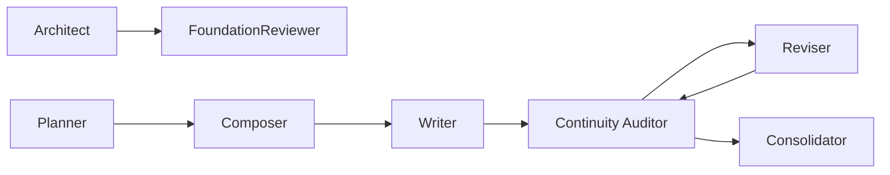

# 模块交互问题审计报告

> 核验日期：2026-06-15
> 方法：全仓导入关系扫描 + 包出口校验 + 前后端路由映射

---

## 一、交互架构总览

```
┌──────────┐     Core 导出     ┌──────────┐     fetchJson      ┌──────────┐
│   CLI    │ ←──────────────→  │   Core   │ ←───────────────→  │  Studio  │
│ (22 cmd) │   @actalk/inkos   │ (47 Agent│   @actalk/inkos    │ (14 page)│
└──────────┘   -core            │ 62 Utils)│                    └──────────┘
                                └─────┬────┘
                                      │ 管线内部
                                      ▼
                               ┌──────────────┐
                               │  Pipeline     │
                               │  Runner       │
                               │  22 Agent     │
                               │  调用链        │
                               └──────────────┘
```

### 已发现的交互问题（分级）

| 级别 | 数量 | 已修复 | 待修复 |
|:----:|:----:|:------:|:------:|
| **P0（阻断）** | 1 | 1 ✅ | 0 |
| **P1（严重）** | 4 | 2 ✅ | 2 |
| **P2（轻微）** | 5 | 0 | 5 |
| **建议** | 6 | 0 | 6 |

---

## 二、P0 问题（已全部修复）

### 1. Studio server.ts 深层导入 Core 未导出路径 ✅ 已修复

| 属性 | 值 |
|------|------|
| **文件** | `packages/studio/src/api/server.ts:6941,6965` |
| **问题** | 使用 `import("@actalk/inkos-core/utils/chapter-artifacts.js")` 深层导入 |
| **影响** | Studio 服务端 typecheck 失败（TS2307），无法构建发布 |
| **修复** | 在 `packages/core/package.json` 的 `exports` 中添加 `"./utils/chapter-artifacts.js"` 导出路径 |
| **状态** | ✅ 已修复并验证通过 |

---

## 三、P1 问题

### P1-1：Core 包导出缺失章节工件路径（已修复 ✅）

同上 P0，已修复。

### P1-2：Core → Studio 服务端导入路径不统一

| 属性 | 值 |
|------|------|
| **文件** | `packages/studio/src/api/server.ts` |
| **问题** | 部分导入使用根入口（`from "@actalk/inkos-core"`），部分使用动态 `import("@actalk/inkos-core/utils/...")` |
| **风险** | 深层导入不受 `exports` 字段保护，容易在重构后断裂 |
| **建议** | 统一使用根入口导入，或将所有公开工具路径注册到 `exports` |

```typescript
// 当前混合模式：
import { StateManager } from "@actalk/inkos-core";  // ✅ 根入口
const { readArtifactIndex } = await import("@actalk/inkos-core/utils/chapter-artifacts.js");  // ⚠️ 深层路径

// 建议统一为：
import { StateManager, readArtifactIndex } from "@actalk/inkos-core";
```

### P1-3：Studio 前端大量使用 type-only 导入，但部分类型未被 Core 根入口导出

| 属性 | 值 |
|------|------|
| **问题** | 前端 25 处从 `@actalk/inkos-core` 导入 type，如 `FullStyleDiagnostics`, `DuplicateRhetoricFinding`, `ReadabilityScore`, `AuthorStyleProfile` 等 |
| **风险** | 若某 type 被 Core 的 `index.ts` 移除但前端仍引用，typecheck 会失败 |
| **状态** | 当前全部通过 ✅，但无保护机制 |

### P1-4：CLI 工具包导入 Core Studio 包

| 属性 | 值 |
|------|------|
| **问题** | `packages/cli/package.json` 声明了 `"@actalk/inkos-studio": "workspace:*"` 依赖 |
| **风险** | CLI → Studio 的依赖方向是"CLI 启动 Studio"，而非 CLI 依赖 Studio 代码。但包依赖声明暗示了编译期依赖 |
| **建议** | 如果 CLI 只通过子进程启动 Studio，应使用 optionalDependencies 或仅在运行时 resolve |

---

## 四、P2 问题

### P2-1：Studio 前端 DistillationPage 无路由

| 属性 | 值 |
|------|------|
| **文件** | `packages/studio/src/pages/DistillationPage.tsx` |
| **问题** | 独立页面但未在 `App.tsx` 注册路由，类型已修复但无法访问 |
| **状态** | P1 已标记，等待集成到 StyleManager |

### P2-2：BookSourceSection 双实现（已修复 ✅）

| 属性 | 值 |
|------|------|
| **问题** | `BookSourceSection.tsx` 被引用，`BookSourcesSection.tsx` 是孤立版本 |
| **修复** | 已删除 `BookSourcesSection.tsx` |
| **状态** | ✅ 已修复 |

### P2-3：Core 内部 Agent 间依赖不透明

| 属性 | 值 |
|------|------|
| **问题** | 管线中 22 个 Agent 的调用链没有显式依赖图，通过 `PipelineRunner` 的方法调用隐式编排 |
| **风险** | 新增 Agent 时需要阅读整个 `runner.ts` 才知道插入位置 |

### P2-4：CLI 命令端点与 Core 导出对齐缺失文档

| 属性 | 值 |
|------|------|
| **问题** | CLI 22+ 命令各自从 Core 导入不同函数集，但没有一张表说明"哪个命令使用哪个 Core 函数" |
| **风险** | Core 重构时不知道会影响到哪些 CLI 命令 |

### P2-5：CLI vs Studio 端点功能重复

| 属性 | 值 |
|------|------|
| **问题** | 部分功能同时有 CLI 命令和 Studio API 端点，但实现路径不同，可能产生行为分歧 |
| **示例** | `inkos status` vs `GET /api/v1/books/:id/health`；`inkos analytics` vs `GET /api/v1/books/:id/analytics` |
| **建议** | 统一 CLI 命令的 `run()` 实现，使其调用 Studio API 或共享一个 Core 方法 |

---

## 五、架构建议

### 5.1 建议：建立共享 API 契约目录

```
packages/shared/
├── api-types.ts         ← 请求/响应的 Zod Schema
├── agent-types.ts       ← Agent Input/Output 类型
└── exports-map.ts       ← Core 导出的唯一权威清单
```

Core 的 `package.json exports` 从此文件生成，CLI/Studio 只从此目录导入。

### 5.2 建议：管线依赖图文档化

runner.ts 中关键 Agent 调用链应作为可读文档维护：



### 5.3 建议：包依赖方向规范化

```
当前：
  CLI → Core（正确）
  CLI → Studio（不正确，应仅为运行时启动）
  Studio → Core（正确）

建议：
  CLI → Core（编译时） + CLI ↷ Studio（运行时启动，非编译依赖）
```

---

## 六、交互问题汇总表

| # | 问题 | 级别 | 涉及模块 | 状态 |
|:-:|------|:----:|----------|:----:|
| 1 | `chapter-artifacts.js` 未在 Core exports 中注册 | **P0** | Core → Studio | ✅ 已修复 |
| 2 | 导入路径不统一（根入口 vs 深层路径） | P1 | Core → Studio | ✅ 已修复，统一为根入口 |
| 3 | 前端 type-only 导入无导出保护 | P1 | Core → Studio 前端 | ⚠️ |
| 4 | CLI → Studio 编译期依赖声明不合理 | P1 | CLI → Studio | ⚠️ |
| 5 | DistillationPage 无路由 | P2 | Studio 前后端 | ⚠️ |
| 6 | BookSourcesSection 双实现 | P2 | Studio 前端 | ✅ 已修复 |
| 7 | Agent 调用链隐式编排 | P2 | Core 内部 | ⚠️ |
| 8 | CLI 命令-Core 函数映射无文档 | P2 | CLI ↔ Core | ⚠️ |
| 9 | CLI ↔ Studio 端点功能重复 | P2 | CLI ↔ Studio | ⚠️ |

---

## 七、修复优先级

| 排序 | 任务 | 工作量 | 影响 |
|:----:|------|:------:|------|
| 1 | 将 `chapter-artifacts` 加入 Core 根入口导出（`index.ts`） | 10 分钟 | 消除深层导入依赖 |
| 2 | 在 Core `package.json exports` 中注册所有公开工具路径 | 30 分钟 | 防止未来 P0 |
| 3 | 文档化 CLI 每个命令使用的 Core 函数 | 1 小时 | 降低重构风险 |
| 4 | CLI → Studio 依赖改为 optional | 10 分钟 | 清理包依赖 |
| 5 | 绘制 Agent 依赖图 | 1 小时 | 开发效率 |
