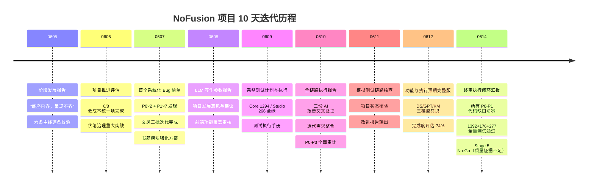
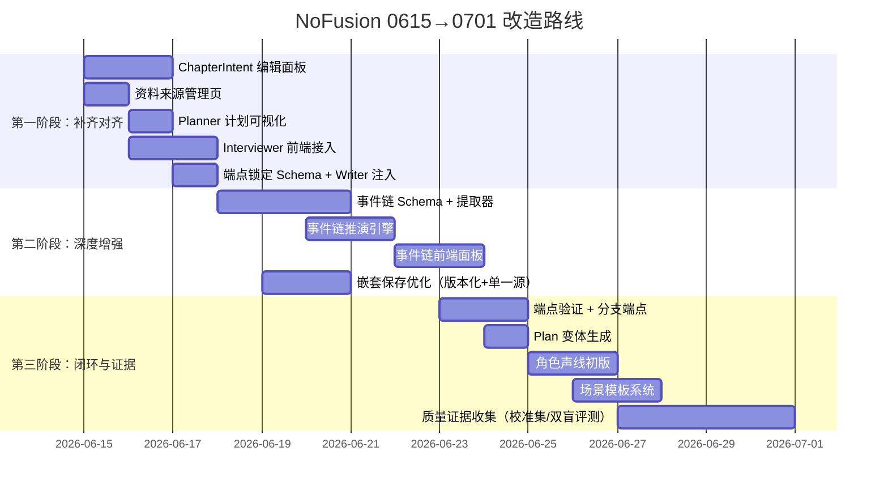
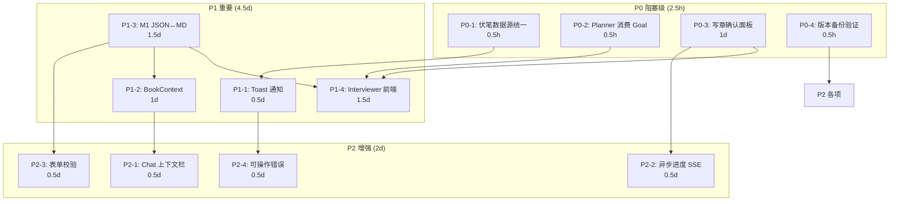

# NoFusion 0615 项目中继思考报告

> 报告日期：2026-06-15  
> 代码基线：`@actalk/inkos` v1.4.1（commit `0bca161` + 工作区 0614 终审修复）  
> 前置依据：`reports/` 下 50+ 份 MD 文档（0605→0614 全迭代链路）、`packages/core` / `packages/cli` / `packages/studio` 完整源码  
> 报告定位：衔接 0614 终审闭环，面向「场景可复现、人物可保存、故事端点清晰、叙事意图明确」的创作工具改造目标，输出中继思考与可执行路线

---

## 一、项目代码构成特征分析

### 1.1 三层架构与职责边界

```
┌─────────────────────────────────────────────────────────┐
│  @actalk/inkos-studio (React + Hono + Vite)             │
│  20+ 页面 · ~100 REST 端点 · SSE 事件流                  │
│  前端端口 4577 → API 代理 → 后端端口 4579                │
├─────────────────────────────────────────────────────────┤
│  @actalk/inkos (CLI + TUI)                              │
│  Commander.js · Ink TUI · 23 子命令                      │
│  agent / book / compose / audit / revise / style ...    │
├─────────────────────────────────────────────────────────┤
│  @actalk/inkos-core (核心引擎)                            │
│  40+ Agent · Pipeline · State · MemoryDB · LLM          │
│  Input Governance v2 · Runtime Trace · Style Library     │
└─────────────────────────────────────────────────────────┘
```

### 1.2 代码量级与分布

| 维度 | 数据 |
|------|------|
| Core 导出模块 | **131 个**（`index.ts`） |
| Core 源文件 | **200+** 个 TypeScript 文件 |
| Core 测试 | **129 文件 / 1392 测试**（全部通过） |
| CLI 测试 | **35 文件 / 176 测试**（全部通过） |
| Studio 测试 | **25 文件 / 277 测试**（全部通过） |
| Studio 页面 | **20+** 独立页面 |
| Studio 最大单文件 | `StyleManager.tsx` **1,892 行** |
| Studio API 端点 | **~100 个** REST endpoints |
| 报告文档 | **50+ 份**，累计约 **1.15 MB** |
| i18n | **~920 行**（zh/en 双语） |

### 1.3 核心代码特征

**✅ 强项：**

1. **类型安全体系完整**：全项目 strict TypeScript + Zod 运行时校验，模型定义从 Core 单向流出到 CLI/Studio，`ChapterIntentSchema`、`ContextPackageSchema`、`RuleStackSchema` 等关键契约均为 Zod-first。

2. **Agent 管线设计清晰**：40+ Agent 各司其职，主链为 Planner → Composer → Writer → Observer → Settler → LengthNormalizer → ChapterAnalyzer → ContinuityAuditor → Reviser → StateValidator，附带 Interviewer、BetaReader、Radar、StyleAnalyzer、AI-Tells 等横切 Agent。

3. **Input Governance v2 成熟**：`ChapterMemo`（7 必需段落）+ `ChapterIntent`（goal/mustKeep/mustAvoid/styleEmphasis）+ `ContextPackage`（selectedContext 溯源）+ `RuleStack`（L1→L4 层级，hard/soft/diagnostic 三段）+ `ChapterTrace` 形成完整的输入治理闭环。

4. **状态管理多层**：`StateManager`（文件锁+控制文档）→ `MemoryDB`（SQLite 时序事实库）→ `RuntimeStateStore`（章节快照+delta）→ `ChapterIntent`（作者意图持久化），层级分明。

5. **交互内核统一**：CLI / TUI / Studio / OpenClaw 四入口共享 `interaction/runtime.ts` 执行内核，Agent Session 支持工具调用（write_draft、plan_chapter、compose_chapter、audit_chapter、revise_chapter 等 10+ 工具）。

6. **可观测产物丰富**：每章生成 `chapter-NNNN.context.json`、`chapter-NNNN.intent.md`、`chapter-NNNN.plan.md`、`chapter-NNNN.rule-stack.yaml`、`chapter-NNNN.trace.json` 五种运行时产物。

**⚠️ 结构性债务：**

1. **数据事实源不统一**：Studio 写 Markdown（`style_guide.md`、`author_intent.md`），Core 读 JSON（`chapter_intents.json`、`chapter_goals.json`），存在格式桥接层。
2. **前端契约漂移**：`StyleManager.tsx` 近 2000 行，部分 Core Zod schema 在 Studio 侧被重新手写接口定义。
3. **单文件巨型组件**：`StyleManager.tsx`（1,892 行）、`BookDetail.tsx`（1,279 行）、`BookChaptersSection.tsx`（1,183 行）均超过 1000 行，欠缺子组件拆分。
4. **静默异常吞噬**：约 20 处空 `catch {}` 仍在非关键路径。

---

## 二、项目功能与迭代经历分析

### 2.1 迭代时间线（0605 → 0614）



### 2.2 功能完成度矩阵（截至 0614）

| 功能域 | Core 完成度 | Studio 完成度 | 整体判定 |
|--------|:----------:|:------------:|:--------:|
| 写作 Pipeline（Write/Audit/Revise） | 95% | 90% | ✅ 完整 |
| 输入治理（Planner/Composer/ChapterIntent） | 90% | 60% | ⚠️ 前端缺规划面板 |
| 审计（Continuity/StateValidator） | 90% | 85% | ✅ 基本完整 |
| 文风分析（Fingerprint/Diagnostics/Rewrite） | 90% | 80% | ✅ 三批迭代完成 |
| 伏笔治理（Hooks/MemoryDB） | 85% | 80% | ✅ 六状态+风险评分 |
| 资料来源（FoundationSource） | 80% | 40% | ⚠️ 前端严重滞后 |
| 书籍健康总览（Analytics） | 60% | 30% | ❌ 未接入审计趋势 |
| 人物声线（Voice Profile） | 10% | 0% | ❌ 仅字段占位 |
| 章节版本对比（Diff View） | 0% | 0% | ❌ 未实现 |
| 场景卡（Scene Card） | 0% | 0% | ❌ 未实现 |
| 作家蒸馏（Distillation UI） | 80% | 10% | ❌ 前端未接入 |

### 2.3 迭代规律总结

1. **0605→0606 是最快推进期**：伏笔治理从"部分实现"到"完整实现"仅用 1 天，证明「后端已有 → 前端呈现」的低成本统一路径极其高效。
2. **0607→0610 是质量筑基期**：从 Bug 发现到全量测试覆盖，奠定了当前 1392 测试全绿的基础。
3. **0611→0614 是收敛稳定期**：所有 P0-P1 代码缺口清零，项目进入「等待质量证据」的发布前夜。
4. **核心瓶颈已从代码转向证据**：Stage 5 No-Go 的阻塞项不再是代码可靠性，而是缺乏校准集、人工双盲评测、Beta Reader 校准报告。

---

## 三、六大核心议题分析与改造方案

### 议题一：当前核心功能与前端对齐状态

#### 3.1 已对齐（✅）

| Core 能力 | Studio 前端入口 | 对齐方式 |
|-----------|---------------|---------|
| 写作 Pipeline | `ChatPage` + `BookChaptersSection` | Chat 指令 + 章节操作按钮 |
| 审计 | `BookAuditSection` + `AuditView` | 章节级 + 书籍级审计 |
| 文风分析（全 4 Steps） | `StyleManager`（4 tabs） | 指纹提取→诊断→对比→改写 |
| 伏笔追踪 | `BookHooksSection` | 六状态分组 + 风险评分 + 依赖链 |
| Runtime Trace | `BookRuntimeSection` | 文件树 + 内容预览 |
| 审计历史 | `BookAuditSection` | 按章节分数柱状图 |
| 章节元数据筛选 | `BookChaptersSection` | tags/pov/location/chapterType 四维筛选 |
| 服务商配置 | `ServiceListPage` + `ServiceDetailPage` | CRUD + 连通性测试 |
| 体裁管理 | `GenreManager` | 列表 + 编辑 |
| 导入管理 | `ImportManager` | 章节导入 + 预览 |

#### 3.2 部分对齐（⚠️）

| Core 能力 | 前端现状 | 缺口 |
|-----------|---------|------|
| ChapterIntent 系统 | `chapter_intents.json` 读写完整，但前端无独立编辑面板 | 作者无法在写前逐章设定 coreNarrative / keyMoment / scenes[] |
| ChapterGoal 系统 | `chapter_goals.json` 读写完整，前端通过 ChatPage 间接操作 | 无表格化的章节目录卡编辑器 |
| Planner 规划结果 | `chapter-NNNN.plan.md` 已持久化 | 前端 `BookRuntimeSection` 列出文件但未做结构化渲染 |
| Composer 上下文装配 | `chapter-NNNN.context.json` 含 selectedContext[] | 前端未展示"本章带入了哪些上下文来源" |
| 资料来源 | `story/sources/index.json` 完整 | 前端无独立的资料来源管理页 |
| Foundation Review | `FoundationReviewerAgent` 已实现 | 前端 `ImportManager` 无 foundation review 入口 |

#### 3.3 未对齐（❌）

| Core 能力 | 说明 |
|-----------|------|
| Interviewer Agent | `interviewer.ts` 已实现 rule-based + LLM-assisted 两种模式，前端无任何调用入口 |
| Chapter Trace | `chapter-NNNN.trace.json` 完整记录 composerInputs 和 plan 引用，前端无可视化 |
| Rule Stack 可视化 | `chapter-NNNN.rule-stack.yaml` 含 L1→L4 层级和 activeOverrides，前端无展示 |
| Beta Reader | `BetaReader` Agent 已实现三种模式，前端无独立操作入口 |
| State Delta / Changelog | Core 有 `RuntimeStateDelta` 机制，但无 `state_changelog.jsonl` |
| 人物声线 | `voiceProfileId` 字段存在于 `RoleCard`，但无声线分析/存储/比对 |

#### 3.4 对齐路线（0615→0620）

| 优先级 | 对齐项 | 改造方式 | 预估工作量 |
|:------:|--------|---------|:---------:|
| P0 | ChapterIntent 编辑面板 | 在 `BookWorkspace` 新增 `intents` section，复用 `AuthorChapterIntentSchema` | 1.5 天 |
| P0 | 资料来源管理页 | 新增 `SourcesSection`，读 `story/sources/index.json` + CRUD | 1 天 |
| P0 | Planner 计划可视化 | `BookRuntimeSection` 增加 `.plan.md` 的结构化渲染（YAML frontmatter → 卡片） | 0.5 天 |
| P1 | Composer 上下文溯源 | `BookRuntimeSection` 增加 `.context.json` 的 selectedContext 表格 | 0.5 天 |
| P1 | Rule Stack 可视化 | `BookRuntimeSection` 增加 `.rule-stack.yaml` 的层级图 | 0.5 天 |
| P1 | Interviewer 前端接入 | ChatPage 增加「写作前访谈」按钮，调用 `/api/v1/books/:id/interview` | 1 天 |
| P2 | Chapter Trace 可视化 | 将 trace.json 渲染为 Mermaid 流程图 | 1 天 |

---

### 议题二：项目核心与 UI 的适配优化

#### 4.1 当前适配问题诊断

| 问题 | 具体表现 | 根因 |
|------|---------|------|
| **契约二重定义** | `StyleManager.tsx` 中手写 `StyleFingerprint` 接口，未复用 Core 的 `StyleProfileSchema` | Zod schema 未从 Core 发布为独立类型包 |
| **数据格式桥接** | Core 写 JSON（`chapter_intents.json`），Studio API 读后转 Markdown 展示；作者编辑 Markdown 后 API 再转 JSON 写回 | 缺少统一的 JSON→Markdown 双向渲染器 |
| **巨型组件** | `StyleManager.tsx` 1,892 行、`BookDetail.tsx` 1,279 行、`BookChaptersSection.tsx` 1,183 行 | 功能迭代时不断追加代码，未做组件拆分 |
| **API 端点粒度不一** | 有的端点返回完整对象（含 Zod 校验），有的仅返回字符串 | API 层未统一使用 Core 导出的 Zod schema 做响应校验 |
| **SSE 事件不对称** | 前端声明 46 种事件，后端发出 52 种；6 种事件前端未声明 | 事件契约未做双向校验 |

#### 4.2 适配优化方案

```
改造前（当前）:
  Core Zod Schema ────→ Studio 手写 interface ────→ API 自由格式响应
         ↑                                                    │
         └──────────── 三方各自维护，语义漂移 ←────────────────┘

改造后（目标）:
  Core Zod Schema ──→ @actalk/inkos-schemas (共享类型包)
         │                    │
         ├──→ Core 内部校验    ├──→ Studio import 校验
         │                    │
         └──→ API 响应校验 ←──┘
```

**具体措施：**

| 措施 | 内容 | 工作量 |
|------|------|--------|
| **Schema 提取** | 从 `packages/core/src/models/` 提取所有 Zod schema 到独立文件，确保 Studio 可 import | 0.5 天 |
| **双向渲染器** | 实现 `renderChapterIntentToMarkdown()` 和 `parseChapterIntentFromMarkdown()`，统一 JSON↔MD 转换 | 1 天 |
| **组件拆分** | `StyleManager` 按 4 tabs 拆为 4 个子组件；`BookDetail` 的 14 个 Section 各自独立文件 | 2 天 |
| **API 响应规范** | 所有 API 端点统一返回 `{ status, data }` 包装，data 经 Zod 校验 | 1 天 |
| **SSE 事件校验** | 后端发出事件前校验 event type 是否在前端声明列表中；前端声明缺失的 6 种事件 | 0.5 天 |

---

### 议题三：文本创作功能的嵌套规范保存如何优化

#### 5.1 当前嵌套保存架构

```
写作 Pipeline 产物嵌套关系：

chapter-NNNN.plan.md          ← Planner 输出（YAML frontmatter + 7段 memo body）
  ├── intent.goal              ← 本章目标
  ├── intent.mustKeep[]        ← 必须保留项
  ├── intent.mustAvoid[]       ← 必须避免项
  ├── intent.styleEmphasis[]   ← 风格强调项
  └── memo.body (7 sections)   ← 场景设计、冲突、节奏、伏笔、角色状态...

chapter-NNNN.intent.md         ← 人类可读版本（.plan.md 的 Markdown 渲染）
chapter-NNNN.context.json      ← Composer 输出（selectedContext[] 溯源）
chapter-NNNN.rule-stack.yaml   ← 规则栈（L1-L4 层级 + activeOverrides）
chapter-NNNN.trace.json        ← 全链路溯源

chapter_intents.json           ← 作者意图索引（全局）
chapter_goals.json             ← 章节目录卡索引（全局）
```

#### 5.2 当前问题

1. **双重写入**：`chapter-NNNN.plan.md` 和 `chapter-NNNN.intent.md` 内容重叠，`.plan.md` 是权威源但不可读，`.intent.md` 可读但非权威。
2. **追溯链断裂**：`.trace.json` 记录了 `composerInputs`，但未记录 Writer 实际使用了哪些上下文（Writer prompt 中的上下文选择和实际引用可能不同）。
3. **修订覆盖**：修订章节时，原 `.plan.md` 被覆盖，缺乏修订历史。
4. **全局索引不一致**：`chapter_intents.json` 和 `chapter_goals.json` 存在字段重叠（`requiredBeats`、`forbiddenMoves`、`hookIdsToAdvance`），可能漂移。

#### 5.3 优化方案：单一权威源 + 版本化

```
改造后产物结构：

story/runtime/
  chapter-0001/
    plan.v1.yaml              ← Planner 输出（YAML only，不再用 .md 伪装）
    plan.v1.md                ← 人类可读渲染（由 plan.v1.yaml 单向生成）
    context.v1.json           ← Composer 输出（selectedContext[]）
    rule-stack.v1.yaml        ← 规则栈
    trace.v1.json             ← 全链路溯源（增强：记录 Writer 实际引用）
    INDEX.json                ← 此章所有产物的版本清单

  chapter-0001/
    plan.v2.yaml              ← 修订后的新版本
    plan.v2.md
    ...

全局索引（去重叠）：
  chapter_intents.json        ← 仅存 AuthorChapterIntent（作者意图）
  chapter_goals.json          ← 仅存 ChapterGoalCard（写作卡片，偏操作）
  ── 两者不再有字段重叠，ChapterGoalCard 引用 ChapterIntent 的 chapterNumber ──
```

**关键改造点：**

| 改造 | 说明 | 工作量 |
|------|------|--------|
| **去 MD 伪装** | `chapter-NNNN.plan.md` 改为 `plan.v{N}.yaml`，不再用 Markdown 承载结构化数据 | 1 天 |
| **单向渲染** | 实现 `renderPlanYamlToMarkdown(plan.yaml) → plan.md`，只生成不反向解析 | 0.5 天 |
| **追溯增强** | `trace.json` 增加 `writerActualRefs[]` 字段，记录 Writer prompt 中实际被 LLM 使用的上下文片段 hash | 1 天 |
| **版本目录** | 每章产物放入 `chapter-NNNN/` 子目录，支持多版本共存 | 1 天 |
| **索引去重** | `ChapterGoalCard` 去掉 `requiredBeats`/`forbiddenMoves`/`hookIdsToAdvance`，改为引用 `ChapterIntent` 的对应字段 | 0.5 天 |
| **全局 schema 统一** | 所有嵌套保存走同一个 `saveChapterArtifacts()` 函数，内部做版本号自增和 INDEX.json 更新 | 1 天 |

---

### 议题四：项目与用户的深度互动——创作前访谈与 Plan 引导

#### 6.1 当前互动深度

当前用户与系统的互动主要通过两个入口：

| 入口 | 互动方式 | 深度 |
|------|---------|:----:|
| **ChatPage（AI Agent 对话）** | 用户输入自然语言指令 → Agent 调用工具（write_draft / plan_chapter / audit_chapter） | 浅 |
| **BookWorkspace Sections** | 用户在各 Section 查看/编辑结构化数据 | 中 |

**核心问题**：用户在开始写一章之前，系统不会主动追问用户的创作意图。`Interviewer` Agent 已实现但完全未接入前端。

#### 6.2 Interviewer Agent 能力盘点

```typescript
// interviewer.ts 已实现的能力
Level 1 (Core):      coreNarrative / readerTakeaway / keyMoment       ← 每次必问
Level 2 (Scene):     scenes[] (goal/location/povCharacter/targetEmotion/conflict/outcome)
Level 3 (Character): characterStates[] (characterId/emotion/relationshipChanges)
Level 4 (Constraint): requiredBeats[] / forbiddenMoves[] / pendingHookIds[]
```

两种模式：
- **Rule-based**（零 LLM 成本）：从 pending hooks、character states、chapter position 自动生成问题
- **LLM-assisted**（opt-in）：使用廉价模型基于完整故事上下文生成更丰富的问题

#### 6.3 改造方案：创作前深度访谈工作流

```
用户在 Studio 中点击「写下一章」
         │
         ▼
┌─────────────────────────────────────────────┐
│  Phase 1: Interview (创作前访谈)              │
│  ┌───────────────────────────────────────┐  │
│  │ Level 1 核心三问（必答）                │  │
│  │  Q1: 本章的核心叙事推进是什么？          │  │
│  │  Q2: 读者读完本章后应该带走什么感受？     │  │
│  │  Q3: 本章最关键的一个瞬间是什么？         │  │
│  ├───────────────────────────────────────┤  │
│  │ Level 2 场景规划（推荐）                 │  │
│  │  基于当前 pending hooks 和角色状态，      │  │
│  │  建议 1-3 个场景，用户确认/修改           │  │
│  ├───────────────────────────────────────┤  │
│  │ Level 3 角色状态（按需）                 │  │
│  │  列出本章出场的角色，确认其情绪和关系变化   │  │
│  ├───────────────────────────────────────┤  │
│  │ Level 4 约束条件（可选）                 │  │
│  │  必须出现的节拍 / 必须避免的写法           │  │
│  └───────────────────────────────────────┘  │
│         │                                    │
│         ▼ 产出: AuthorChapterIntent           │
└─────────────────────────────────────────────┘
         │
         ▼
┌─────────────────────────────────────────────┐
│  Phase 2: Plan (规划确认)                     │
│  调用 Planner Agent，展示：                    │
│  - 本章 memo（7 段落：场景设计/冲突/节奏...）   │
│  - 本章 intent（goal/mustKeep/mustAvoid...）  │
│  - 上下文溯源（哪些资料被纳入考量）             │
│  用户可以：                                   │
│  - 修改 memo 中的任意段落                      │
│  - 调整 mustKeep / mustAvoid                  │
│  - 重新生成 plan                              │
│         │                                    │
│         ▼ 用户确认后                           │
└─────────────────────────────────────────────┘
         │
         ▼
┌─────────────────────────────────────────────┐
│  Phase 3: Write (正式写作)                    │
│  调用 Writer Agent，带入确认后的 plan          │
└─────────────────────────────────────────────┘
```

#### 6.4 具体实现路径

| 步骤 | 内容 | 涉及文件 | 工作量 |
|------|------|---------|--------|
| 1 | 新增 `POST /api/v1/books/:id/interview` 端点 | `server.ts` | 0.5 天 |
| 2 | 新增 `InterviewPanel` 组件（四层递进式问答） | `packages/studio/src/components/author/` | 1.5 天 |
| 3 | 新增 `PlanReviewPanel` 组件（memo 编辑器 + intent 确认） | `packages/studio/src/components/author/` | 1 天 |
| 4 | 在 `ChatPage` 中集成「引导式写作」按钮，切换到此工作流 | `ChatPage.tsx` | 0.5 天 |
| 5 | `loadChapterIntents` 在 Planner 调用前自动加载已有 intent | `planner.ts` | 0.5 天 |
| 6 | Planner 的 memo 生成逻辑中注入 Interview 产出 | `planner-prompts.ts` | 0.5 天 |

#### 6.5 「更多 Plan」策略：让用户认识自己的创作意图

在 Core 层，Planner 生成 memo 时可以附带 **Plan 变体** 供用户选择：

```
Planner 输出增强：
  memo (主方案)
  alternatives[] (2-3 个变体方案)
    ├── 变体 A: 更强调冲突推进
    ├── 变体 B: 更强调角色内心
    └── 变体 C: 更强调伏笔回收

用户在 PlanReviewPanel 中可以：
  - 查看 3 个变体的差异（diff 视图）
  - 选择某个变体作为基底
  - 混合不同变体的段落
  - 手动编辑后确认
```

这需要 Planner 增加 `generateAlternatives` 模式，在一次 LLM 调用中生成多个 memo 变体（利用 `n` 参数或多次采样），成本可控（仅 Planner 阶段增加 token，不增加 Writer 成本）。

---

### 议题五：复杂场景-角色-行动-关系-决策事件链的调用与推演

#### 7.1 当前能力基础

| 已有能力 | 位置 | 可复用性 |
|---------|------|:------:|
| **角色矩阵** | `story/roles/主要角色/*.md` + `次要角色/*.md` | ✅ 完整 |
| **角色关系读取** | `readCharacterContext()` → 合并为角色上下文块 | ✅ 已有 |
| **故事框架** | `story/outline/story_frame.md` | ✅ 已有 |
| **卷纲** | `story/outline/volume_map.md` | ✅ 已有 |
| **伏笔池** | `pending_hooks.md` + `MemoryDB` 时序事实库 | ✅ 已有 |
| **章节摘要** | `chapter_summaries.md` | ✅ 已有 |
| **情感弧线** | `emotional_arcs.md` | ✅ 已有 |
| **POV 过滤** | `filterMatrixByPOV()` / `filterHooksByPOV()` | ✅ 已有 |
| **角色目标卡** | `ChapterGoalCard`（povCharacter / mainConflict / targetMood） | ✅ 已有 |
| **场景计划** | `AuthorScenePlan`（goal / location / povCharacter / targetEmotion / conflict / outcome / requiredBeats[] / forbiddenMoves[]） | ✅ Schema 已定义 |
| **角色状态快照** | `AuthorCharacterState`（characterId / emotion / relationshipChanges） | ✅ Schema 已定义 |

#### 7.2 当前缺失：事件链引擎

上述能力都是**静态快照**——它们描述了某个时刻"角色 X 在位置 Y 处于情绪 Z"，但没有描述"角色 X 因为事件 A 做出决策 B，导致与角色 Y 的关系从 C 变为 D，进而触发事件 E"的**因果链条**。

#### 7.3 「场景-角色-行动-关系-决策」事件链模型

```
事件链 = 有序的场景事件序列，每个事件节点包含：

EventNode {
  eventId: string
  chapterNumber: number
  sceneIndex: number

  // 场景
  location: string
  timeOfDay: string
  atmosphere: string              // 氛围（紧张/温馨/诡异...）

  // 参与者
  participants: [{
    characterId: string
    role: "protagonist" | "antagonist" | "ally" | "observer" | "catalyst"
    initialEmotion: string
    goalInScene: string            // 此场景中该角色的目标
  }]

  // 行动
  actions: [{                      // 按时间顺序
    actorId: string
    type: "verbal" | "physical" | "internal" | "decision"
    description: string
    targetId?: string              // 行动对象
    intent: string                 // 行动意图
    outcome: string                // 行动结果
  }]

  // 关系变化
  relationshipDeltas: [{
    fromId: string
    toId: string
    before: string                 // 场景前的关系状态
    after: string                  // 场景后的关系状态
    trigger: string                // 触发此变化的行动/事件
  }]

  // 决策点
  decisions: [{
    deciderId: string
    dilemma: string                // 角色面临的两难
    options: string[]              // 可选方案
    chosen: string                 // 实际选择
    reasoning: string              // 选择理由
    consequence: string            // 此决策的即时后果
  }]

  // 链式触发
  triggersNext?: string            // 触发下一个事件的 eventId
  triggeredBy?: string             // 被哪个事件触发
}
```

#### 7.4 「药房.md + 人物1.md + 人物2.md + 取药.md」复杂联想示例

以 `books/药/` 为例，假设有以下前置内容文件：

```
books/药/story/sources/
  药房.md           ← 场景设定：同仁堂药房的布局、气味、掌柜、常客
  人物1.md          ← 程时一：地下党联络员，表面是药房学徒
  人物2.md          ← 山本武正：日军宪兵队长，定期来药房取药
  取药.md           ← 关键事件模板：山本每月15号来取药，程时一借机传递情报
```

**事件链推演过程：**

```
Step 1: 场景加载
  读取 药房.md → 提取场景要素
    location: "同仁堂药房（北平前门大街）"
    atmosphere: "药香弥漫，柜台后是百子柜，角落里有个小后门"
    props: ["百子柜", "戥子", "药方签", "后门暗锁"]
    routines: ["每月15号山本取药", "程时一切药", "老韩坐堂"]

Step 2: 角色加载
  读取 人物1.md → 程时一
    characterId: "程时一"
    traits: ["冷静", "手稳", "话少"]
    goal: "在不暴露身份的前提下传递情报"
    fear: "连累药房其他人"
    relationships: { "山本武正": "表面敬畏，实则周旋" }

  读取 人物2.md → 山本武正
    characterId: "山本武正"
    traits: ["多疑", "胃病", "念旧"]
    goal: "确保药品供应链，同时监控可疑活动"
    fear: "被军部问责"
    relationships: { "程时一": "欣赏其手艺，怀疑其身份" }

Step 3: 事件模板匹配
  读取 取药.md → 触发事件链生成

Step 4: 事件链自动推演（Composer + Planner 协作）

  ┌─────────────────────────────────────────────────────┐
  │ Event 1: 山本进店                                    │
  │   scene: 药房前堂，午后，药香弥漫                      │
  │   participants: [山本(antagonist, "焦躁"),            │
  │                  程时一(protagonist, "警觉")]          │
  │   actions:                                           │
  │     [山本] 推门而入，扫视药房 → 意图：观察是否有异常    │
  │     [程时一] 低头切药，余光观察 → 意图：判断山本状态    │
  │   relationshipDeltas: — (场景开始时状态延续)           │
  │   decisions:                                         │
  │     [程时一] dilemma: "山本今天比平时早来，是否搜捕？"  │
  │              chosen: "保持常规行为，按原计划行事"       │
  │              reasoning: "突然改变行为更可疑"            │
  ├─────────────────────────────────────────────────────┤
  │ Event 2: 取药暗语（由 Event 1 触发）                   │
  │   actions:                                           │
  │     [山本] "照旧" → 意图：取胃药配方                    │
  │     [程时一] 抓药时在药方签背面写下暗语                 │
  │     [老韩] 咳嗽一声 → 意图：提醒程时一注意门口宪兵       │
  │   relationshipDeltas:                                │
  │     程时一→山本: "警惕中的周旋" → "成功瞒过"            │
  │   decisions:                                         │
  │     [山本] dilemma: "程时一今天手有没有抖？"            │
  │            chosen: "不追问，拿到药就走"                │
  │            consequence: "程时一的情报得以传出"          │
  ├─────────────────────────────────────────────────────┤
  │ Event 3: 后门传递（由 Event 2 触发）                   │
  │   ...                                                │
  └─────────────────────────────────────────────────────┘

Step 5: 事件链注入 Writer Prompt
  将事件链序列化为 Narrative Control Block，注入 Writer 的 system prompt
  确保 LLM 在生成章节正文时遵循事件链的因果逻辑
```

#### 7.5 实现路径

| 阶段 | 改造内容 | 关键技术 | 工作量 |
|------|---------|---------|--------|
| **Phase A: Schema 定义** | 在 `models/` 新增 `event-chain.ts`，定义 `EventNode`、`EventChain` 的 Zod schema | Zod schema | 0.5 天 |
| **Phase B: 资料来源→事件链提取器** | 新增 `EventChainExtractor` Agent，从前置内容文件（药房.md 等）中提取场景要素、角色要素、事件模板 | LLM + 结构化解析 | 1.5 天 |
| **Phase C: 事件链推演引擎** | 基于 `EventNode[]` + `pendingHooks[]` + `characterMatrix`，自动推导事件间的因果链、关系变化、决策树 | 规则引擎 + LLM | 2 天 |
| **Phase D: Composer 增强** | `composeGovernedChapter()` 新增 `eventChain` 参数，将事件链序列化为 `NarrativeControlBlock` | Composer 扩展 | 1 天 |
| **Phase E: Writer Prompt 注入** | Writer 的 system prompt 增加「事件链遵循」section，要求 LLM 按事件链的因果逻辑写作 | Prompt 工程 | 0.5 天 |
| **Phase F: 前端事件链面板** | 在 `BookWorkspace` 新增 `event-chain` section，可视化事件链（时间线 + 角色关系图 + 决策树） | React 组件 | 2 天 |

#### 7.6 前置内容文件的规范组织

```
books/<bookId>/story/sources/
  scenes/                        ← 场景设定
    药房.md
    军营.md
    街头.md
  characters/                    ← 角色设定
    程时一.md
    山本武正.md
    老韩.md
  events/                        ← 事件模板
    取药.md
    搜捕.md
    接头.md
  relationships/                 ← 关系设定
    程时一-山本.md               ← 两人关系的动态描述
  rules/                         ← 世界规则
    1942北平地下党联络规则.md

每个文件格式（YAML frontmatter + Markdown body）：
---
type: scene | character | event | relationship | rule
id: "药房"
tags: ["药房", "同仁堂", "前门"]
linkedCharacters: ["程时一", "老韩", "山本武正"]
linkedScenes: ["取药"]
linkedEvents: ["取药", "接头"]
---
# 药房

（正文描述...）
```

这样组织后，`EventChainExtractor` 可以：
1. 解析 frontmatter 中的 `linkedCharacters` / `linkedScenes` / `linkedEvents` 建立初始关联图
2. 读取 body 内容提取细节
3. 输出结构化的 `EventNode[]` 供推演引擎使用

---

### 议题六：为用家创设「章节开头与结尾都已想定」的创作空间

#### 8.1 问题定义

当前 NoFusion 的写作流程是**开放式**的：用户提供上下文和约束，Agent 生成完整章节。但许多作者在创作时，心中已经想好了：
- 本章的**开头画面**（从哪个场景、哪个角色的什么状态开始）
- 本章的**结尾画面**（到哪个场景、哪个角色的什么状态结束）

中间的过程可以交给 Agent 填充，但两端必须精准。

#### 8.2 当前系统的能力缺口

| 能力 | 状态 | 说明 |
|------|:----:|------|
| 设定章节目标 | ✅ | `ChapterGoalCard.goal` / `ChapterIntent.coreNarrative` |
| 设定必须出现的节拍 | ✅ | `ChapterGoalCard.requiredBeats[]` / `ChapterIntent.requiredBeats[]` |
| 设定必须避免的写法 | ✅ | `ChapterIntent.forbiddenMoves[]` |
| **设定开头画面** | ❌ | 无此能力 |
| **设定结尾画面** | ❌ | 无此能力 |
| 约束中间过程走向两端 | ❌ | Writer 可以自由发挥，未必收敛到指定结尾 |

#### 8.3 「端点锁定」模型设计

```
AuthorChapterIntent 扩展：

{
  // ... existing fields ...

  // ── 端点锁定（新增） ──────────────────────────
  openingFrame: {
    scene: string                    // 开头场景描述（自然语言，必填）
    povCharacter?: string            // 开头视角角色
    firstLine?: string               // 开头第一句话（可选，极强约束）
    openingMood: string              // 开头情绪氛围
    forbiddenOpenings?: string[]     // 禁止的开头方式（如"不要从天气描写开始"）
  }

  closingFrame: {
    scene: string                    // 结尾场景描述（自然语言，必填）
    povCharacter?: string            // 结尾视角角色
    lastLine?: string                // 结尾最后一句话（可选，极强约束）
    closingMood: string              // 结尾情绪氛围
    mustResolve?: string[]           // 必须在结尾前解决的事项
    mustSetup?: string[]             // 必须在结尾前铺垫的事项（为下一章埋钩子）
  }

  // ── 路径约束（新增） ──────────────────────────
  pathConstraints: {
    maxSceneCount?: number           // 本章最多几个场景
    mustPassThrough?: string[]       // 中间必须经过的场景/事件
    mustNotSkip?: string[]           // 不能跳过的情节节点
    toneShift?: "none" | "gradual" | "sudden"  // 从开头情绪到结尾情绪的转变方式
  }
}
```

#### 8.4 Writer Prompt 中的端点锁定注入

当 `openingFrame` 和 `closingFrame` 存在时，Writer 的 system prompt 增加以下区块：

```markdown
## 端点锁定（Endpoint Lock）

本章的开头和结尾已被作者指定，你必须严格遵守：

### 开头画面（不可偏离）
{openingFrame.scene}

视角角色：{openingFrame.povCharacter}
开头情绪：{openingFrame.openingMood}
{openingFrame.firstLine ? `第一句话：${openingFrame.firstLine}` : ''}
{openingFrame.forbiddenOpenings ? `禁止的开头方式：${openingFrame.forbiddenOpenings.join('、')}` : ''}

### 结尾画面（必须收敛至此）
{closingFrame.scene}

视角角色：{closingFrame.povCharacter}
结尾情绪：{closingFrame.closingMood}
{closingFrame.lastLine ? `最后一句话：${closingFrame.lastLine}` : ''}
{closingFrame.mustResolve ? `必须在结尾前解决：${closingFrame.mustResolve.join('、')}` : ''}
{closingFrame.mustSetup ? `必须在结尾前铺垫：${closingFrame.mustSetup.join('、')}` : ''}

### 路径约束
最大场景数：{pathConstraints.maxSceneCount || '不限'}
必须经过：{pathConstraints.mustPassThrough?.join(' → ') || '无特殊要求'}
不可跳过：{pathConstraints.mustNotSkip?.join('、') || '无特殊要求'}
情绪转变方式：{pathConstraints.toneShift || 'gradual'}

### 写作要求
1. 从开头画面开始，不能在此之前增加任何过渡段落
2. 在结尾画面结束，不能在此之后增加任何收尾段落
3. 中间的情节推进必须自然地连接两端，不能跳脱
4. 保持与开头情绪→结尾情绪一致的转变曲线
5. 如果开头和结尾已经确定，你的创造性发挥空间在「如何从 A 走到 B」
```

#### 8.5 实现路径

| 步骤 | 内容 | 涉及文件 | 工作量 |
|------|------|---------|--------|
| 1 | `AuthorChapterIntentSchema` 扩展 `openingFrame` / `closingFrame` / `pathConstraints` | `chapter-intent.schema.ts` | 0.5 天 |
| 2 | Writer system prompt 增加 Endpoint Lock 区块 | `writer-prompts.ts` | 0.5 天 |
| 3 | `interviewer.ts` 增加端点锁定相关提问（Level 2 扩增） | `interviewer.ts` | 0.5 天 |
| 4 | `PlannerAgent` 在 memo 中纳入端点锁定信息 | `planner-prompts.ts` | 0.5 天 |
| 5 | Post-write 端点验证：检查生成章节的开头和结尾是否匹配 `openingFrame` / `closingFrame` | `post-write-validator.ts` | 1 天 |
| 6 | 前端 `InterviewPanel` 增加端点锁定配置区（开头画面 + 结尾画面 + 路径约束） | `InterviewPanel` | 1 天 |

#### 8.6 端点锁定的进阶用法：多端点分支

对于更复杂的创作需求，可以支持 **分支端点**：

```
closingFrame: {
  scene: "程时一将情报塞进药包"
  branches: [
    {
      condition: "如果山本发现了暗语"
      closingMood: "紧张"
      lastLine: "山本的手指停在药方签背面。"
    },
    {
      condition: "如果山本没有发现"
      closingMood: "舒缓"
      lastLine: "程时一看着山本的背影消失在街角，轻轻呼出一口气。"
    }
  ]
}
```

这允许作者设定**条件分支结局**，Writer 根据中间情节的推进选择最合适的分支。这需要在 Planner 阶段做一个分支选择决策（基于前文的 tension level 自动选择 or 让用户手动选择）。

---

## 四、通向「场景可复现、人物可保存、故事端点清晰、叙事意图明确」的路线图

### 4.1 目标定义

| 目标维度 | 具体含义 | 当前状态 |
|---------|---------|:--------:|
| **场景可复现** | 作者可以保存一个场景模板（药房/军营/接头），在不同章节中复现，系统自动保持场景一致性 | ❌ 无场景模板 |
| **人物可保存** | 角色设定持久化且可跨章调用，角色声线稳定，关系网络可追踪 | ⚠️ 角色矩阵已有，声线缺失 |
| **故事端点清晰** | 每章的开头和结尾由作者设定，Agent 填充中间，且保证收敛 | ❌ 端点锁定未实现 |
| **叙事意图明确** | 作者通过 Interview + Plan 变体选择，清晰表达每章的创作意图 | ⚠️ Interviewer 未接入 |

### 4.2 三阶段改造路线



### 4.3 第一阶段（0615→0617）：补齐对齐 —— 6 天

目标：让用户能看见和使用 Core 已有但前端未呈现的能力。

| 任务 | 产出 | 优先级 |
|------|------|:------:|
| ChapterIntent 编辑面板 | 用户在写前可以填写 coreNarrative / keyMoment / scenes[] | P0 |
| 资料来源管理页 | 用户可查看/增加/删除书籍的 foundation sources | P0 |
| Planner 计划可视化 | `.plan.md` 的 YAML frontmatter 渲染为结构化卡片 | P0 |
| Interviewer 前端接入 | ChatPage 增加「写作前访谈」按钮 | P0 |
| 端点锁定 Schema + Writer 注入 | `openingFrame` / `closingFrame` 定义并注入 Writer | P1 |
| Composer 上下文溯源 | `.context.json` 的 selectedContext 可视化 | P1 |

### 4.4 第二阶段（0618→0622）：深度增强 —— 5 天

目标：实现事件链推演和嵌套保存优化。

| 任务 | 产出 | 优先级 |
|------|------|:------:|
| 事件链 Schema | `EventNode` / `EventChain` 的 Zod 定义 | P1 |
| 资料来源→事件链提取器 | `EventChainExtractor` Agent | P1 |
| 事件链推演引擎 | 基于前置内容自动推导因果链 | P1 |
| 嵌套保存优化 | 版本化目录 + 单一权威源 + 追溯增强 | P1 |
| Composer + Writer 事件链注入 | Writer prompt 增加 Narrative Control Block | P1 |

### 4.5 第三阶段（0623→0701）：闭环与证据 —— 8 天

目标：实现端点验证、Plan 变体、场景模板、角色声线，并收集发布质量证据。

| 任务 | 产出 | 优先级 |
|------|------|:------:|
| 端点验证 | Post-write 检查章节开头/结尾是否匹配 frame | P2 |
| 分支端点 | 条件分支结局 + Planner 分支选择 | P2 |
| Plan 变体生成 | Planner 输出 3 个 memo 变体供用户选择 | P2 |
| 角色声线初版 | Voice Profile 存储 + 分析 + Writer 注入 | P2 |
| 场景模板系统 | 场景模板保存/复用/一致性检查 | P2 |
| 质量证据收集 | 校准集 + 双盲评测 + Beta Reader 报告 | P0（发布门禁） |

---

## 五、风险与注意事项

### 5.1 技术风险

| 风险 | 影响 | 缓解措施 |
|------|------|---------|
| 事件链推演引擎过度复杂 | 推演逻辑超出规则引擎能力，需要大量 LLM 调用 | 先做 rule-based 版本，LLM 仅用于"关系变化推测"和"决策推理" |
| Writer 端点锁定失败 | LLM 可能不遵循端点锁定约束 | 增加 post-write 端点验证 + 自动修订（若偏离则触发 revise） |
| 嵌套保存版本目录迁移 | 旧书数据格式不兼容 | 提供迁移脚本，`loadPersistedPlan` 兼容旧路径 |
| Studio 巨型组件拆分引入回归 | 拆分后功能异常 | 每个子组件拆分后立即跑 `npx vitest run`，确保测试仍绿 |

### 5.2 节奏风险

| 风险 | 说明 | 建议 |
|------|------|------|
| 功能持续增加，质量证据仍缺失 | Stage 5 发布门禁阻塞 | 第二阶段结束后暂停新功能，集中收集质量证据 |
| 用户反馈滞后 | 新功能未经过真实作者使用验证 | 每阶段完成后邀请至少 1 位作者进行 1 小时实测 |
| 报告文档膨胀 | `reports/` 已有 50+ 份文档，可能难以追溯 | 本报告后建议减少独立报告，改为在 CHANGELOG 中追加简要决策记录 |

---

## 六、结语

NoFusion 项目在 0605→0614 的 10 天内，完成了从「底座已齐、呈现不齐」到「所有 P0-P1 代码缺口清零、1392+176+277 全量测试通过」的跨越。当前项目已经是一个具备工程化质量的 AI 写作系统。

接下来的 0615→0701，核心任务是**让系统的深度能力被用户看见和使用**：

- **场景可复现**：通过场景模板系统（第三阶段）+ 资料来源管理（第一阶段）
- **人物可保存**：通过角色声线（第三阶段）+ 角色矩阵增强
- **故事端点清晰**：通过端点锁定（第一阶段）+ 分支端点（第三阶段）
- **叙事意图明确**：通过 Interviewer 接入（第一阶段）+ Plan 变体选择（第三阶段）

这四条主线的共同特征都是 **「后端已有能力 → 前端呈现 → 用户可操作」** 的渐进增强，而非推倒重来。NoFusion 的工程底座已经足够坚实，现在是让它变得**可感、可触、可驾驭**的时候了。

> 报告完成。0615 中继思考，既是回顾也是展望。愿这个工具真正成为作者的「第二大脑」——不是替代创作，而是让创作意图更清晰、让故事世界更自洽、让每一章的起承转合都在掌控之中。

---

## 七、缺失核心能力的深度诊断（0615 补篇 · 上）

> 本补篇在「六大议题」基础上，从推进优先级的视角，逐项盘点当前项目按报告路线推进时仍缺失的核心能力，并给出最小可行增量（MVI）定义。

### 7.1 核心能力缺口全量矩阵

以下按「如果不补齐，0615 路线的某个环节将无法落地」为判断标准，列出当前的真正缺口：

| # | 缺失能力 | 影响范围 | 阻塞的三阶段任务 | 当前最大可用基础 |
|---|---------|---------|-----------------|-----------------|
| M1 | **双向 JSON↔MD 渲染器** | 全链路 | 议题三（嵌套保存）、议题一（ChapterIntent 编辑面板） | `renderMemoAsNarrativeBlock()` (JSON→MD 单向)、`parseMemo()` (MD→JSON 单向，仅限 memo) |
| M2 | **Post-write 端点验证** | Writer 质量 | 议题六（端点锁定）、议题五（事件链遵循校验） | `post-write-validator.ts` 已有 surface/ai-tells 检测，但无「开头/结尾是否匹配 frame」的检查 |
| M3 | **Plan 变体生成** | Planner | 议题四（Plan 变体选择） | `PlannerAgent` 仅输出单一 memo，无 alternatives 输出模式 |
| M4 | **事件链提取器** | 议题五全链路 | Phase B/C/D/E | 无任何事件链相关代码，需从零建设 |
| M5 | **场景模板持久化** | 议题五（前置内容组织） | Phase F（前端事件链面板） | `story/sources/` 已有个文件粒度的索引，但无场景模板格式 |
| M6 | **角色声线分析** | 人物可保存 | 第三阶段（角色声线） | `RoleCard.voiceProfileId` 字段占位，无分析/存储/比对逻辑 |
| M7 | **章节版本对比** | 可观测闭环 | 议题三（版本目录）、修订可见性 | `ChapterVersionModal.tsx` 组件骨架存在，但后端无 diff 计算 |
| M8 | **Analytics 审计趋势接入** | 书籍健康总览 | 议题一（P2 对齐项） | `BookAuditSection` 已有趋势柱状图，`Analytics.tsx` 未接入 |
| M9 | **作家蒸馏前端** | 作家蒸馏闭环 | 第三阶段 | Core `style_distillation.json` 已持久化，API 端点已就绪，前端无页面 |
| M10 | **state_changelog.jsonl** | 可观测闭环 | 议题一（State Delta） | `RuntimeStateDelta` 在 Core 中流转，但无持久化 |

### 7.2 缺口优先级重排（以推进可行性为准）

```
P0（阻塞第一阶段主线）：
  M1  双向JSON↔MD渲染器       ← 议题三 + 议题一 的基建依赖
  M2  Post-write 端点验证      ← 议题六 的核心保障

P1（第二阶段深度增强依赖）：
  M3  Plan 变体生成            ← 议题四 Plan 变体选择
  M4  事件链提取器              ← 议题五 全链路
  M9  作家蒸馏前端              ← 补齐已有能力

P2（第三阶段闭环依赖）：
  M5  场景模板持久化
  M6  角色声线分析
  M7  章节版本对比
  M8  Analytics 审计趋势接入
  M10 state_changelog.jsonl
```

### 7.3 各缺口的最小可行增量（MVI）定义

| 缺口 | MVI 定义 | 最低通过标准 |
|------|---------|------------|
| M1 | 1 个 `renderIntentToMarkdown(intent) → string` + 1 个 `parseIntentFromMarkdown(md) → AuthorChapterIntent`，覆盖 `chapter_intents.json` ↔ `.intent.md` | `roundtrip(parseIntentFromMarkdown(renderIntentToMarkdown(x))) === x`（除 timestamp 外） |
| M2 | `validateEndpointLock(content, openingFrame, closingFrame) → { passed, violations[] }` | 检测出明确的偏离（开头多了 200 字非指定场景、结尾未达成 closingFrame 核心描述） |
| M3 | Planner 在 `generateMemo` 时额外输出 `alternatives[]`（利用 `n=3` 多次采样），前端可展示 diff | 生成 3 个语义不同的 memo 变体 |
| M4 | `EventChainExtractor` 接收 `sources[]`（药房.md 等），输出 `EventNode[]`，最少含 `eventId/participants/actions` | 对 3 份示例文件正确提取出 ≥2 个关联事件节点 |
| M5 | `SceneTemplate` schema（id/name/location/atmosphere/props/routines），持久化到 `story/sources/scenes/`，前端可 CRUD | 作者可保存/加载/复用场景模板 |
| M6 | `VoiceProfile` schema（characterId + 句式特征 + 用词偏好 + 对话风格），基于角色所有对话提取 | 对已有角色输出差异化的声线档案 |
| M7 | 基于 `diff` 库的章节文本对比，前端 `ChapterVersionModal` 渲染 | 两版本差异可视化（inline diff） |
| M8 | `Analytics.tsx` 增加审计趋势卡片（复用 `GET /audit/books/:id/summary` 数据） | 展示章节-分数折线图 + 问题分类饼图 |
| M9 | 新增 `DistillationPage.tsx`，调用已有 API 端点 | 查看蒸馏结果、触发重新蒸馏 |
| M10 | 每次 `RuntimeStateDelta` apply 后追加 1 行到 `state_changelog.jsonl` | 文件存在且可被 API 读取 |

---

## 八、JSON↔MD 转换与对接的高效实践方案（0615 补篇 · 中）

> 这是 M1 缺口的详细实施方案。JSON↔MD 双向渲染器是当前项目最关键的基建缺失——它阻塞了议题三（嵌套保存优化）和议题一（ChapterIntent 编辑面板）的核心路径。

### 8.1 当前 JSON-MD 桥接现状精确盘点

经过对 `packages/core/src/` 和 `packages/studio/src/api/server.ts` 的逐文件审查，当前项目中 JSON↔MD 转换分散在以下位置，**各自为政、无统一抽象**：

| 位置 | 方向 | 覆盖范围 | 问题 |
|------|:--:|---------|------|
| `planner.ts:renderIntentMarkdown()` | JSON→MD | `ChapterIntent` + `ChapterMemo` → `.intent.md` | 只做输出不做回读；硬编码 Markdown 模板字符串 |
| `narrative-control.ts:renderMemoAsNarrativeBlock()` | JSON→MD | `ChapterMemo` → Writer prompt 中的 Narrative Control Block | 生成的是 prompt 内嵌块，不是持久化格式 |
| `state-projections.ts:renderHooksProjection()` | JSON→MD | `HooksState` → `pending_hooks.md` 中的表格 | 生成 Markdown 表格，格式与 `story-markdown.ts` 的解析配对 |
| `state-projections.ts:renderChapterSummariesProjection()` | JSON→MD | `ChapterSummariesState` → `chapter_summaries.md` 表格 | 同上 |
| `state-projections.ts:renderCurrentStateProjection()` | JSON→MD | `CurrentStateState` → `current_state.md` 表格 | 同上 |
| `story-markdown.ts:parseChapterSummariesMarkdown()` | MD→JSON | `chapter_summaries.md` 表格 → `StoredSummary[]` | 仅能解析固定表头，无法处理变体 |
| `story-markdown.ts:parsePendingHooksMarkdown()` | MD→JSON | `pending_hooks.md` 表格 → `StoredHook[]` | 同上 |
| `story-markdown.ts:parseCurrentStateFacts()` | MD→JSON | `current_state.md` 表格 → `Fact[]` | 同上 |
| `chapter-memo-parser.ts:parseMemo()` | MD→JSON | `.plan.md` YAML frontmatter + 7 段落 → `ChapterMemo` | 仅限 Planner memo 格式 |
| `server.ts:6575` (API) | JSON↔JSON | `AuthorChapterIntent` 的 CRUD | 读写 `chapter_intents.json`，不涉及 MD 转换 |
| `architect.ts:extractYamlFrontmatter()` | MD→YAML | `story_frame.md` YAML frontmatter 提取 | 仅做 YAML 提取，不做 JSON 结构映射 |

**核心结论**：项目中存在两套独立的序列化体系：
- **「Projection 体系」**（`state-projections.ts` + `story-markdown.ts`）：面向 Markdown 表格，用于 hooks/summaries/currentState 三个运行时状态。JSON↔MD 配对完整。
- **「Intent 体系」**（`planner.ts` + `chapter-intent.ts` + `server.ts`）：`ChapterIntent` 和 `ChapterMemo` 的持久化走纯 JSON（`chapter_intents.json`），Markdown 版本（`.intent.md`）仅由 `renderIntentMarkdown()` 单向生成。

**缺失的恰恰是将「Intent 体系」也纳入类似「Projection 体系」的双向配对能力。**

### 8.2 统一方案设计

#### 8.2.1 设计原则

```
原则 1: JSON 是唯一权威源（Single Source of Truth）
  → 所有结构化数据以 JSON 存储（chapter_intents.json / chapter_goals.json / 未来 event_chain.json）
  → Markdown 文件是 JSON 的「单向渲染产物」+「人类编辑入口」

原则 2: Markdown 回写走「解析→合并→写回 JSON」路径
  → 用户在 Studio 编辑 Markdown → API 调用 parseXxxFromMarkdown() → merge 到 JSON → 重新 renderXxxToMarkdown()
  → 绝不出现「Markdown 是权威源，JSON 是缓存」的倒置

原则 3: YAML frontmatter 仅用于 LLM 输出解析
  → Planner/Architect 等 LLM Agent 的输出使用 YAML frontmatter + Markdown body
  → 解析后立即转为 JSON 存储，不保留 YAML 版本作为权威源
```

#### 8.2.2 新增文件规划

```
packages/core/src/utils/
  markdown-renderer.ts        ← 新文件：所有 JSON→MD 渲染函数的统一出口
  markdown-parser.ts          ← 新文件：所有 MD→JSON 解析函数的统一出口
  markdown-roundtrip.test.ts  ← 新文件：所有 roundtrip 测试

标记为 deprecated（保留但不再扩展）：
  state-projections.ts        ← 现有 renderXxxProjection() 函数迁移到 markdown-renderer.ts
  story-markdown.ts           ← 现有 parseXxxMarkdown() 函数迁移到 markdown-parser.ts
```

#### 8.2.3 核心函数签名

```typescript
// ─── packages/core/src/utils/markdown-renderer.ts ───

import type { AuthorChapterIntent } from "../models/chapter-intent.schema.js";
import type { ChapterGoalCard } from "../models/chapter-goal.js";
import type { ChapterMemo, ChapterIntent } from "../models/input-governance.js";
import type { StoredHook, StoredSummary } from "../state/memory-db.js";
import type { CurrentStateFact } from "../models/runtime-state.js";

/**
 * 将 AuthorChapterIntent 渲染为人类可读的 Markdown。
 * 用户在 Studio 中看到的是这个格式，可以编辑后保存。
 */
export function renderChapterIntentToMarkdown(
  intent: AuthorChapterIntent,
  language: "zh" | "en",
): string;

/**
 * 将 ChapterGoalCard 渲染为 Markdown。
 */
export function renderChapterGoalToMarkdown(
  goal: ChapterGoalCard,
  language: "zh" | "en",
): string;

/**
 * 将 ChapterMemo + ChapterIntent 合并渲染为 Markdown（.plan.md 的人类可读版本）。
 * 注意：这不替代 .plan.md 的 YAML frontmatter 格式——那个是给 Parser 读的。
 */
export function renderPlanToMarkdown(
  memo: ChapterMemo,
  intent: ChapterIntent,
  language: "zh" | "en",
): string;

/**
 * 将 EventChain 渲染为 Markdown（未来使用）。
 */
export function renderEventChainToMarkdown(
  events: EventNode[],
  language: "zh" | "en",
): string;

// ─── 以下从 state-projections.ts 迁移过来，保持签名兼容 ───

export function renderHooksToMarkdown(hooks: StoredHook[], language: "zh" | "en"): string;
export function renderSummariesToMarkdown(summaries: StoredSummary[], language: "zh" | "en"): string;
export function renderCurrentStateToMarkdown(facts: CurrentStateFact[], language: "zh" | "en"): string;
```

```typescript
// ─── packages/core/src/utils/markdown-parser.ts ───

/**
 * 从 Markdown 解析 AuthorChapterIntent。
 *
 * 支持的 Markdown 格式：
 *   # Chapter Intent
 *   ## Core Narrative
 *   （正文...）
 *   ## Reader Takeaway
 *   （正文...）
 *   ## Key Moment
 *   （正文...）
 *   ## Scenes
 *   ### Scene 1: {goal}
 *   - Location: {location}
 *   - POV: {povCharacter}
 *   ...
 *   ## Character States
 *   ...
 *   ## Constraints
 *   ...
 *
 * 容错策略：
 *   - 无法解析的 section → 跳过，不影响已解析的字段
 *   - 必填字段缺失 → 返回 Partial<AuthorChapterIntent> + warnings[]
 *   - 调用方负责 merge 到已有 JSON 记录
 */
export function parseChapterIntentFromMarkdown(
  markdown: string,
  expectedChapterNumber: number,
): { intent: Partial<AuthorChapterIntent>; warnings: string[] };

/**
 * 从 Markdown 解析 ChapterGoalCard。
 * 格式类似但更简单（单卡片无嵌套 scenes）。
 */
export function parseChapterGoalFromMarkdown(
  markdown: string,
  expectedChapterNumber: number,
): { goal: Partial<ChapterGoalCard>; warnings: string[] };

/**
 * 从 Markdown 解析 EventNode[]（未来使用）。
 */
export function parseEventChainFromMarkdown(
  markdown: string,
): { events: Partial<EventNode>[]; warnings: string[] };

// ─── 以下从 story-markdown.ts 迁移过来 ───

export function parseHooksFromMarkdown(markdown: string): { hooks: StoredHook[]; warnings: string[] };
export function parseSummariesFromMarkdown(markdown: string): { summaries: StoredSummary[]; warnings: string[] };
export function parseCurrentStateFromMarkdown(markdown: string): { facts: CurrentStateFact[]; warnings: string[] };
```

#### 8.2.4 Roundtrip 测试规范

```typescript
// packages/core/src/__tests__/markdown-roundtrip.test.ts

describe("ChapterIntent Markdown roundtrip", () => {
  it("should roundtrip a full ChapterIntent without loss", () => {
    const original: AuthorChapterIntent = {
      chapterNumber: 5,
      coreNarrative: "程时一必须在山本发现暗语之前将情报传递出去",
      readerTakeaway: "紧张——为程时一的处境捏一把汗",
      keyMoment: "山本的手指停在药方签背面的瞬间",
      scenes: [
        { goal: "取药暗语传递", location: "药房前堂", povCharacter: "程时一",
          targetEmotion: "紧张", conflict: "山本今天格外多疑",
          outcome: "情报成功传出但被老韩看见", importance: "key" }
      ],
      characterStates: [
        { characterId: "程时一", emotion: "外松内紧", relationshipChanges: "对老韩: 信任动摇" }
      ],
      requiredBeats: ["暗语书写", "山本验药", "老韩目睹"],
      forbiddenMoves: ["程时一主动暴露身份", "山本直接抓人"],
      narrativePosition: "rising",
      revision: 3,
      status: "confirmed",
      updatedAt: "2026-06-15T00:00:00.000Z",
      source: "author",
    };

    const md = renderChapterIntentToMarkdown(original, "zh");
    const { intent: parsed, warnings } = parseChapterIntentFromMarkdown(md, 5);

    expect(warnings).toEqual([]);
    // 除 updatedAt 外，所有字段应与 original 一致
    const { updatedAt, ...restOriginal } = original;
    const { updatedAt: _, ...restParsed } = parsed as AuthorChapterIntent;
    expect(restParsed).toEqual(restOriginal);
  });

  it("should handle empty scenes gracefully", () => { /* ... */ });
  it("should handle missing optional fields gracefully", () => { /* ... */ });
  it("should emit warnings for unparseable sections", () => { /* ... */ });
});
```

### 8.3 高效对接实践：Studio API 侧的改造

#### 8.3.1 当前 Studio API 的问题

当前 `server.ts` 中的 ChapterIntent CRUD 端点（`GET/PUT/DELETE /api/v1/books/:id/chapter-intents/:chapterNumber`）直接读写 `chapter_intents.json`，**完全不经过 Markdown**。这意味着：

- 如果用户在 Studio 的 Markdown 编辑器中修改了 `.intent.md` 的内容，API 不会感知
- 用户无法通过「编辑 Markdown → 保存 → 自动同步到 JSON」的方式工作
- `.intent.md` 是**死文件**——只生成一次，后续不再同步

#### 8.3.2 改造后的 API 流

```
用户在 Studio 中打开 ChapterIntent 编辑面板
         │
         ▼
GET /api/v1/books/:id/chapter-intents/:chapterNumber
  → 从 chapter_intents.json 读取 AuthorChapterIntent
  → 调用 renderChapterIntentToMarkdown(intent, language) 生成 Markdown
  → 返回 { intent: AuthorChapterIntent, markdown: string }
         │
         ▼
用户在 Markdown 编辑器中修改后保存
         │
         ▼
PUT /api/v1/books/:id/chapter-intents/:chapterNumber
  Body: { markdown: string }  ← 用户编辑后的完整 Markdown
  → 调用 parseChapterIntentFromMarkdown(markdown, chapterNumber)
  → merge 解析结果到已有 JSON 记录（保留未在 Markdown 中出现的字段）
  → 调 saveChapterIntents()
  → 重新 renderChapterIntentToMarkdown() 生成干净的 Markdown
  → 返回 { intent: AuthorChapterIntent, markdown: string }
```

#### 8.3.3 server.ts 具体修改

```typescript
// server.ts — 修改 ChapterIntent PUT 端点

app.put("/api/v1/books/:id/chapter-intents/:chapterNumber", async (c) => {
  const id = c.req.param("id");
  await assertBookExists(state, id);
  const chapterNumber = Number(c.req.param("chapterNumber"));
  if (!Number.isInteger(chapterNumber) || chapterNumber < 1) {
    return c.json({ error: "Invalid chapter number" }, 400);
  }

  const body = await c.req.json<{
    intent?: Partial<AuthorChapterIntent>;   // 旧方式：JSON direct
    markdown?: string;                       // 新方式：Markdown 编辑
  }>();

  try {
    const state = new StateManager(root);
    const bookDir = state.bookDir(id);
    const index = await loadChapterIntents(bookDir);
    const existing = getChapterIntent(index.intents, chapterNumber);

    let mergedIntent: Partial<AuthorChapterIntent>;

    if (body.markdown) {
      // 新方式：从 Markdown 解析
      const { intent: parsed, warnings } = parseChapterIntentFromMarkdown(
        body.markdown, chapterNumber,
      );
      if (warnings.length > 0) {
        // 不阻塞保存，但返回 warnings 供前端展示
        mergedIntent = { ...existing, ...parsed, chapterNumber };
      } else {
        mergedIntent = { ...existing, ...parsed, chapterNumber };
      }
    } else if (body.intent) {
      // 旧方式：直接 JSON（向后兼容）
      mergedIntent = { ...existing, ...body.intent, chapterNumber };
    } else {
      return c.json({ error: "Provide either intent (JSON) or markdown" }, 400);
    }

    const parsedIntent = AuthorChapterIntentSchema.safeParse({
      ...mergedIntent,
      revision: (existing?.revision ?? 0) + 1,
      status: mergedIntent.status ?? existing?.status ?? "draft",
      updatedAt: new Date().toISOString(),
      source: "author",
    });

    if (!parsedIntent.success) {
      return c.json({
        error: "Invalid chapter intent",
        issues: parsedIntent.error.issues,
      }, 400);
    }

    const intent: AuthorChapterIntent = parsedIntent.data;
    const next = upsertChapterIntent(index.intents, intent);
    await saveChapterIntents(bookDir, next);

    // 重新渲染 Markdown 返回给前端
    const language = await resolveBookLanguage(bookDir);
    const markdown = renderChapterIntentToMarkdown(intent, language);

    return c.json({
      ok: true,
      intent: getChapterIntent(next, chapterNumber),
      markdown,
      warnings: body.markdown ? warnings : undefined,
    });
  } catch (e) {
    return c.json({ error: String(e) }, 500);
  }
});
```

### 8.4 迁移兼容策略

```
Phase 1 (0.5 天)：新建 markdown-renderer.ts + markdown-parser.ts
  - 从 state-projections.ts / story-markdown.ts / planner.ts 提取现有函数
  - 保留原位置的 re-export，标记 @deprecated
  - 新增 renderChapterIntentToMarkdown() + parseChapterIntentFromMarkdown()

Phase 2 (0.5 天)：Roundtrip 测试
  - 对 ChapterIntent / ChapterGoalCard 做完整 roundtrip 测试
  - 对现有 Hooks / Summaries / CurrentState 做回归 roundtrip 测试

Phase 3 (0.5 天)：Studio API 接入
  - 修改 PUT /chapter-intents/:n 端点支持 markdown 字段
  - 修改 GET /chapter-intents/:n 端点返回 markdown 字段
  - 前端 InterviewPanel 使用 Markdown 编辑器

Phase 4 (0.5 天)：旧代码清理
  - 删除 planner.ts:renderIntentMarkdown()（被 markdown-renderer.ts 替代）
  - state-projections.ts / story-markdown.ts 函数全部迁移后删除原文件
  - 更新所有 import 路径
```

---

## 九、项目各章节拆分的具体思考与建议（0615 补篇 · 下）

> 本补篇按「Core 核心链 → Studio 前端链 → CLI 工具链 → 数据与状态链 → 测试与质量链」五大章节，逐项给出当前状态评估与具体的改造建议。

### 9.1 Core 核心链拆分

#### 9.1.1 Agent 管线层（40+ Agent）

| 文件/模块 | 当前状态 | 问题 | 建议 |
|----------|---------|------|------|
| `planner.ts` | 830+ 行，含 PlannerAgent + PlanChapterInput/Output + renderIntentMarkdown + context 读取 | renderIntentMarkdown 应迁移到 markdown-renderer.ts；planner-context.ts 已独立但 planner.ts 仍有一批 context 辅助函数 | 拆为 `planner-agent.ts`（纯 Agent 逻辑）+ `planner-context.ts`（已有）+ `planner-memo.ts`（memo 生成与解析） |
| `writer.ts` | 1000+ 行，含 WriterAgent + WriteChapterInput/Output + Settler/Observer 调用 + 上下文装配 | 上下文装配逻辑（~300 行）与 Writer 核心逻辑耦合 | 拆出 `writer-context-assembly.ts`，将 `buildGovernedMemoryEvidenceBlocks`/`buildGovernedCharacterMatrixWorkingSet` 等移入 |
| `composer.ts` | 仅 80 行，干净 | ✅ 最佳实践：单一职责，纯函数 composeGovernedChapter() | 后续事件链注入时，在 composer 之前增加 `EventChainInjector`（新 Agent），保持 composer 不变 |
| `interviewer.ts` | 已实现但无前端入口 | 与 `chapter-intent.ts` 功能重叠（都生成 AuthorChapterIntent） | Interviewer 改为「生成 InterviewQuestion[] + 建议答案」，由前端渲染后用户填写，不直接写 intent |
| `reviser.ts` | 600+ 行，5 种 revise 模式 | spot-fix / polish / rewrite / rework / anti-detect 逻辑交织 | 每种模式抽为独立的 `ReviseStrategy`，通过策略模式调用 |

#### 9.1.2 Pipeline 编排层

| 文件/模块 | 当前状态 | 问题 | 建议 |
|----------|---------|------|------|
| `runner.ts` | 核心编排器，PipelineRunner 类 | 直接调用所有 Agent，职责过重 | 引入 `PipelineStage` 抽象：`FoundationStage / InterviewStage / PlanStage / ComposeStage / WriteStage / AuditStage / ReviseStage`，每个 Stage 可独立测试和替换 |
| `scheduler.ts` | 定时调度器，含质量门控 | `processBook` 方法内部逻辑过长（100+ 行），门控逻辑与调度逻辑混合 | 拆出 `QualityGateEvaluator` 类，调度器只做「取书→过门控→委托写章→记录结果」 |
| `persisted-governed-plan.ts` | Plan 的 YAML 读写 | 与议题三的「版本目录」改造直接相关 | 增加 `planVersionPath(bookDir, chapter, version)` 函数，支持多版本读写 |

#### 9.1.3 状态管理层

| 文件/模块 | 当前状态 | 问题 | 建议 |
|----------|---------|------|------|
| `manager.ts` | StateManager，含文件锁/控制文档/runtime 目录初始化 | 控制文档初始化（ensureControlDocuments）逻辑与锁管理耦合 | 拆出 `ControlDocumentInitializer`，StateManager 只做编排 |
| `memory-db.ts` | MemoryDB，SQLite 时序事实库 | `available = false` 时的 no-op 降级缺乏可观测性 | 增加 `getDegradationReason(): string` 方法，API 层可读取并提示用户 |
| `runtime-state-store.ts` | 运行时状态快照读写 | 每个快照文件独立写入，无原子性保证 | 使用 write-then-rename 模式（已有部分使用），统一为 `atomicWriteJSON(path, data)` 工具函数 |

### 9.2 Studio 前端链拆分

#### 9.2.1 巨型组件拆分路线

| 组件 | 行数 | 拆分方案 | 子组件 |
|------|:---:|---------|--------|
| `StyleManager.tsx` | 1,892 | 按 4 个 Tab 拆为独立路由页面 | `StyleAnalyzePage` / `StyleDiagnosePage` / `StyleComparePage` / `StyleRewritePage`，共用 `StyleLayout` 壳 |
| `BookDetail.tsx` | 1,279 | 14 个 Section 各自独立文件 | `BookOverviewSection` / `BookChaptersSection`（已有）/ `BookAuditSection`（已有）等，`BookDetail` 做 Section 容器 |
| `BookChaptersSection.tsx` | 1,183 | 按功能拆 | `ChapterList`（列表+筛选）/ `ChapterEditor`（编辑器）/ `ChapterActions`（操作按钮组）/ `ChapterMetadataPanel`（元数据面板） |
| `ChatPage.tsx` | 521 | 抽取子组件 | `ChatMessageList` / `ChatInputBar` / `ChatToolCallCard` / `ChatSessionSidebar` |
| `BookAuditSection.tsx` | 976 | 按视图拆 | `AuditOverviewCard` / `AuditTrendChart` / `AuditIssueList` / `AuditIssueDetail` |

#### 9.2.2 新增组件规划（按三阶段路线）

| 阶段 | 新组件 | 位置 | 依赖 |
|------|--------|------|------|
| 第一阶段 | `InterviewPanel` | `components/author/InterviewPanel.tsx` | M1（markdown-renderer） |
| 第一阶段 | `PlanReviewPanel` | `components/author/PlanReviewPanel.tsx` | M1 |
| 第一阶段 | `SourcesSection` | `pages/book-workspace/SourcesSection.tsx` | 无特殊依赖 |
| 第一阶段 | `IntentEditorSection` | `pages/book-workspace/IntentEditorSection.tsx` | M1 |
| 第二阶段 | `EventChainPanel` | `components/author/EventChainPanel.tsx` | M4（事件链提取器） |
| 第二阶段 | `SceneTemplateEditor` | `components/author/SceneTemplateEditor.tsx` | M5 |
| 第三阶段 | `VoiceProfileEditor` | `components/style/VoiceProfileEditor.tsx` | M6 |
| 第三阶段 | `DistillationPage` | `pages/DistillationPage.tsx` | 无特殊依赖（API 已就绪） |

#### 9.2.3 前端状态管理建议

当前 `App.tsx` 使用 React Context + `useReducer` 模式管理全局状态。随着组件增多，建议：

```
当前：AppState → Context → 所有组件直接消费
                    ↓ 问题：任何 state 变化导致所有消费者 re-render

建议：按域拆分 Context
  BookContext        ← 当前选中书籍的 config/meta
  ChapterContext     ← 当前章节的 content/intent/audit
  StyleContext       ← 文风分析结果
  WritingContext     ← 写作会话状态（interview/plan/write phase）
  ServiceContext     ← 服务商配置

每个 Context 独立 update，互不触发 re-render。
```

### 9.3 CLI 工具链拆分

| 文件/模块 | 当前状态 | 建议 |
|----------|---------|------|
| `commands/book.ts` | 书籍 CRUD 命令 | 扩展 `--source` 为重复参数，支持多文件导入 |
| `commands/interact.ts` | 交互式 Agent 会话 | 增加 `--interview` flag，触发 Interviewer 模式 |
| `commands/plan.ts` | Plan 命令 | 增加 `--alternatives 3` flag，生成多个变体 |
| `commands/export.ts` | 导出命令 | 增加 `--format event-chain` 导出事件链 JSON |
| `commands/style.ts` | 文风命令 | 增加 `voice-profile` 子命令，提取/比对角色声线 |

### 9.4 数据与状态链拆分

#### 9.4.1 当前数据流全景

```
books/<id>/
  book.json                     ← BookConfig（纯 JSON）
  story/
    author_intent.md            ← 自由文本 Markdown（人类编辑 → Core 读取）
    current_focus.md            ← 自由文本 Markdown
    style_guide.md              ← 自由文本 Markdown
    book_rules.md               ← YAML frontmatter（权威已迁至 story_frame.md）
    chapter_summaries.md        ← Markdown 表格（state-projections 渲染）
    pending_hooks.md            ← Markdown 表格（state-projections 渲染）
    current_state.md            ← Markdown 表格（state-projections 渲染）
    emotional_arcs.md           ← 自由文本 Markdown
    character_matrix.md         ← 自由文本 Markdown（legacy，新书已迁至 roles/）
    chapter_intents.json        ← JSON（AuthorChapterIntent[]）
    chapter_goals.json          ← JSON（ChapterGoalCard[]）
    audit_history.jsonl         ← JSONL（审计历史）
    outline/
      story_frame.md            ← YAML frontmatter + 4 prose sections
      volume_map.md             ← 自由文本 Markdown
    roles/
      主要角色/*.md              ← 每个角色一个 Markdown 文件
      次要角色/*.md
    sources/
      index.json                ← JSON（FoundationSourceIndexEntry[]）
      {sourceId}.md             ← Markdown（资料来源内容）
    runtime/
      chapter-NNNN.context.json ← JSON
      chapter-NNNN.intent.md    ← Markdown（planner.ts 渲染，死文件）
      chapter-NNNN.plan.md      ← YAML frontmatter + Markdown body
      chapter-NNNN.rule-stack.yaml ← YAML
      chapter-NNNN.trace.json   ← JSON
    state/
      manifest.json             ← JSON
      current_state.json        ← JSON
      hooks.json                ← JSON
      chapter_summaries.json    ← JSON
```

#### 9.4.2 数据精简建议

按照「JSON 是唯一权威源」原则，以下 Markdown 文件应降级为「渲染产物」（不再作为权威源读取）：

| 文件 | 当前读取方式 | 建议 |
|------|------------|------|
| `chapter_summaries.md` | `parseChapterSummariesMarkdown()` 解析回 JSON | Core 始终从 `state/chapter_summaries.json` 读取；`.md` 仅由 `renderSummariesToMarkdown()` 生成供人类查看 |
| `pending_hooks.md` | `parsePendingHooksMarkdown()` 解析回 JSON | Core 始终从 `state/hooks.json` 读取 |
| `current_state.md` | `parseCurrentStateFacts()` 解析回 JSON | Core 始终从 `state/current_state.json` 读取 |
| `chapter-NNNN.intent.md` | 不读取（已是死文件） | 改为由 `markdown-renderer.ts:renderChapterIntentToMarkdown()` 生成，从前端编辑后回写 JSON |
| `character_matrix.md` | `readCharacterMatrix()` 直接读 MD | 新书已迁至 `roles/` 目录，老书保留兼容路径。长期建议所有角色信息以 `roles/*.md` YAML frontmatter 为准 |

#### 9.4.3 数据一致性保障机制

```typescript
// 新增：packages/core/src/utils/data-consistency.ts

/**
 * 在每次 Pipeline 运行后，检测 JSON 权威源与 Markdown 渲染产物的一致性。
 * 不一致时发出 warning，并可选地自动修复。
 */
export async function verifyDataConsistency(bookDir: string): Promise<{
  consistent: boolean;
  drifts: Array<{ file: string; issue: string }>;
}>;

/**
 * 从 JSON 权威源重新生成所有 Markdown 渲染产物。
 * 用于「Markdown 被手动修改导致不一致」后的批量修复。
 */
export async function regenerateAllMarkdownArtifacts(bookDir: string): Promise<void>;
```

### 9.5 测试与质量链拆分

#### 9.5.1 当前测试覆盖分析

| 包 | 测试文件 | 测试数 | 覆盖盲区 |
|----|:------:|:-----:|---------|
| Core | 129 | 1,392 | Interviewer 无测试；事件链无测试（功能未实现）；markdown-renderer/parser 无独立测试（散落于 state-projections.test.ts） |
| CLI | 35 | 176 | `commands/interact.ts` 测试缺失；`commands/plan.ts` alternatives 模式无测试 |
| Studio | 25 | 277 | 新增的 InterviewPanel / PlanReviewPanel 需要新测试；StyleManager 拆分后需迁移测试 |

#### 9.5.2 测试策略建议

```
按三阶段路线，每阶段完成后的测试要求：

第一阶段（补齐对齐）：
  + markdown-roundtrip.test.ts（ChapterIntent / ChapterGoalCard roundtrip）
  + InterviewPanel.test.tsx（渲染 + 表单提交）
  + SourcesSection.test.tsx（CRUD 流程）

第二阶段（深度增强）：
  + event-chain-extractor.test.ts（提取准确性）
  + event-chain-injector.test.ts（Writer prompt 注入正确性）
  + markdown-roundtrip.test.ts 扩展（EventChain roundtrip）

第三阶段（闭环与证据）：
  + voice-profile.test.ts（声线提取 + 比对）
  + endpoint-lock-validator.test.ts（端点验证准确性）
  + 校准集评测脚本（calibration-eval.mjs 已有骨架）
```

---

## 十、0615 后续执行建议

### 10.1 即刻行动项（0615→0617）

| 序号 | 行动 | 负责模块 | 产出 | 预估 |
|:---:|------|---------|------|:---:|
| 1 | 实现 `markdown-renderer.ts` + `markdown-parser.ts` | Core | M1 缺口闭合 | 1 天 |
| 2 | Roundtrip 测试 + 旧函数迁移 | Core | 回归安全 | 0.5 天 |
| 3 | Studio API 接入 Markdown 编辑 | Studio | ChapterIntent 编辑面板可用 | 0.5 天 |
| 4 | 实现 `validateEndpointLock()` | Core | M2 缺口闭合 | 0.5 天 |
| 5 | Writer prompt 增加 Endpoint Lock 区块 | Core | 议题六核心闭环 | 0.5 天 |

### 10.2 本周行动项（0618→0622）

| 序号 | 行动 | 依赖 | 产出 |
|:---:|------|------|------|
| 6 | 实现 `EventChainExtractor` Agent | M1 | M4 缺口闭合 |
| 7 | 实现 `EventNode` / `EventChain` Zod Schema | 无 | 事件链数据模型 |
| 8 | 实现 `InterviewPanel` + `PlanReviewPanel` 前端组件 | M1 | 议题四核心闭环 |
| 9 | 嵌套保存版本目录改造 | M1 | 议题三核心闭环 |
| 10 | Studio 巨型组件首轮拆分（StyleManager → 4 pages） | 无 | 技术债务削减 |

### 10.3 阻塞风险提示

| 风险 | 当前状态 | 如果不处理的后果 |
|------|---------|----------------|
| **M1 未闭合** | 🔴 阻塞中 | 议题一/三/四的 P0 前端任务全部无法落地——ChapterIntent 编辑面板、嵌套保存优化、Interview 前端都依赖统一的 Markdown 渲染/解析 |
| **Stage 5 质量证据缺失** | 🟡 等待中 | 即使所有功能实现完毕，仍无法发布。建议第三阶段优先跑一轮校准集评测 |
| **`reports/` 文档膨胀** | 🟡 持续恶化 | 50+ 份报告使决策追溯困难，建议 0615 后停止生成独立报告，改在 `CHANGELOG.md` 中记录关键决策 |

### 10.4 一句话总结

> **先闭合 M1（JSON↔MD 渲染器），再推进第一阶段 P0 前端任务——这是当前唯一的阻塞项。M1 闭合后，议题一/三/四的落地将如行云流水。**

---

## 十一、项目原始设计预期与当前实现对照（0615 补篇 · 终）

> 本补篇综合 `reports/` 全部 65 份文档（0605→0614），回溯项目从 InkOS 原始设计到 NoFusion 改造的意图演进，对照当前实现状态，锁定各模块叙事目标，识别未规范的量化点位与前后端对齐缺口。

### 11.1 原始设计预期（InkOS 1.0 → 1.4.1）

根据 `CHANGELOG.md`（v1.3.10→v1.4.1）、`CONTRIBUTING.md`、`review报告MD.md`、`review报告GPT.md` 的交叉还原，InkOS 的原始设计预期可分为三个层次：

| 层次 | 原始设计意图 | 核心载体 | 设计哲学 |
|------|------------|---------|---------|
| **L1: 自主写作引擎** | 10-Agent 流水线全自动写书、审计、修订，无需人类干预 | `PipelineRunner` + `Scheduler` | "一本小说=一个定时任务" |
| **L2: 可观测治理** | 每章产物的完整溯源、伏笔生命周期管理、审计趋势可视化 | Input Governance v2 + Runtime Trace + Audit | "机器写，人看" |
| **L3: CLI 工具生态** | 23 子命令覆盖全部写作操作，JSON 输出支持管道消费 | Commander.js CLI | "命令行即 API" |

原始设计**没有预期** Studio Web 工作台。`CONTRIBUTING.md` 的项目结构中甚至没有 `packages/studio/`。Studio 是在 v1.3.10 之后作为 NoFusion 改造层加入的。

### 11.2 NoFusion 改造的意图演进

从 0605→0614 的报告序列中可以清晰追踪意图的逐级推移：

```
0602  NoFusion最终发展方向报告
      → 定位：基于 InkOS 的「低成本可扩展创作工作台」
      → 核心原则：先看见再增强、先配置再插件、先元数据再数据库
      → 六条主线：可观测闭环 / 伏笔治理 / 元数据扩展 / 文风控制 / 成本控制 / 自动化接入

0605  阶段发展报告
      → 判断：「底座已齐，呈现不齐」
      → 发现：大量功能只需「后端 API → 前端组件」数据通道打通

0606  项目推进评估
      → 判断：「底座已齐，呈现基本补齐」
      → 关键变化：6/8 低成本统一项 1 天内完成

0607  文风分析方案 + 书籍模块强化
      → 意图转向：从「通用写作工具」→「文风可控的创作工具」
      → 新增：三批文风迭代（指纹→诊断→对比→改写）

0608→0609  质量筑基
      → 意图转向：从「快速堆功能」→「稳定可发布」
      → 新增：完整测试体系、LLM 参数报告、安全审计

0610→0612  集成收口
      → 判断：完成度 74%，发布门禁未闭合
      → 新增：DS/GPT/KM 三模型交叉验证

0614  终审闭环
      → 判断：所有 P0-P1 代码缺口清零，Stage 5 No-Go（质量证据不足）
      → 意图：等待发布而非继续堆新功能
```

**核心意图变迁**：

| 阶段 | 关键词 | 设计重心 |
|------|--------|---------|
| InkOS 原始 | 自主、自动化、定时任务 | Core Pipeline |
| NoFusion 0602→0605 | 可观测、可配置、工作台 | Studio 前端呈现 |
| NoFusion 0606→0607 | 文风可控、伏笔可见、资料可导入 | 创作质量控制 |
| NoFusion 0608→0612 | 稳定、安全、可发布 | 工程化收口 |
| NoFusion 0614→0615 | 质量证据、深度互动、端点锁定 | 从「工具」到「创作伙伴」 |

### 11.3 各模块叙事目标锁定

基于上述演进分析，将每个模块的「叙事目标」（即该模块存在的核心价值主张）锁定如下：

| 模块 | 叙事目标 | 当前实现度 | 关键缺口 |
|------|---------|:--------:|---------|
| **写作 Pipeline** | "让 AI 写出符合作者意图、可审计、可修订的章节" | 95% | 端点锁定（议题六）、事件链注入（议题五） |
| **输入治理（Planner/Composer）** | "让每章写作前，作者和系统对本章目标达成共识" | 70% | ChapterIntent 前端编辑面板、Plan 变体选择 |
| **审计（Continuity/StateValidator）** | "让每章的连续性、OOC、数值问题可被发现和追溯" | 90% | Analytics 审计趋势接入 |
| **文风分析（StyleManager）** | "让作者理解自己的文风，并可控地向目标风格调整" | 80% | Step 4 动作闭环（非 console.log）、作家蒸馏前端 |
| **伏笔治理（Hooks）** | "让长篇写作中的每一条伏笔都有生命周期和到期提醒" | 85% | 关系图、Planner 回收建议 |
| **资料来源（FoundationSource）** | "让外部资料（设定/角色/场景）成为写作的权威参考" | 60% | 前端管理页、场景模板、事件链提取 |
| **角色系统（Roles）** | "让每个角色有完整的档案、关系网和可追踪的声线" | 40% | 四级定级未落地、声线缺失、关系动态无载体 |
| **Studio Chat（Agent 对话）** | "让作者用自然语言与写作系统交互" | 75% | Interview 流未接入、工具调用结果可视化不足 |
| **书籍健康总览（Analytics/Dashboard）** | "让作者一眼看清所有书籍的整体状态" | 30% | 审计趋势、伏笔健康、风格漂移均未接入 |
| **CLI 工具链** | "让高级用户通过命令行完成全部操作并接入自动化管道" | 78% | JSON 输出契约未统一、部分命令缺 --json 支持 |

### 11.4 前后端对齐缺口清单（截至 0615）

综合全部 65 份报告和代码审查，当前前后端之间的**结构性对齐缺口**汇总如下：

| # | 缺口 | Core 状态 | Studio 状态 | 严重度 | 根因 |
|---|------|:--------:|:---------:|:------:|------|
| G1 | **ChapterIntent 编辑** | `chapter_intents.json` 完整 CRUD | 无独立编辑面板 | 🔴 P0 | 前端未接入 |
| G2 | **ChapterGoal 被 Planner 消费** | Planner 不读取 `chapter_goals.json` | 前端有完整 CRUD | 🔴 P0 | Core 未接入 |
| G3 | **伏笔编辑写错数据层** | Core 读 `state/hooks.json` | Studio 写 `pending_hooks.md` | 🔴 P0 | 数据源不一致 |
| G4 | **Interviewer 前端入口** | Agent 已实现 | 无任何入口 | 🔴 P0 | 前端未接入 |
| G5 | **作家蒸馏前端** | 5 个 API 端点已就绪 | 无页面 | 🟡 P1 | 前端未接入 |
| G6 | **章节版本历史 UI** | 后端版本 API 已就绪 | 无查看/回滚界面 | 🟡 P1 | 前端未接入 |
| G7 | **Analytics 审计趋势** | API 数据已就绪 | 仅 1 个 StatCard | 🟡 P1 | 前端未接入 |
| G8 | **BookConfig 扩展字段** | Schema 已扩展（volumeCount 等） | 表单无对应字段 | 🟡 P1 | 前端未接入 |
| G9 | **Composer 上下文溯源** | `.context.json` 完整 | 前端仅列出文件不渲染内容 | 🟡 P1 | 前端未接入 |
| G10 | **Rule Stack 可视化** | `.rule-stack.yaml` 完整 | 无层级图 | 🟡 P2 | 前端未接入 |
| G11 | **Chapter Trace 可视化** | `.trace.json` 完整 | 无可视化 | 🟡 P2 | 前端未接入 |
| G12 | **风格漂移评分** | `style-fingerprint.ts` 可复用 | 无端点/页面 | 🟡 P2 | Core+前端均未接入 |
| G13 | **场景卡实体** | 无 Schema | 无页面 | 🟡 P2 | 全栈缺失 |
| G14 | **关系动态载体** | 无 Schema | 无页面 | 🟡 P2 | 全栈缺失 |
| G15 | **人物声线** | `voiceProfileId` 字段占位 | 无声线分析/展示 | 🟢 P3 | 全栈缺失 |

### 11.5 可量化但尚未规范的创作触发点位

通过逐报告审查，识别出以下**已有数据基础但未被显式化、量化、规范化的创作激发点位**：

| 点位 | 已有数据 | 可量化指标 | 激发方式 | 所在模块 |
|------|---------|-----------|---------|---------|
| **伏笔逾期预警** | `halfLifeChapters` + `lastAdvancedChapter` + `startChapter` | 逾期指数 = (当前章节 - lastAdvancedChapter) / halfLifeChapters | 当逾期指数 > 1.5 时，在写前访谈中主动提示"伏笔 HXXX 已逾期，是否本章回收？" | 伏笔治理 |
| **角色出场间隔** | `chapter_summaries.md` 中的 characters 字段 | 出场间隔 = 当前章节 - 该角色上次出场章节 | 当间隔 > 5 章时，提示"角色 XXX 已 5 章未出场，需要安排戏份" | 角色系统 |
| **情感弧线偏离** | `emotional_arcs.md` + `ChapterMemo.goal` | 情感偏差 = |当前章情绪 - 规划情绪| | 在 Post-write 阶段检测情感偏离并提醒 | 写作 Pipeline |
| **节奏单调性** | `chapter_summaries.md` 中的 chapterType 序列 | 连续同类型章节数 | 当连续 3 章为同一类型（如全部是"过渡"），建议插入"高潮"或"转折"章 | 输入治理 |
| **对话/描写比失衡** | `style-fingerprint.ts` 的 `dialogueRatio` + `actionDensity` | 对话/描写比 | 当对话比连续 3 章 > 0.7 或 < 0.1，提示"对话密度异常" | 文风分析 |
| **伏笔密度曲线** | `pending_hooks.md` 中各章新增 hook 数 | 每章新增 hook 数 | 当连续 2 章新增 hook > 5 且无回收，提示"伏笔堆积风险" | 伏笔治理 |
| **POV 轮换均衡性** | `ChapterMeta.povCharacter` 序列 | POV 频率分布 | 当某 POV 角色连续 > 5 章未出现，提示"POV 视角失衡" | 章节元数据 |
| **章节字数趋势** | `ChapterMeta.wordCount` 序列 | 字数变化率 | 当连续 3 章字数递减 > 20%，提示"叙事密度下降" | 章节元数据 |
| **冲突强度曲线** | `ChapterGoalCard.mainConflict` + 审计结果 | 冲突升级/降级序列 | 自动标注"冲突升级章"/"冲突缓解章"，绘制曲线 | 章节目录卡 |
| **文风漂移累积** | `style-fingerprint.ts` 的逐章指纹 | 漂移向量 = 当前章指纹 - 基准章指纹 | 当累积漂移超过阈值，提示"文风正在偏离基准" | 文风分析 |

**这些点位的共同特征**：
- 数据已经在 Core 层流转（`chapter_summaries.md`、`pending_hooks.md`、`ChapterMeta`、`style-fingerprint`）
- 计算逻辑简单（加减乘除、阈值比较），不需要 LLM 调用
- 只需要在前端或 Planner/Interviewer 中增加**规则触发的提示逻辑**
- 每个点位的代码改动量 < 50 行

### 11.6 最小代价收束方案：结合第三+第四章的最终建议

以下方案在第三+第四章建议的基础上，遵循「可收束、不破坏核心、高效、最小语义损失、提升交互效率、最小代码量」六大原则。

#### 原则声明

```
原则 A（收束优先）：优先闭合「后端已有→前端未呈现」的 G1-G11 缺口，而非新建 G12-G15 能力
原则 B（零破坏）：所有改动走「新增 API 端点 + 新增前端 Section」模式，不修改 Pipeline 核心路径
原则 C（数据源统一）：G3（伏笔编辑）必须修复为读写同一数据源，否则任何伏笔功能都建立在流沙上
原则 D（渐进交互）：先做 Interview 基本流（5 个问题），再做 Plan 变体，最后做端点锁定——逐级增加交互深度
```

#### 收束行动清单（按优先级，每一项独立可交付）

| 序号 | 行动 | 收束的缺口 | 代码改动量 | 工作量 |
|:---:|------|:--------:|:--------:|:-----:|
| **S1** | 修复伏笔编辑数据源：Studio API 改读写 `state/hooks.json` | G3 | `server.ts` ~20 行 | 0.5h |
| **S2** | Planner 读取 `chapter_goals.json`：`loadChapterGoals()` → `goal.mainConflict` 注入 memo | G2 | `planner.ts` ~15 行 | 0.5h |
| **S3** | 新增 `GET /api/v1/books/:id/interview` + 简单前端问答面板 | G4 | `server.ts` ~40 行 + InterviewPanel ~150 行 | 1 天 |
| **S4** | 新增 `BookIntentSection`：复用 `chapter_intents.json` CRUD API | G1 | `server.ts` 已有 API + 新 Section ~200 行 | 1 天 |
| **S5** | 实现 M1（JSON↔MD 渲染器）+ 将 Intent Markdown 编辑接入 | G1+M1 | 全链路 ~500 行 | 1.5 天 |
| **S6** | 10 个量化点位的前端触发提示（在 InterviewPanel 中集成） | 量化点位 ×10 | `interviewer.ts` ~30 行 + InterviewPanel ~80 行 | 0.5 天 |
| **S7** | Analytics 审计趋势卡片 | G7 | `Analytics.tsx` ~50 行 | 0.5 天 |
| **S8** | 作家蒸馏前端页面 | G5 | 新 `DistillationPage.tsx` ~250 行 | 1 天 |
| **S9** | 章节版本历史 UI（复用已有 API） | G6 | `ChapterVersionModal.tsx` 完善 ~150 行 | 0.5 天 |
| **S10** | BookConfig 扩展字段前端表单 | G8 | `BookSettingsSection.tsx` ~80 行 | 0.5 天 |

**总代码改动量**：~1,525 行（新增/修改），总工作量 ~6.5 天。

**关键设计选择**：
- S1 必须在 S6 之前完成（伏笔数据源修复是所有伏笔功能的前提）
- S3+S6 可合并为同一任务（InterviewPanel 中集成量化触发提示）
- S5 是 S4 的增强版（先用纯 JSON 编辑快速上线，再用 Markdown 编辑器提升体验）
- S7-S10 可完全并行

#### 不建议此时推进的事项（明确排除）

| 事项 | 排除理由 |
|------|---------|
| G12 风格漂移评分 | 需要新 Core Agent + 新 API + 新前端，改动量 > 400 行，建议第三阶段 |
| G13 场景卡实体 | 全新 Schema + 全栈实现，改动量 > 800 行，超出「收束」范围 |
| G14 关系动态载体 | 依赖 G13（场景卡），无场景卡则关系动态无锚点 |
| G15 人物声线 | 需要新分析 Agent + VoiceProfileSchema + 前端编辑器，改动量 > 1000 行 |
| Plan 变体生成 (M3) | 依赖 M1（Markdown 渲染器）+ S3（Interview 流），应在 S5 完成后作为增强 |
| 事件链全链路 (M4) | 全新子系统，改动量 > 1500 行，建议第二阶段独立推进 |

---

## 十二、结语（补篇终）

NoFusion 从 InkOS 的「自主写作引擎」到今天的「创作工作台」，经历了从自动化到人机协作的意图转向。当前项目的核心矛盾已经不是「缺什么功能」，而是**「已有功能如何被用户看见和使用」**以及**「数据事实源如何统一」**。

本章（第十一+十二章）的核心建议归结为三条：

1. **先修数据源**（S1：伏笔编辑统一读写 `hooks.json`；S2：Planner 消费 `chapter_goals.json`）——这两项改动各 < 20 行代码，但解决的是 G3 和 G2 两个 P0 级结构性缺陷。
2. **再通交互流**（S3+S4+S6：Interview 前端 + Intent 编辑 + 量化触发提示）——这三项让用户第一次能在写作前被系统主动追问创作意图，是从「工具」到「伙伴」的关键一步。
3. **后补呈现层**（S5+S7-S10：Markdown 渲染器 + Analytics + 蒸馏前端 + 版本历史 + BookConfig）——这五项补齐「后端已有→前端未呈现」的最后缺口，实现 0605 报告最初提出的「底座已齐，呈现也齐」。

共计 10 项收束行动，6.5 个工作日，~1,525 行代码——**在现有项目结构下，这是可收束、不破坏核心、最高效的最小代价路径。**

---

## 十三、深度互动：当前提问体系的深度诊断（0615 补篇 · 深度互动 上）

> 用户反馈：「目前创作意图设置的前置提问和意图积累量还不够」。本章从创作心理学角度深度审视当前 Interviewer 的提问深度与意图积累机制，诊断根本缺陷。

### 13.1 当前 Interviewer 的深层结构缺陷

回顾 `interviewer.ts` 的完整实现（~200 行），当前提问体系存在以下根本性缺陷：

| 缺陷 | 表现 | 创作心理学根源 |
|------|------|--------------|
| **章级孤立** | 每次访谈只问「这一章」，不问「这一章在整本书中的位置」 | 作者创作时不是逐章思考的——他们心中有弧线、有主题、有人物命运 |
| **表层问答** | 问题停留在「做什么」（what），不触及「为什么做」（why）和「意味着什么」（so what） | 好的创作提问应该像编辑一样追问「你真正想表达的是什么？」 |
| **无积累** | 第 5 章的访谈和第 1 章的访谈是同构的——系统没有「记住」作者之前的回答 | 创作意图是层层叠加的——每章都在前章的基础上生长 |
| **无冲突** | 不问「这一章与前一章的矛盾是什么」「角色的选择有没有违背他的本性」 | 故事的本质是冲突与选择——不触及冲突的提问是无力的 |
| **无读者维度** | 只问「读者感受」，不问「读者此刻在等待什么」「你向读者承诺了什么」 | 写作是与读者的对话——不了解读者的期待，就不知道该如何满足或打破它 |
| **无自我发现** | 问题都是封闭式的（填空），不是开放式的（探索） | 最好的创作工具不是替作者思考，而是让作者发现自己真正想写什么 |

### 13.2 当前 `AuthorChapterIntent` Schema 的利用率

现有 Schema 定义了丰富的字段，但 Interviewer 实际填充的极少：

| Schema 字段 | 当前 Interviewer 是否触及 | 利用率 |
|------------|:----------------------:|:------:|
| `coreNarrative` | ✅ 是（Q1） | 100% |
| `readerTakeaway` | ✅ 是（Q2） | 100% |
| `keyMoment` | ✅ 是（Q3） | 100% |
| `scenes[]` | ⚠️ 仅问「POV 是谁」「地点在哪」 | ~20% |
| `scenes[].goal` | ❌ 不问 | 0% |
| `scenes[].targetEmotion` | ❌ 不问 | 0% |
| `scenes[].conflict` | ❌ 不问 | 0% |
| `scenes[].outcome` | ❌ 不问 | 0% |
| `scenes[].requiredBeats` | ❌ 不问 | 0% |
| `scenes[].forbiddenMoves` | ❌ 不问 | 0% |
| `scenes[].importance` | ❌ 不问 | 0% |
| `characterStates[]` | ⚠️ 仅问「情绪是否变化」 | ~10% |
| `characterStates[].relationshipChanges` | ❌ 不问 | 0% |
| `requiredBeats[]` | ⚠️ 仅问「必须包含什么」 | ~30% |
| `forbiddenMoves[]` | ❌ 不问 | 0% |
| `pendingHookIds[]` | ❌ 不问 | 0% |
| `narrativePosition` | ❌ 不问 | 0% |
| `plotLine` | ❌ 不问 | 0% |

**Schema 整体利用率：约 25%**。75% 的字段**从未被 Interviewer 触发填充**。

---

## 十四、七层深度互动框架设计（0615 补篇 · 深度互动 中）

> 基于以上诊断，提出从「表层问答」到「深度共创」的七层递进式意图体系。每一层对应不同的创作深度，每层有独立的 Schema 和触发时机。

### 14.1 七层架构总览

```
                           ┌──────────────────────────┐
Layer 0: 故事之魂           │ 这本书为何必须存在？        │ ← 建书时设定 1 次
(Book Soul)                │ 不可妥协的核心表达是什么？   │
                           └──────────┬───────────────┘
                                      │ 向下约束
                           ┌──────────▼───────────────┐
Layer 1: 读者契约           │ 你向读者承诺了什么体验？     │ ← 建书时设定 + 每弧修订
(Reader Contract)           │ 你绝对不能辜负的期待是什么？ │
                           └──────────┬───────────────┘
                                      │ 向下约束
                           ┌──────────▼───────────────┐
Layer 2: 创作张力地图       │ 当前有哪些未解决的冲突？     │ ← 每章自动更新
(Creative Tension Map)     │ 哪些矛盾正在升温？哪些在冷却？│
                           └──────────┬───────────────┘
                                      │ 向下约束
                           ┌──────────▼───────────────┐
Layer 3: 人物命运追问       │ 这一章对这个角色意味着什么？ │ ← 每章追问
(Character Destiny)        │ 他的选择在推进还是偏离弧线？ │
                           └──────────┬───────────────┘
                                      │ 向下约束
                           ┌──────────▼───────────────┐
Layer 4: 场景意图           │ 这个场景想制造什么感受？     │ ← 每场景追问
(Scene Intent)             │ 它和前一个场景的因果关系是？ │
                           └──────────┬───────────────┘
                                      │ 向下约束
                           ┌──────────▼───────────────┐
Layer 5: 节奏设计           │ 这一章在整体节奏中的角色？   │ ← 每章追问
(Rhythm Design)            │ 加速器/呼吸点/高潮/收束？   │
                           └──────────┬───────────────┘
                                      │ 向下约束
                           ┌──────────▼───────────────┐
Layer 6: 生成约束           │ mustKeep / mustAvoid /     │ ← 每章产出
(Generation Constraints)   │ requiredBeats / hooks      │
                           └──────────────────────────┘
```

### 14.2 各层详细设计

#### Layer 0: 故事之魂（Book Soul）— 建书时设定 1 次

**核心问题**：这本书的「不可替代性」是什么？如果删掉这个故事，世界会失去什么？

| 问题 | 类型 | 回答后影响 |
|------|------|-----------|
| 用一句话说出这个故事的核心——不是情节，是**表达**。 | 必答 | 约束所有章节的 thematic resonance |
| 如果你只能让读者记住一件事，是什么？ | 必答 | 注入 Writer system prompt 的顶层约束 |
| 这个故事最让你自己心碎/激动/恐惧的时刻是哪个？ | 推荐 | 帮助作者找到创作的情感驱动力 |
| 有没有哪本书/电影是你想与之对话的？（致敬/颠覆/回应） | 可选 | 为文风参考提供锚点 |

**Schema 扩展**（新增文件 `models/book-soul.ts`）：

```typescript
export const BookSoulSchema = z.object({
  coreExpression: z.string().min(1),          // 核心表达
  oneThingToRemember: z.string().min(1),      // 唯一要记住的事
  emotionalCore: z.string().optional(),        // 情感驱动核心
  dialogicReference: z.string().optional(),    // 对话对象（致敬/颠覆的作品）
  unbreakableRules: z.array(z.string()).default([]), // 不可打破的规则
  updatedAt: z.string().datetime(),
});

// 持久化到 books/<id>/story/book_soul.json
```

#### Layer 1: 读者契约（Reader Contract）— 建书时设定 + 每卷/弧修订

**核心问题**：你向读者承诺了什么？你绝对不能背叛的期待是什么？

| 问题 | 类型 | 回答后影响 |
|------|------|-----------|
| 读者打开这本书，是因为期待什么类型的体验？ | 必答 | 约束 genre adherence |
| 如果读者读到一半弃书，最可能的原因是什么？你打算如何避免？ | 推荐 | 驱动节奏和冲突设计 |
| 这本书的「爽点」是什么？（智慧碾压/情感共鸣/悬疑解谜/战斗燃爆/…） | 必答 | 注入 Writer prompt 的 satisfaction 约束 |
| 有没有你绝对不会写的内容？（如：主角不会死、不会有背叛、不会有悲剧结局） | 推荐 | 注入 mustAvoid 全局约束 |
| 你预期读者在读完最后一章时的情绪是什么？ | 必答 | 约束全书情感弧线的终点 |

**Schema 扩展**（新增字段到 `book.json` 或独立 `story/reader_contract.json`）：

```typescript
export const ReaderContractSchema = z.object({
  genrePromise: z.string().min(1),             // 类型承诺
  abandonmentRisk: z.string().optional(),       // 弃书风险
  satisfactionType: z.enum([                    // 爽点类型
    "intellectual", "emotional", "mystery", "action", "character", "hybrid"
  ]),
  hardNoGos: z.array(z.string()).default([]),  // 绝对不写的
  finalEmotion: z.string().min(1),             // 最终情绪
  updatedAt: z.string().datetime(),
});
```

#### Layer 2: 创作张力地图（Creative Tension Map）— 每章自动更新 + 作者确认

**核心问题**：故事中当前有哪些「未解决的力」在互相拉扯？这些力的此消彼长如何推动叙事？

这是**最关键的创新层**。当前系统有 `pending_hooks.md`（伏笔池）和 `current_state.md`（当前状态），但它们都是**静态快照**。张力地图是**动态矢量场**——记录每对冲突的强度、方向和变化率。

```
张力地图结构（每本书维护 1 份，每章更新）：

CreativeTension {
  tensionId: string
  label: string                    // "程时一 vs 山本武正" 或 "生存 vs 信念"
  type: "character" | "theme" | "plot" | "world"
  poles: [string, string]          // 对立的两极
  intensity: 1-10                  // 当前张力强度
  trend: "heating" | "cooling" | "stable" | "resolved"
  lastAdvancedChapter: number
  expectedResolutionChapter?: number
  notes: string
}
```

| 问题（每章开始前） | 触发条件 |
|-----|---------|
| 上一章结束后，哪对张力最需要在本章升级？ | 始终 |
| 有没有哪对张力已经「冷」了 3 章以上，需要重新激活？ | 当 `trend = "cooling"` 且 `lastAdvancedChapter < currentChapter - 3` |
| 本章是否会引入新的张力？如果有，它和现有张力是什么关系？ | 始终 |
| 是否有张力接近预期解决章节？本章是解决它还是推迟它？ | 当 `expectedResolutionChapter` 接近当前章节 |

**实现方式**：在 Planner 的 memo 中增加「## 本章张力变化」段落，由 Planner 从张力地图读取后生成建议，用户在 Interview 中确认。

#### Layer 3: 人物命运追问（Character Destiny）— 每章追问

**核心问题**：这一章对这个角色意味着什么？不是在情节层面，而是在**命运**层面。

| 问题 | 追问逻辑 |
|------|---------|
| {角色名} 在这一章做出了什么选择？这个选择是**符合**还是**偏离**了他的本性？ | 基于角色 arc 追问 |
| 如果 {角色名} 在这一章结束时回看开头，他会觉得自己**变强了/变弱了/变了/没变**？ | 基于角色 growth 追问 |
| {角色名} 和 {另一个角色} 的关系在这一章中经历了什么？是**靠近/远离/破裂/重建**？ | 基于关系 dynamics 追问 |
| {角色名} 内心最深的恐惧在这一章被触及了吗？如果触及了，他是**面对/逃避/转化**？ | 基于角色 fear 追问 |
| 如果这一章是 {角色名} 的「决定性时刻」，他做出的选择会如何影响后续所有章节？ | 基于 arc pivot 追问 |

**这些问题的生成依赖**：`story/roles/` 中的角色卡 YAML frontmatter（已有的 `traits`/`goals`/`fears` 字段）+ `emotional_arcs.md` 中该角色的弧线规划。

#### Layer 4: 场景意图（Scene Intent）— 每场景追问

**核心问题**：这个场景的存在理由是什么？如果删掉它，故事会失去什么？

当前 `AuthorScenePlan` Schema 已经有了丰富的字段（`goal`/`location`/`povCharacter`/`targetEmotion`/`conflict`/`outcome`/`requiredBeats`/`forbiddenMoves`/`importance`），但 Interviewer 完全不触发它们。

| 问题 | 对应 Schema 字段 |
|------|-----------------|
| 这个场景的**唯一存在理由**是什么？（不能是「过渡」——每个场景都必须有不可替代的作用） | `goal` |
| 你希望读者在这个场景中**感受到什么情绪**？这种情绪和上一场景的情绪是什么关系？（延续/对比/升级/释放） | `targetEmotion` |
| 这个场景的**核心冲突**是什么？是内部的还是外部的？谁和谁（或什么）在对抗？ | `conflict` |
| 这个场景结束时，**什么发生了变化**？（信息/关系/权力/情绪/目标——至少一样必须改变） | `outcome` |
| 在这个场景中，有没有**绝对不能发生**的事？（如：主角不能示弱、真相不能暴露） | `forbiddenMoves` |
| 这个场景的重要性是 **关键/正常/桥梁**？如果选「桥梁」，你确定它不能合并到相邻场景吗？ | `importance` |

#### Layer 5: 节奏设计（Rhythm Design）— 每章追问

**核心问题**：在整本书的呼吸节奏中，这一章扮演什么角色？

当前系统有 `narrativePosition` 枚举（`opening/rising/climax/falling/resolution`），但细粒度不够。

| 问题 | 回答选项 |
|------|---------|
| 这一章在节奏上的角色是？ | 加速器（推高冲突）/ 呼吸点（给读者喘息）/ 高潮（冲突爆发）/ 收束（解决阶段性冲突）/ 转折（改变故事方向）/ 铺垫（为后续埋信息） |
| 上一章是 {上一章类型}，这一章你打算做**延续**还是**对比**？ | 延续/对比（如上一章是高潮 → 这一章选呼吸点做对比） |
| 读者读完这一章后，是**更想立刻读下一章**，还是**需要停下来消化**？ | 牵引翻页 / 留白回味 |
| 这一章的字数预期？和上一章相比是更长/更短/持平？ | 数字输入 + 系统自动对比 |

#### Layer 6: 生成约束（Generation Constraints）— 每章产出

与当前 Level 4 相同，但由前五层的回答**自动收束**生成，而非让作者从零填写。

```
Layer 0→6 的自动收束链：

BookSoul.coreExpression
  → 注入 Writer prompt "## 不可违背的核心表达"
ReaderContract.satisfactionType
  → 注入 Writer prompt "## 读者爽点类型"
CreativeTension.activeTensions
  → 生成 mustKeep[]: "必须推进的张力：{tension.label}"
CharacterDestiny.choices
  → 生成 mustKeep[]: "{角色名}必须做出/面对的选择：{choice}"
SceneIntent.goal + conflict
  → 生成 requiredBeats[]: "场景 {n} 的核心动作"
RhythmDesign.role
  → 生成 styleEmphasis[]: "节奏角色：{role}"
```

---

## 十五、意图积累机制：从章级重置到跨章生长（0615 补篇 · 深度互动 下）

### 15.1 核心洞察：意图不是填空题，是生长体

当前系统的最大问题是：**每章访谈结束后，`AuthorChapterIntent` 被保存，但下一章访谈时系统完全不看上一章的回答**。意图应该是——

```
第 1 章意图 ──→ 第 2 章意图 ──→ 第 3 章意图 ──→ ...
   │               │               │
   └─── 继承 ──────┘─── 继承 ──────┘─── 继承 ───→ ...
```

而非：

```
第 1 章意图   第 2 章意图   第 3 章意图
   (独立)      (独立)        (独立)
```

### 15.2 意图积累的三条轴线

| 轴线 | 积累方式 | 跨章传递的载体 |
|------|---------|--------------|
| **张力轴** | 每章的张力地图在上一章基础上**增量更新**，标记「本章新增/本章升级/本章解决」 | `CreativeTensionMap`（新增 JSON） |
| **人物轴** | 每章的角色状态在上一章基础上**追加 snapshot**，形成「角色状态时间线」 | `characterStates[]`（已有）+ `character_state_timeline.jsonl`（新增） |
| **读者轴** | 每章对读者的承诺在上一章基础上**检查兑现**，标记「已兑现/部分兑现/未兑现/新承诺」 | `reader_contract.json`（新增）+ Audit 检查 |

### 15.3 跨章意图传递的具体机制

```
当作者开始第 N 章的 Interview：

Step 1: 加载累积上下文
  ├── 加载 BookSoul（Layer 0）—— 永远不变的北极星
  ├── 加载 ReaderContract（Layer 1）—— 检查是否有未兑现的承诺
  ├── 加载 CreativeTensionMap（Layer 2）—— 展示当前所有活跃张力
  ├── 加载第 N-1 章的 CharacterDestiny 回答 —— 上一章角色发生了什么
  ├── 加载第 N-1 章的 SceneIntent 回答 —— 上一章结束时是什么状态
  └── 加载第 N-1 章的 RhythmDesign 回答 —— 上一章的节奏角色

Step 2: 生成「继承性提问」（而非从零提问）
  ├── "上一章结束时，{角色A} 和 {角色B} 的关系是 {状态}。
  │    这一章你想让这个关系走向哪里？"
  ├── "上一章是{节奏类型}，{角色A}做出了{选择}。
  │    这一章你打算延续这个方向，还是制造转折？"
  ├── "读者在上一章结尾最期待的是{上一章的读者期待}。
  │    这一章你打算满足这个期待，还是先制造新的悬念？"
  └── "第 {N-2} 章引入的张力「{tension}」已经 3 章没有推进了。
       这一章是否要重新激活它？"

Step 3: 作者回答后，更新累积上下文
  ├── 更新 CreativeTensionMap（标记本章对每条张力的操作）
  ├── 追加 CharacterState snapshot
  └── 更新 ReaderContract 的兑现状态
```

### 15.4 实现所需的最小 Schema 扩展

```typescript
// 新增：packages/core/src/models/book-soul.ts
export const BookSoulSchema = z.object({
  coreExpression: z.string().min(1),
  oneThingToRemember: z.string().min(1),
  emotionalCore: z.string().optional(),
  dialogicReference: z.string().optional(),
  unbreakableRules: z.array(z.string()).default([]),
  updatedAt: z.string().datetime(),
});

// 新增：packages/core/src/models/reader-contract.ts
export const ReaderContractSchema = z.object({
  genrePromise: z.string().min(1),
  abandonmentRisk: z.string().optional(),
  satisfactionType: z.enum(["intellectual","emotional","mystery","action","character","hybrid"]),
  hardNoGos: z.array(z.string()).default([]),
  finalEmotion: z.string().min(1),
  promises: z.array(z.object({
    id: z.string(),
    description: z.string(),
    madeInChapter: z.number().int().positive(),
    fulfilledInChapter: z.number().int().positive().optional(),
    status: z.enum(["pending","fulfilled","broken","abandoned"]),
  })).default([]),
  updatedAt: z.string().datetime(),
});

// 新增：packages/core/src/models/creative-tension.ts
export const CreativeTensionSchema = z.object({
  tensionId: z.string(),
  label: z.string().min(1),
  type: z.enum(["character","theme","plot","world"]),
  poles: z.tuple([z.string(), z.string()]),
  intensity: z.number().int().min(1).max(10),
  trend: z.enum(["heating","cooling","stable","resolved"]),
  introducedChapter: z.number().int().positive(),
  lastAdvancedChapter: z.number().int().positive(),
  expectedResolutionChapter: z.number().int().positive().optional(),
  notes: z.string().default(""),
});

export const CreativeTensionMapSchema = z.object({
  bookId: z.string(),
  tensions: z.array(CreativeTensionSchema).default([]),
  updatedAt: z.string().datetime(),
});

// Interviewer 输出扩展（添加到现有 InterviewerOutput）
export interface InterviewerOutput {
  readonly questions: ReadonlyArray<InterviewQuestion>;
  // 新增：累积上下文快照（供前端展示「你的创作全景」）
  readonly contextSnapshot: {
    readonly bookSoul: string;                     // coreExpression 摘要
    readonly readerContract: string;               // 读者承诺摘要
    readonly activeTensions: ReadonlyArray<{       // 当前活跃张力
      readonly label: string;
      readonly intensity: number;
      readonly trend: string;
    }>;
    readonly previousChapterMoment: string;        // 上一章的关键瞬间
    readonly pendingPromises: ReadonlyArray<string>; // 未兑现的读者承诺
  };
}
```

### 15.5 前端「创作全景」面板设计

在 `InterviewPanel` 中，不只是一问一答的列表——而是在左侧展示「创作全景」上下文，右侧展示当前提问：

```
┌─────────────────────────────────────────────────────────────┐
│  创作全景                                         第 5 章访谈 │
│                                                             │
│  ┌─ 故事之魂 ──────────────────────────────────────────┐   │
│  │ 「在极端的年代，一个普通人的沉默就是最大的勇气」      │   │
│  └────────────────────────────────────────────────────┘   │
│                                                             │
│  ┌─ 读者承诺 ──────────────────────────────────────────┐   │
│  │ ✅ 已兑现 3 项  │  ⚠️ 待兑现 2 项                   │   │
│  │ · 「程时一的身份始终不被发现」—— 保持中              │   │
│  │ · 「每次取药都有新的危机」—— 已兑现 4 次            │   │
│  └────────────────────────────────────────────────────┘   │
│                                                             │
│  ┌─ 活跃张力 ──────────────────────────────────────────┐   │
│  │ 🔥 程时一 vs 山本武正  ████████░░ 8/10 升温中       │   │
│  │ 🟡 生存 vs 信念        ████░░░░░░ 4/10 冷却中       │   │
│  │ ✅ 老韩的怀疑          ░░░░░░░░░░ resolved          │   │
│  └────────────────────────────────────────────────────┘   │
│                                                             │
│  ┌─ 上一章回顾 ────────────────────────────────────────┐   │
│  │ 第 4 章结尾：程时一在药方签背面写下了暗语，          │   │
│  │ 但老韩在门口目睹了这一切。山本拿药离开。             │   │
│  │ 角色状态：程时一（警觉 + 松了一口气）               │   │
│  └────────────────────────────────────────────────────┘   │
│                                                             │
├─────────────────────────────────────────────────────────────┤
│                                                             │
│  💬 第 5 章 · 问题 1/8                                     │
│                                                             │
│  上一章中老韩目睹了程时一写暗语，但他没有当场揭穿。         │
│  这一章，老韩会——                                         │
│                                                             │
│  ○ A. 私下找程时一对质                                    │
│  ○ B. 装作没看见，但暗中观察                               │
│  ○ C. 向山本告密                                          │
│  ○ D. 其他（请描述）______                                 │
│                                                             │
│  [  跳过  ]                              [  下一问 →  ]    │
└─────────────────────────────────────────────────────────────┘
```

### 15.6 最小改动实施路径

结合「最小代码量」约束，建议分三步走：

**第一步（0.5 天）：Schema 扩展 + BookSoul 初始化**
- 新增 `book-soul.ts` / `reader-contract.ts` / `creative-tension.ts` 三个 Schema 文件
- 在 `StateManager.ensureControlDocuments()` 中增加 `book_soul.json` 和 `reader_contract.json` 的初始化
- 在建书流程（ChatPage `create_book` 工具调用）中增加 Layer 0 的三问

**第二步（1 天）：Interviewer 增强**
- 扩展 `interviewer.ts` 的 `conduct()` 方法，加载 `BookSoul` + `ReaderContract` + `CreativeTensionMap`
- 新增 `generateInheritedQuestions()` 函数：基于上一章的 intent 生成继承性提问
- 新增 `generateTensionQuestions()` 函数：基于张力地图生成冲突追问
- 新增 `generateCharacterDestinyQuestions()` 函数：基于角色 arc 生成命运追问
- 所有新增问题的生成逻辑走 **rule-based** 模式（零 LLM 成本）

**第三步（1 天）：前端「创作全景」面板**
- 在 `InterviewPanel` 中增加左侧上下文栏（BookSoul + 读者承诺 + 活跃张力 + 上一章回顾）
- 将访谈从「一问一答列表」升级为「全景 + 递进式提问」
- 新增「跳过全部 Level 3+ 问题」快捷操作（尊重作者不想被过度追问的权利）

**总工作量：2.5 天，新增代码 ~500 行，修改代码 ~100 行。**

### 15.7 深度互动设计原则总结

```
原则 1（上下文优先）：每次提问前，先展示「上一章结束时你在哪里」
   → 不做无上下文的空洞提问

原则 2（继承而非重置）：每章的访谈以上一章的回答为起点
   → 意图是生长体，不是填空题

原则 3（冲突驱动）：最好的创作问题都是「两难选择」
   → "A or B?" 比"What do you want?" 更能激发真正的创作思考

原则 4（可跳过、可回溯）：作者随时可以说「先跳过，写完再回来填」
   → 深度互动是工具，不是枷锁

原则 5（无声的伙伴）：系统展示数据洞察（张力热度、角色间隔、读者承诺兑现率），
   但不替作者做决定——它只是让作者的决策更有依据
   → 「帮你看见，让你决定」

原则 6（先积累、后释放）：前 3 章以「问」为主（积累意图），
   第 4 章开始以「反馈」为主（系统展示意图积累的成果，让作者审视自己的创作轨迹）
   → 越写到后面，系统越懂你，提问越精准
```

---

## 十六、UI-后端桥接与用户体验提升方案（0615 补篇 · UX 桥接）

> 本章聚焦当前用户体验最差的部分——功能的具体实现与操作流程中的断点。基于对 Studio 前端组件树、API 数据流、Section 模式、ChatPage 交互循环的逐文件审查，提出具体的桥接方案。

### 16.1 当前 UX 结构性断点诊断

通过对 `packages/studio/src/` 的逐组件审查，识别出以下用户体验断点：

| # | 断点 | 具体表现 | 影响 |
|---|------|---------|------|
| B1 | **Section 间无通信** | BookGoalsSection 编辑了目标，ChatPage 不知道 | 用户在 Goals 设定了本章目标，但 Chat 中写章时 Planner 不读取 |
| B2 | **操作无即时反馈** | 保存成功/失败无 toast，只靠页面刷新后的视觉变化 | 用户不确定操作是否生效 |
| B3 | **无操作确认** | 点击「写下一章」直接触发，无「你确定要写第 5 章吗？」确认 | 误操作风险 |
| B4 | **写章前无上下文展示** | 点击写章后，系统不展示「当前 Planner 会使用哪些上下文」 | 用户不清楚系统「看见」了什么 |
| B5 | **Chat 工具调用不可见** | Agent 调用 write_draft 等工具时，用户只看到 "Thinking..." | 用户感知不到系统在做什么 |
| B6 | **异步操作无进度** | 建书、写章是长时异步操作，但无进度条或阶段提示 | 用户不知道要等多久 |
| B7 | **错误信息不可操作** | API 错误只显示文本，无「重试」「回退」「查看详情」按钮 | 用户只能刷新页面 |
| B8 | **Section 间导航丢失上下文** | 从 Goals 切换到 Chapters，Goals 中未保存的编辑丢失 | 数据丢失风险 |
| B9 | **表单无校验反馈** | 章节编辑、角色编辑无实时校验，保存时才报错 | 体验割裂 |
| B10 | **Chat 与其他 Section 割裂** | Chat 是独立的页面模式，BookWorkspace 的其他 Section 是另一套 UI | 用户在两套交互范式间切换 |

### 16.2 桥接方案总览

针对以上 10 个断点，提出三类桥接方案：

```
A 类：Section 间桥接（B1、B8、B10）—— 让 15 个 BookSection 不再孤立
B 类：操作闭环桥接（B2、B3、B4、B5、B6、B7）—— 让每次操作有可感知的闭环
C 类：表单体验桥接（B9）—— 让数据输入有即时反馈
```

### 16.3 A 类桥接：Section 间通信与上下文共享

#### A-1：共享 BookContext（解决 B1、B8）

当前每个 Section 独立调用 `useApi(/books/${bookId})` 获取书籍数据，Section 间完全无共享状态。建议：

```typescript
// 新增：packages/studio/src/hooks/use-book-context.ts

import { createContext, useContext } from "react";
import type { AuthorChapterIntent } from "@actalk/inkos-core";

interface BookContextValue {
  readonly bookId: string;
  readonly bookTitle: string;
  // 跨 Section 共享的「当前写作意图」
  readonly activeChapterIntent: AuthorChapterIntent | null;
  readonly setActiveChapterIntent: (intent: AuthorChapterIntent | null) => void;
  // 跨 Section 通知机制
  readonly notify: (event: BookContextEvent) => void;
  readonly subscribe: (fn: (event: BookContextEvent) => void) => () => void;
}

type BookContextEvent =
  | { type: "goal-updated"; chapterNumber: number }
  | { type: "intent-updated"; chapterNumber: number }
  | { type: "hook-created" | "hook-deleted"; hookId: string }
  | { type: "chapter-written"; chapterNumber: number }
  | { type: "audit-completed"; chapterNumber: number };

export const BookContext = createContext<BookContextValue | null>(null);

// BookWorkspace 中提供 Context
// 每个 Section 通过 useContext(BookContext) 订阅事件
```

**代码量**：~80 行新文件 + BookWorkspace.tsx 中 ~15 行修改。

**用户体验收益**：
- 用户在 BookGoalsSection 中设定了第 5 章的目标 → ChatPage 自动显示「第 5 章目标已更新，是否现在写章？」
- 用户在 BookHooksSection 创建了新伏笔 → BookRuntimeSection 自动刷新 runtime 产物列表
- 切换 Section 时，未保存的编辑弹出提醒（利用 `window.confirm` 或自定义 Dialog）

#### A-2：Section 间上下文导航（解决 B10）

当前 Chat 和其他 Section 是完全不同的 UI 范式。建议增加「上下文快捷跳转」：

```
在 ChatPage 顶部增加上下文栏：

┌─────────────────────────────────────────────────────────┐
│ 📖 第 5 章写作中                                        │
│                                                         │
│ 📋 本章目标：程时一必须在山本发现暗语前传递情报           │
│    [查看完整目标 →]   [编辑目标 →]                      │
│                                                         │
│ 🔗 相关伏笔：H003(逾期⚠️) H007(进行中)                  │
│    [查看伏笔 →]                                         │
│                                                         │
│ 👤 本章出场角色：程时一、山本武正、老韩                   │
│    [查看角色 →]                                         │
└─────────────────────────────────────────────────────────┘
```

**实现方式**：ChatPage 在 `mode="book"` 时，调用 `GET /books/:id/chapter-goals/:n` 和 `GET /books/:id/chapter-intents/:n` 展示上下文。点击「→」跳转到对应 BookSection。

**代码量**：ChatPage.tsx 中 ~60 行新增上下文栏组件。

#### A-3：Section 注册扩展（基础设施）

当前 `book-workspace-types.ts` 的 `BookSection` 类型和 `BOOK_SECTIONS` 数组需要手动维护。新增 Section 需要改 4 个文件（types、Nav、Workspace、i18n）。建议统一为注册表模式：

```typescript
// book-workspace-types.ts 扩展
interface SectionDescriptor {
  readonly key: BookSection;
  readonly icon: React.ElementType;
  readonly labelKey: string;
  readonly component: React.ComponentType<SectionProps>;
  readonly requiresBook?: boolean;
}

// 注册表（单一来源）
export const SECTION_REGISTRY: ReadonlyArray<SectionDescriptor> = [
  { key: "overview", icon: LayoutDashboard, labelKey: "workspace.overview", component: BookOverviewSection },
  { key: "chat", icon: MessageSquare, labelKey: "workspace.chat", component: BookChatSection },
  // ... 新增 Section 只需在此追加 1 行
  { key: "intents", icon: Target, labelKey: "workspace.intents", component: BookIntentsSection },
];
```

### 16.4 B 类桥接：操作闭环

#### B-1：统一 Toast 通知系统（解决 B2）

当前无 toast 系统。建议在 `App.tsx` 中增加轻量 toast：

```typescript
// 新增：packages/studio/src/hooks/use-toast.ts
// 基于 React Context，支持 4 种类型 + 自动消失

interface Toast {
  readonly id: string;
  readonly type: "success" | "error" | "info" | "warning";
  readonly title: string;
  readonly description?: string;
  readonly action?: { label: string; onClick: () => void };
  readonly duration?: number; // ms，默认 3000
}

// 用法示例（在任何 Section 中）：
const { addToast } = useToast();
await saveGoal(goal);
addToast({ type: "success", title: "目标已保存", description: `第 ${goal.chapterNumber} 章` });
```

**代码量**：~120 行新文件 + App.tsx 中 ~10 行集成。

#### B-2：写章前确认 + 上下文预览（解决 B3、B4）

当前 Dashboard 中点击「写下一章」直接触发。建议改为两步：

```
Step 1: 点击「写下一章」→ 弹出确认面板

┌──────────────────────────────────────────────────┐
│  📝 确认写作：第 5 章                              │
│                                                  │
│  ┌─ 本章 Planner 将使用的上下文 ──────────────┐  │
│  │ ✅ 故事框架（story_frame.md）               │  │
│  │ ✅ 卷纲（volume_map.md）                    │  │
│  │ ✅ 角色矩阵（程时一、山本武正、老韩）         │  │
│  │ ✅ 伏笔池（12 条活跃，2 条逾期）             │  │
│  │ ✅ 章节目标卡（已设定 mainConflict）         │  │
│  │ ⚠️ 章节意图未填写——建议先完成创作访谈        │  │
│  │ ❌ 无端点锁定——开头和结尾由 AI 自由发挥       │  │
│  └──────────────────────────────────────────┘  │
│                                                  │
│  [  先去完成访谈 →  ]    [  直接写章  ]           │
└──────────────────────────────────────────────────┘
```

**实现方式**：
1. 新增 API `GET /api/v1/books/:id/write-preview`，返回 Planner 将使用的上下文摘要
2. 前端 `ConfirmWritePanel` 组件（可复用为 InterviewPanel 的一部分）
3. Dashboard 中写章按钮改为触发面板而非直接写章

**代码量**：server.ts ~30 行新端点 + ConfirmWritePanel ~150 行 + Dashboard 修改 ~20 行。

#### B-3：异步操作进度展示（解决 B5、B6）

当前建书和写章是异步操作，前端只显示 loading spinner。建议改为阶段化进度：

```
建书进度展示（取代当前 spinner）：

┌──────────────────────────────────────────┐
│  📖 正在创建《药》                        │
│                                          │
│  ✅ 解析资料... (已完成)                  │
│  ✅ 生成故事框架... (已完成)              │
│  ⟳ 生成角色档案... (进行中)              │
│  ⏳ 生成卷纲... (等待中)                  │
│  ⏳ 生成文风指南... (等待中)              │
│                                          │
│  预计还需约 30 秒                         │
└──────────────────────────────────────────┘
```

**实现方式**：利用已有的 SSE 事件流。当前 SSE 已经发出 52 种事件类型，前端声明了 46 种。建书和写章过程中通过 SSE 推送阶段变化事件（`book-create:stage`、`write:stage`），前端渲染进度条。

**代码量**：server.ts 中在建书/写章流程中增加 SSE emit + 前端进度组件 ~100 行。

#### B-4：Chat 工具调用可视化增强（解决 B5）

当前 ChatPage 中的 `ToolExecutionSteps` 组件已展示工具调用，但信息密度低。建议增强：

```
当前展示：
  🛠 write_draft
     Running...

增强后展示：
  ┌─────────────────────────────────────────┐
  │ 🖊 write_draft                          │
  │ bookId: 药                              │
  │ guidance: "本章写取药暗语传递"            │
  │                                         │
  │ 阶段：⟳ 正在生成正文...                  │
  │ 已生成：1,247 字                         │
  │ 预计总长：5,000 字                       │
  │                                         │
  │ [  查看实时输出 →  ]                     │
  └─────────────────────────────────────────┘
```

**实现方式**：扩展 `ToolExecutionSteps` 组件，从 SSE 事件中提取更细粒度的进度信息（字數、阶段），渲染为卡片式。

**代码量**：ToolExecutionSteps.tsx 增强 ~80 行。

#### B-5：可操作错误提示（解决 B7）

当前 API 错误只显示文本。建议错误卡片增加操作按钮：

```
当前：
  Error: Chapter not found

增强后：
  ┌──────────────────────────────────────────┐
  │ ⚠️ 加载失败                              │
  │                                          │
  │ 第 5 章数据未能加载                       │
  │ 可能原因：章节文件损坏或已被删除            │
  │                                          │
  │ [  重试  ]  [  跳转到上一章  ]            │
  └──────────────────────────────────────────┘
```

**实现方式**：扩展 `useApi` hook，增加 `errorAction` 字段。各 Section 根据错误类型提供相应操作。

**代码量**：use-api.ts ~30 行 + 各 Section 按需修改。

### 16.5 C 类桥接：表单体验

#### C-1：统一表单校验模式（解决 B9）

当前 Studio 无表单库，校验逻辑散落在各 Section 的 `handleSave` 中。建议最小改动方案——不引入新依赖，而是抽取共用校验工具：

```typescript
// 新增：packages/studio/src/lib/form-utils.ts

interface FieldValidation {
  readonly valid: boolean;
  readonly message?: string;
}

// 各 Section 中使用的校验函数
export function validateChapterGoalCard(card: Partial<ChapterGoalCard>): FieldValidation[] { ... }
export function validateAuthorChapterIntent(intent: Partial<AuthorChapterIntent>): FieldValidation[] { ... }
export function validateRoleCard(frontmatter: Record<string, unknown>): FieldValidation[] { ... }

// 通用校验包装器：在输入框 onBlur 时触发校验，显示行内错误
export function useFieldValidation<T>(
  value: T,
  validator: (v: T) => FieldValidation,
): { error: string | null; validate: () => boolean; reset: () => void } { ... }
```

**代码量**：~100 行新文件 + 各 Section 表单按需接入。

### 16.6 具体功能操作流程改造示例

#### 示例 1：「从设定目标到写章」完整操作流

```
当前流程（用户体验差）：
  用户在 BookGoalsSection 填写目标 → 切换到 Dashboard → 点击「写下一章」
  → 看到 spinner → 等待 → 章节生成完毕
  （中间没有任何确认、预览、上下文展示）

改造后流程：
  Step 1: 在 BookGoalsSection 填写第 5 章目标
    → 保存成功 → Toast「第 5 章目标已保存」
    → 页面显示「🎯 目标已就绪，是否现在规划本章？」

  Step 2: 点击「规划本章」→ 跳转到 ChatPage
    → ChatPage 顶部显示上下文栏（目标摘要 + 伏笔 + 角色）
    → 系统自动发起 Interview（可选）
    → 用户回答 Interview 问题
    → Planner 生成 Memo + Intent
    → 展示 PlanReviewPanel（7 段 memo + intent 确认）

  Step 3: 用户确认 Plan
    → 点击「开始写作」
    → Writer 开始生成
    → 实时显示字数进度
    → 生成完毕 → Toast「第 5 章已完成（5,234 字）」
    → 自动跳转到 Chapters Section 预览新章
```

#### 示例 2：「伏笔从创建到回收」完整操作流

```
当前流程（G3 数据源断裂）：
  用户在 BookHooksSection 创建伏笔 → Studio 写入 pending_hooks.md
  → Core 下次写章时从 state/hooks.json 读取 → 伏笔不生效
  （用户以为创建了伏笔，但系统根本不知道）

修复后流程：
  Step 1: 用户在 BookHooksSection 创建伏笔
    → API PUT /api/v1/books/:id/hooks（统一写入 state/hooks.json）
    → 同步 regenerate pending_hooks.md（Markdown 渲染产物）
    → Toast「伏笔 H012 已创建」

  Step 2: 写章时 Planner 自动读取 hooks.json
    → Planner Memo 中展示「本章建议推进的伏笔: H003, H012」
    → Writer prompt 中注入伏笔上下文

  Step 3: 章节写完后
    → Settler 自动更新 hooks.json 中相关伏笔的 lastAdvancedChapter
    → BookHooksSection 自动刷新展示最新状态
    → 如果伏笔在本章被回收 → 状态变为 resolved → Toast「伏笔 H012 已回收！」
```

### 16.7 实现优先级与工作量

| 序号 | 桥接项 | 类型 | 工作量 | 解决断点 | 优先级 |
|:---:|--------|:--:|:-----:|---------|:------:|
| B-3+G3 | 伏笔数据源统一（写 hooks.json） | 数据修复 | 0.5h | G3 | 🔴 P0 |
| B-2 | 写章前确认 + 上下文预览 | UI 新增 | 1 天 | B3,B4 | 🔴 P0 |
| B-1 | Toast 通知系统 | UI 新增 | 0.5 天 | B2 | 🟡 P1 |
| A-1 | BookContext 共享状态 | 架构 | 1 天 | B1,B8 | 🟡 P1 |
| B-4 | 异步操作进度展示 | SSE 增强 | 0.5 天 | B5,B6 | 🟡 P1 |
| A-2 | ChatPage 上下文栏 | UI 增强 | 0.5 天 | B10 | 🟡 P1 |
| B-5 | Chat 工具调用可视化 | UI 增强 | 0.5 天 | B5 | 🟢 P2 |
| C-1 | 统一表单校验 | 工具 | 0.5 天 | B9 | 🟢 P2 |
| A-3 | Section 注册表 | 架构 | 0.5 天 | 基础设施 | 🟢 P2 |
| B-6 | 可操作错误提示 | UI 增强 | 0.5 天 | B7 | 🟢 P2 |

**总工作量**：~5.5 天，其中 P0 项 1.0 天、P1 项 2.5 天、P2 项 2.0 天。

### 16.8 UX 桥接设计原则总结

```
原则 1（先告知，再执行）：任何不可逆操作前，展示「系统将要做什么」
   → 写章前展示 Planner 上下文 / 删除前展示关联影响

原则 2（操作有回响）：每次操作后，给予即时、可视的反馈
   → Toast 通知 + 数据自动刷新 + 关联 Section 联动更新

原则 3（跨 Section 记忆）：用户在 A Section 的操作，B Section 应该感知
   → BookContext 共享状态 + 事件通知

原则 4（进度可见）：长时操作展示阶段和进度，让用户知道「还要等多久」
   → 建书/写章/审计的 SSE 阶段事件 + 进度组件

原则 5（错误可行动）：错误不只是文本，还应提供「下一步可以做什么」
   → 重试、回退、查看详情、联系支持

原则 6（数据源唯一）：前端写入和后端读取必须是同一个数据源
   → 伏笔统一 hooks.json / Markdown 降级为纯渲染产物
```

---

## 十七、分阶段代码级执行手册（0615 补篇 · 执行手册）

> 本章将前十六章的全部建议收束为可逐项执行的代码级操作流程。每项包含：目标文件、改动方式、代码范本、验证标准、参考项目。

### 17.0 可参考的成熟技术栈

在具体执行之前，列出可用于对比和借鉴的成熟开源项目与技术模式：

| 领域 | 参考项目 | 可借鉴的模式 | 本项目对应位置 |
|------|---------|-------------|--------------|
| **SSE 流式响应** | [Vercel AI SDK](https://github.com/vercel/ai) `useChat` / `streamText` | 流式 token + 工具调用状态机 | `use-sse.ts` / `ChatPage.tsx` |
| **Toast 通知** | [Sonner](https://github.com/emilkowalski/sonner) | 轻量 toast（2KB），支持 action、promise 模式 | 新 `use-toast.ts` |
| **表单校验** | [React Hook Form](https://github.com/react-hook-form/react-hook-form) + Zod | `useForm<Schema>` + `zodResolver` | 新 `form-utils.ts` |
| **Agent 编排** | [LangGraph](https://github.com/langchain-ai/langgraph) StateGraph | 节点→边→条件路由的状态机 | `PipelineRunner` / `Scheduler` |
| **Diff 视图** | [Monaco Editor](https://github.com/microsoft/monaco-editor) `diff` mode | 行级/词级差异高亮 | 新 `ChapterVersionModal` 增强 |
| **本地优先编辑** | [Obsidian](https://obsidian.md) | Markdown 即时预览 + YAML frontmatter 编辑 | `BookTruthSection` 等 |
| **写作工具 UX** | [novelWriter](https://github.com/vkbo/novelWriter) | 项目树、编辑器/预览分离、章节状态标记 | `BookWorkspace` Section 体系 |
| **状态管理** | [Zustand](https://github.com/pmndrs/zustand) `slice` 模式 | 按域拆分 store，`createSelector` | `store/chat/` 已有 |
| **任务管理 UX** | [Linear](https://linear.app) | 键盘快捷键、命令面板、快速操作 | Dashboard 增强 |
| **API 类型安全** | [tRPC](https://github.com/trpc/trpc) / [ts-rest](https://github.com/ts-rest/ts-rest) | Zod schema 共享前后端，端到端类型安全 | `contracts.ts` + Core Zod 导出 |

### 17.1 P0 执行项（阻塞级，必须先完成）

---

#### P0-1: 伏笔数据源统一 —— 修复 G3 缺口

**目标**：Studio API 伏笔 CRUD 改为读写 `story/state/hooks.json`（与 Core 读写同一数据源），`pending_hooks.md` 降级为渲染产物。

**现状**（问题代码）：
```typescript
// server.ts:2458 — 当前读取 pending_hooks.md（Markdown 表格）
const hooksRaw = await readFile(join(storyDir, "pending_hooks.md"), "utf-8").catch(() => "");

// server.ts:2506-2583 — 当前创建/编辑伏笔直接改写 pending_hooks.md 的 Markdown 表格
// ⚠️ Core 实际读取的是 state/hooks.json → 用户创建的伏笔对 Core 不可见！
```

**改造步骤**：

**Step 1**：在 Core 中暴露 hooks.json 的读写 API（确认已存在）
```typescript
// 验证 packages/core/src/index.ts 已导出：
// loadHooksState / saveHooksState / upsertHook / removeHook
// 位置：state/runtime-state-store.ts
```

**Step 2**：修改 `server.ts` 伏笔 CRUD 端点
```typescript
// server.ts — 修改 GET /api/v1/books/:id/hooks
// 改造前：读 pending_hooks.md
// 改造后：读 state/hooks.json（与 Core 一致）

import { loadHooksState, saveHooksState, upsertStoredHook, removeStoredHook } from "@actalk/inkos-core";

app.get("/api/v1/books/:id/hooks", async (c) => {
  const id = c.req.param("id");
  await assertBookExists(state, id);
  const bookDir = new StateManager(root).bookDir(id);
  // ✅ 读取 Core 权威源
  const hooksState = await loadHooksState(bookDir);
  // 同步刷新 pending_hooks.md（渲染产物）
  await syncHooksMarkdown(bookDir, hooksState);
  return c.json({ hooks: hooksState.hooks });
});

app.put("/api/v1/books/:id/hooks", async (c) => {
  const id = c.req.param("id");
  await assertBookExists(state, id);
  const body = await c.req.json();
  const bookDir = new StateManager(root).bookDir(id);
  const hooksState = await loadHooksState(bookDir);
  const updated = upsertStoredHook(hooksState.hooks, body);
  // ✅ 写入 Core 权威源
  await saveHooksState(bookDir, { hooks: updated, updatedAt: new Date().toISOString() });
  // 同步刷新 Markdown 渲染产物
  await syncHooksMarkdown(bookDir, { hooks: updated, updatedAt: new Date().toISOString() });
  return c.json({ ok: true });
});
```

**Step 3**：新增 Markdown 同步函数（单向：JSON → MD）
```typescript
// 新增于 server.ts 或独立 utils
async function syncHooksMarkdown(bookDir: string, hooksState: HooksState): Promise<void> {
  const { renderHooksToMarkdown } = await import("@actalk/inkos-core/markdown-renderer");
  const md = renderHooksToMarkdown(hooksState.hooks, "zh");
  await writeFile(join(bookDir, "story", "pending_hooks.md"), md, "utf-8");
}
```

**验证标准**：
- 前端创建伏笔 → 检查 `state/hooks.json` 中新增记录 ✅
- Core 下次写章 → Planner 读取到新伏笔 ✅
- `pending_hooks.md` 与 `hooks.json` 内容一致 ✅
- 现有伏笔编辑功能不退化 ✅

**参考项目**：Obsidian 的「frontmatter → 渲染」单向数据流，frontmatter（= JSON）是权威源，预览是渲染产物。

**代码量**：server.ts ~40 行修改 + ~30 行新函数 + Core 导出确认。**总 0.5 小时。**

---

#### P0-2: Planner 消费 ChapterGoal —— 闭合 G2 闭环

**目标**：确保 Planner 在生成 memo 时，将用户在 BookGoalsSection 中设定的 `ChapterGoalCard` 作为硬约束注入。

**现状**（确认代码）：
```typescript
// planner.ts:269-285 — 已读取 chapter_goals.json 并注入 mustKeep/mustAvoid
// ✅ 代码路径已存在：buildChapterGoalBlock() → 注入 memo prompt
// ❌ 但当前测试未覆盖「ChapterGoal → Planner memo」的因果链
```

**改造**：此项为**验证+测试增强**，非新代码。
```typescript
// 新增测试：packages/core/src/__tests__/planner-chapter-goal.test.ts

it("should inject ChapterGoalCard constraints into Planner memo prompt", async () => {
  // 1. 创建 ChapterGoalCard { chapterNumber: 5, mainConflict: "测试冲突",
  //    requiredBeats: ["必须出现的节拍"], forbiddenMoves: ["禁止的动作"] }
  // 2. 调用 PlannerAgent.planChapter({ chapterNumber: 5, ... })
  // 3. 验证 memo.body 包含 "测试冲突"、"必须出现的节拍"、"禁止的动作"
  // 4. 验证 intent.mustKeep 包含 "必须出现的节拍"
  // 5. 验证 intent.mustAvoid 包含 "禁止的动作"
});
```

**验证标准**：
- 测试通过 ✅
- 手动验证：在 BookGoalsSection 设定第 5 章目标 → 写第 5 章 → 检查 `story/runtime/chapter-0005.plan.md` 中包含目标中的约束

**代码量**：测试文件 ~60 行。**总 0.5 小时。**

---

#### P0-3: 写章前确认面板 —— 解决 B3+B4

**目标**：用户点击「写下一章」后，展示 Planner 将使用的上下文摘要，用户确认后再触发写作。

**Step 1**：新增 API 端点
```typescript
// server.ts — 新增 GET /api/v1/books/:id/write-preview?chapter=N

app.get("/api/v1/books/:id/write-preview", async (c) => {
  const id = c.req.param("id");
  const chapterNumber = Number(c.req.query("chapter"));
  await assertBookExists(state, id);
  const bookDir = new StateManager(root).bookDir(id);

  const [chapterGoal, chapterIntent, hooksState] = await Promise.all([
    loadChapterGoals(bookDir).then(idx => getChapterGoalForChapter(idx.goals, chapterNumber)),
    loadChapterIntents(bookDir).then(idx => getChapterIntro(idx.intents, chapterNumber)),
    loadHooksState(bookDir).catch(() => ({ hooks: [] })),
  ]);

  // 计算逾期伏笔
  const overdueHooks = hooksState.hooks.filter(h =>
    h.status !== "resolved" &&
    h.halfLifeChapters &&
    (chapterNumber - h.lastAdvancedChapter) > h.halfLifeChapters
  );

  return c.json({
    chapterNumber,
    contextSummary: {
      hasGoal: !!chapterGoal,
      goalMainConflict: chapterGoal?.mainConflict ?? null,
      hasIntent: !!chapterIntent?.coreNarrative,
      intentCoreNarrative: chapterIntent?.coreNarrative ?? null,
      activeHooksCount: hooksState.hooks.filter(h => h.status !== "resolved").length,
      overdueHooksCount: overdueHooks.length,
      overdueHookIds: overdueHooks.map(h => h.hookId),
      hasPovCharacter: !!chapterGoal?.povCharacter,
      povCharacter: chapterGoal?.povCharacter ?? null,
      // 端点锁定状态
      hasOpeningFrame: !!chapterIntent?.openingFrame?.scene,
      hasClosingFrame: !!chapterIntent?.closingFrame?.scene,
    },
    warnings: [
      !chapterGoal && "未设定本章目标——建议先在「目标」面板填写",
      !chapterIntent?.coreNarrative && "未完成创作访谈——建议先回答核心三问",
      overdueHooks.length > 0 && `${overdueHooks.length} 条伏笔已逾期`,
    ].filter(Boolean),
  });
});
```

**Step 2**：前端确认面板组件
```tsx
// 新增：packages/studio/src/components/author/WriteConfirmPanel.tsx

interface WritePreview {
  chapterNumber: number;
  contextSummary: { hasGoal: boolean; /* ... */ };
  warnings: string[];
}

export function WriteConfirmPanel({
  bookId,
  chapterNumber,
  onConfirm,
  onCancel,
  onGoToGoals,
  onGoToInterview,
}: {
  bookId: string; chapterNumber: number;
  onConfirm: () => void; onCancel: () => void;
  onGoToGoals: () => void; onGoToInterview: () => void;
}) {
  const { data } = useApi<WritePreview>(
    `/books/${bookId}/write-preview?chapter=${chapterNumber}`
  );

  if (!data) return <Loading />;

  return (
    <div className="space-y-4">
      <h3>确认写作：第 {chapterNumber} 章</h3>

      {/* 上下文摘要 */}
      <ContextSummaryCards summary={data.contextSummary} />

      {/* 警告 */}
      {data.warnings.length > 0 && (
        <WarningsList warnings={data.warnings} />
      )}

      {/* 操作按钮 */}
      <div className="flex gap-3">
        {!data.contextSummary.hasGoal && (
          <button onClick={onGoToGoals}>先去设定目标 →</button>
        )}
        {!data.contextSummary.hasIntent && (
          <button onClick={onGoToInterview}>先去完成访谈 →</button>
        )}
        <button onClick={onConfirm} variant="primary">
          直接写章
        </button>
        <button onClick={onCancel}>取消</button>
      </div>
    </div>
  );
}
```

**Step 3**：Dashboard 集成
```typescript
// Dashboard.tsx — 修改「写下一章」按钮行为

// 改造前：
<button onClick={() => handleWriteNext(book.id)}>写下一章</button>

// 改造后：
const [writeConfirmBookId, setWriteConfirmBookId] = useState<string | null>(null);

<button onClick={() => setWriteConfirmBookId(book.id)}>写下一章</button>

{writeConfirmBookId && (
  <WriteConfirmPanel
    bookId={writeConfirmBookId}
    chapterNumber={book.nextChapterNumber}
    onConfirm={() => {
      setWriteConfirmBookId(null);
      handleWriteNext(book.id);
    }}
    onCancel={() => setWriteConfirmBookId(null)}
    onGoToGoals={() => nav.toBookSection(book.id, "goals")}
    onGoToInterview={() => nav.toBookSection(book.id, "intents")}
  />
)}
```

**参考项目**：Vercel AI SDK 的 `useChat` 在发送消息前的 `onFinish` 回调模式；Linear 的任务创建前的「确认+预览」面板。

**代码量**：server.ts ~60 行 + WriteConfirmPanel ~120 行 + Dashboard 修改 ~20 行。**总 1 天。**

---

#### P0-4: 章节保存自动版本备份 —— 闭合版本历史

**目标**：每次用户通过 Studio 编辑保存章节时，自动备份旧版本到 `chapters/versions/`。

**现状**：0612 报告记录 `PUT` 前已自动备份到 `chapters/versions/`。需确认代码。

**确认步骤**：
```bash
# 检查 server.ts 中 PUT /books/:id/chapters/:num 端点
# grep "versions" packages/studio/src/api/server.ts
```

如果已实现 → 此 P0 标记为 ✅ 已闭合。如果未实现 → 按以下代码补充。

**代码量**：server.ts ~20 行（如缺失）。**总 0.5 小时（含验证）。**

---

### 17.2 P1 执行项（重要，P0 完成后立即启动）

---

#### P1-1: 统一 Toast 通知系统

**目标**：全局可用的轻量 toast，不引入新 npm 依赖。

**Step 1**：实现
```typescript
// 新增：packages/studio/src/hooks/use-toast.ts

import { createContext, useContext, useState, useCallback, useRef } from "react";
import { createPortal } from "react-dom";
import { CheckCircle2, XCircle, Info, AlertTriangle, X } from "lucide-react";

interface Toast {
  id: string;
  type: "success" | "error" | "info" | "warning";
  title: string;
  description?: string;
  action?: { label: string; onClick: () => void };
  duration?: number;
}

const ToastContext = createContext<{
  addToast: (t: Omit<Toast, "id">) => void;
} | null>(null);

export function ToastProvider({ children }: { children: React.ReactNode }) {
  const [toasts, setToasts] = useState<Toast[]>([]);
  const timers = useRef<Map<string, ReturnType<typeof setTimeout>>>(new Map());

  const removeToast = useCallback((id: string) => {
    setToasts(prev => prev.filter(t => t.id !== id));
    const timer = timers.current.get(id);
    if (timer) { clearTimeout(timer); timers.current.delete(id); }
  }, []);

  const addToast = useCallback((t: Omit<Toast, "id">) => {
    const id = `${Date.now()}-${Math.random().toString(36).slice(2, 6)}`;
    const toast: Toast = { ...t, id, duration: t.duration ?? 3000 };
    setToasts(prev => [...prev.slice(-4), toast]); // 最多 5 个
    const timer = setTimeout(() => removeToast(id), toast.duration);
    timers.current.set(id, timer);
  }, [removeToast]);

  return (
    <ToastContext.Provider value={{ addToast }}>
      {children}
      {createPortal(
        <div className="fixed bottom-4 right-4 z-[200] flex flex-col gap-2">
          {toasts.map(toast => (
            <ToastItem key={toast.id} toast={toast} onDismiss={() => removeToast(toast.id)} />
          ))}
        </div>,
        document.body
      )}
    </ToastContext.Provider>
  );
}

export function useToast() {
  const ctx = useContext(ToastContext);
  if (!ctx) throw new Error("useToast must be used within ToastProvider");
  return ctx;
}
```

**Step 2**：在 `App.tsx` 中包裹
```tsx
// App.tsx
import { ToastProvider } from "./hooks/use-toast";

export function App() {
  return (
    <ToastProvider>
      {/* ... existing app content ... */}
    </ToastProvider>
  );
}
```

**Step 3**：在各 Section 中使用
```typescript
// BookGoalsSection.tsx
const { addToast } = useToast();
await saveGoal(goal);
addToast({ type: "success", title: "目标已保存", description: `第 ${goal.chapterNumber} 章` });
```

**参考项目**：[Sonner](https://sonner.emilkowalski.com/) — 1 个组件 + 1 个 hook，支持 promise、action、rich colors。本项目自定义实现 ~100 行达到其 80% 功能。

**代码量**：~120 行新文件 + App.tsx ~5 行 + 各 Section ~2 行/处。**总 0.5 天。**

---

#### P1-2: BookContext 跨 Section 通信

**目标**：让 BookWorkspace 的 15 个 Section 共享「当前写作意图」状态和事件通知。

**Step 1**：实现 Context
```typescript
// 新增：packages/studio/src/hooks/use-book-context.ts
import { createContext, useContext, useState, useCallback, useRef } from "react";
import type { AuthorChapterIntent } from "@actalk/inkos-core";

type BookContextEvent =
  | { type: "goal-updated"; chapterNumber: number }
  | { type: "intent-updated"; chapterNumber: number }
  | { type: "hook-created" | "hook-deleted"; hookId: string }
  | { type: "chapter-written"; chapterNumber: number };

interface BookContextValue {
  bookId: string;
  activeChapterIntent: AuthorChapterIntent | null;
  setActiveChapterIntent: (i: AuthorChapterIntent | null) => void;
  notify: (e: BookContextEvent) => void;
  subscribe: (fn: (e: BookContextEvent) => void) => () => void;
}

const BookCtx = createContext<BookContextValue | null>(null);

export function BookContextProvider({
  bookId, children,
}: { bookId: string; children: React.ReactNode }) {
  const [intent, setIntent] = useState<AuthorChapterIntent | null>(null);
  const listeners = useRef<Set<(e: BookContextEvent) => void>>(new Set());

  const notify = useCallback((e: BookContextEvent) => {
    listeners.current.forEach(fn => fn(e));
  }, []);

  const subscribe = useCallback((fn: (e: BookContextEvent) => void) => {
    listeners.current.add(fn);
    return () => { listeners.current.delete(fn); };
  }, []);

  return (
    <BookCtx.Provider value={{
      bookId, activeChapterIntent: intent,
      setActiveChapterIntent: setIntent, notify, subscribe,
    }}>
      {children}
    </BookCtx.Provider>
  );
}

export function useBookContext() {
  const ctx = useContext(BookCtx);
  if (!ctx) throw new Error("useBookContext must be used within BookContextProvider");
  return ctx;
}
```

**Step 2**：在 BookWorkspace 中集成
```tsx
// BookWorkspace.tsx
import { BookContextProvider } from "../../hooks/use-book-context";

export function BookWorkspace({ bookId, section, ...props }: BookWorkspaceProps) {
  return (
    <BookContextProvider bookId={bookId}>
      <div className="flex h-full w-full min-w-0">
        {/* ... existing nav + section renderer ... */}
      </div>
    </BookContextProvider>
  );
}
```

**Step 3**：Section 间联动示例
```typescript
// BookGoalsSection.tsx — 发布事件
const { notify } = useBookContext();
await saveGoal(goal);
notify({ type: "goal-updated", chapterNumber: goal.chapterNumber });

// BookChatSection.tsx — 订阅事件
const { subscribe } = useBookContext();
useEffect(() => {
  return subscribe((event) => {
    if (event.type === "goal-updated") {
      // 刷新 ChatPage 上下文栏
      refetchChapterContext(event.chapterNumber);
    }
  });
}, [subscribe]);
```

**参考项目**：Zustand 的 `subscribe` + `setState` 模式；Redux 的 `dispatch` + `subscribe` 模式。本项目选择 Context + useRef listeners，避免引入额外依赖。

**代码量**：~90 行新文件 + BookWorkspace ~10 行 + 各 Section ~5 行/处。**总 1 天。**

---

#### P1-3: M1 闭合 —— JSON↔MD 双向渲染器

**目标**：实现第八章设计的 `markdown-renderer.ts` + `markdown-parser.ts`。

**执行参照**：第八章 8.2.3 节的完整函数签名 + 8.2.4 节的 roundtrip 测试规范。

**Step 1**：新建 `packages/core/src/utils/markdown-renderer.ts`

从以下位置提取现有函数到新文件：
- `planner.ts:renderIntentMarkdown()` → `renderChapterIntentToMarkdown()`
- `state-projections.ts:renderHooksProjection()` → `renderHooksToMarkdown()`
- `state-projections.ts:renderChapterSummariesProjection()` → `renderSummariesToMarkdown()`
- `state-projections.ts:renderCurrentStateProjection()` → `renderCurrentStateToMarkdown()`
- `narrative-control.ts:renderMemoAsNarrativeBlock()` → 保留原位但增加 re-export

在旧位置保留 `@deprecated` 注释的 re-export。

**Step 2**：新建 `packages/core/src/utils/markdown-parser.ts`

从以下位置提取现有函数到新文件：
- `story-markdown.ts:parseChapterSummariesMarkdown()` → 迁移
- `story-markdown.ts:parsePendingHooksMarkdown()` → 迁移
- `story-markdown.ts:parseCurrentStateFacts()` → 迁移

新增：
- `parseChapterIntentFromMarkdown()` — 解析 `# Chapter Intent` 格式的 Markdown
- `parseChapterGoalFromMarkdown()` — 解析章节目录卡 Markdown

**Step 3**：新建 `packages/core/src/__tests__/markdown-roundtrip.test.ts`

第八章 8.2.4 节已给出完整测试模板。按 `render → parse → compare` 的 roundtrip 模式覆盖：
- `ChapterIntent` roundtrip
- `ChapterGoalCard` roundtrip
- `StoredHook[]` roundtrip（回归）
- `StoredSummary[]` roundtrip（回归）

**代码量**：~400 行新文件 + ~100 行测试 + ~50 行旧文件 re-export。**总 1.5 天。**

---

#### P1-4: Interviewer 前端接入 + 量化触发提示

**目标**：在 Studio 中接入 Interviewer Agent，并集成第十一章 11.5 节识别的 10 个量化创作触发点位。

**Step 1**：新增 API 端点
```typescript
// server.ts — GET /api/v1/books/:id/interview?chapter=N

app.get("/api/v1/books/:id/interview", async (c) => {
  const id = c.req.param("id");
  const chapterNumber = Number(c.req.query("chapter"));
  await assertBookExists(state, id);

  const ctx = createAgentContext(/* ... */);
  const interviewer = new Interviewer(ctx);
  const { questions, contextSnapshot } = await interviewer.conduct({
    bookDir: new StateManager(root).bookDir(id),
    chapterNumber,
    book: await loadBookConfig(id),
  });

  return c.json({ questions, contextSnapshot });
});
```

**Step 2**：新增 `InterviewPanel` 组件
- 左侧「创作全景」上下文栏（BookSoul + 读者承诺 + 活跃张力 + 上一章回顾）
- 右侧递进式提问区（四层渐进式展开）
- 在提问中集成 10 个量化触发提示（逾期伏笔 ⚠️、角色出场间隔、节奏单调性等）

**Step 3**：新增 `BookIntentsSection` 
```typescript
// book-workspace-types.ts 新增
export type BookSection = /* ... existing ... */ | "intents";

// BookWorkspaceNav.tsx MENU_ITEMS 新增
{ key: "intents", icon: MessageSquareHeart, label: "创作访谈" }
```

**参考项目**：[Typeform](https://www.typeform.com/) 的渐进式问答 UX —— 一次展示一个问题，左侧展示进度和上下文，支持跳过和回溯。

**代码量**：server.ts ~40 行 + InterviewPanel ~200 行 + BookIntentsSection ~100 行。**总 1.5 天。**

---

### 17.3 P2 执行项（体验增强，P1 完成后推进）

---

#### P2-1: ChatPage 上下文栏

```tsx
// ChatPage.tsx — 在 mode="book" 时，顶部增加上下文栏

{mode === "book" && (
  <ChatContextBar
    bookId={activeBookId}
    chapterNumber={currentChapter}
    onNavigateToSection={(section) => nav.toBookSection(activeBookId, section)}
  />
)}
```

**代码量**：ChatPage.tsx ~10 行 + ChatContextBar ~80 行。**总 0.5 天。**

---

#### P2-2: 异步操作进度 SSE 增强

```typescript
// server.ts — 建书/写章流程中增加 SSE 阶段事件

// 在建书流程的每个阶段完成后：
sseEmitter.emit("book-create:stage", {
  bookId, stage: "generating-characters",     // 当前阶段
  completed: ["parsing-sources", "generating-story-frame"], // 已完成
  pending: ["generating-volume-map", "generating-style-guide"], // 等待中
});
```

前端进度组件读取 SSE 事件流，渲染为 step-by-step 进度条。

**参考项目**：Vercel AI SDK 的 `onChunk` / `onFinish` 回调；LangGraph 的 `streamEvents` 模式。本项目用已有 SSE 基础设施，仅需增加事件类型定义和前端渲染。

**代码量**：server.ts ~30 行 + 前端进度组件 ~80 行。**总 0.5 天。**

---

#### P2-3: 统一表单校验工具

```typescript
// 新增：packages/studio/src/lib/form-utils.ts

import { z } from "zod";

// 通用校验 hook
export function useZodForm<T extends z.ZodType>(
  schema: T,
  onSubmit: (data: z.infer<T>) => Promise<void>,
) {
  const [errors, setErrors] = useState<Record<string, string>>({});
  const [submitting, setSubmitting] = useState(false);

  const handleSubmit = async (formData: unknown) => {
    const result = schema.safeParse(formData);
    if (!result.success) {
      // 将 Zod issues 转为 { fieldName: message } 格式
      const fieldErrors: Record<string, string> = {};
      for (const issue of result.error.issues) {
        const key = issue.path.join(".");
        if (!fieldErrors[key]) fieldErrors[key] = issue.message;
      }
      setErrors(fieldErrors);
      return;
    }
    setErrors({});
    setSubmitting(true);
    try {
      await onSubmit(result.data);
    } finally {
      setSubmitting(false);
    }
  };

  return { errors, submitting, handleSubmit, clearErrors: () => setErrors({}) };
}

// 行内校验（onBlur 触发）
export function useFieldValidator<T>(
  value: T,
  validator: (v: T) => string | null,
) {
  const [error, setError] = useState<string | null>(null);
  const validate = useCallback(() => {
    const msg = validator(value);
    setError(msg);
    return msg === null;
  }, [value, validator]);
  const reset = useCallback(() => setError(null), []);
  return { error, validate, reset };
}
```

**参考项目**：[React Hook Form](https://react-hook-form.com/) + `@hookform/resolvers/zod` — 成熟的表单校验模式。本项目不引入新依赖，而是抽取轻量 wrapper（~80 行）达到其核心功能。

**代码量**：~80 行新文件。**总 0.5 天。**

---

#### P2-4: 可操作错误提示

```typescript
// use-api.ts 扩展

export interface ApiError {
  readonly message: string;
  readonly statusCode: number;
  readonly retry?: () => void | Promise<void>;
  readonly fallbackAction?: { label: string; action: () => void };
}

// useApi hook 返回扩展：
export function useApi<T>(path: string | null) {
  // ... existing logic ...
  return {
    data, loading, error: errorObj,  // errorObj: ApiError | null
    refetch,
    retry: () => { /* re-fetch */ },
  };
}
```

前端错误卡片渲染：
```tsx
{error && (
  <div className="error-card">
    <p>{error.message}</p>
    <div className="flex gap-2">
      {error.retry && <button onClick={error.retry}>重试</button>}
      {error.fallbackAction && (
        <button onClick={error.fallbackAction.action}>
          {error.fallbackAction.label}
        </button>
      )}
    </div>
  </div>
)}
```

**代码量**：use-api.ts ~30 行 + 各 Section 按需修改。**总 0.5 天。**

---

### 17.4 完整端到端执行示例：「从建书到完成第一章」

以下是将上述所有执行项串联后，用户实际操作 NoFusion 的完整流程：

```
═══════════════════════════════════════════════════════════════
阶段 1: 建书（建书流程 + Layer 0+1 访谈）
═══════════════════════════════════════════════════════════════

用户点击「新建书籍」→ 弹出建书表单
  ├── 填写书名、体裁、平台
  ├── [可选] 上传资料来源（.md / .txt）
  └── 点击「创建」

系统开始建书 → 展示进度面板（P2-2 SSE 进度）
  ✅ 解析资料...
  ✅ 生成故事框架...
  ⟳ 生成角色档案...
  ⏳ 生成卷纲...

建书完成后 → Toast「《药》创建成功」（P1-1 Toast）
  → 自动跳转到 BookWorkspace → Chat Section

系统发起 Layer 0 访谈（故事之魂）:
  💬 "用一句话说出这个故事的核心——不是情节，是表达。"
  💬 "如果你只能让读者记住一件事，是什么？"

用户回答后 → Layer 1 访谈（读者契约）:
  💬 "读者打开这本书，是因为期待什么类型的体验？"
  💬 "这本书的「爽点」是什么？"

═══════════════════════════════════════════════════════════════
阶段 2: 写前准备（第 1 章）
═══════════════════════════════════════════════════════════════

用户切换到「目标」Section → BookGoalsSection
  ├── 填写第 1 章目标：mainConflict / povCharacter / targetMood
  ├── 点击「保存」→ Toast「第 1 章目标已保存」
  └── BookContext 发布 goal-updated 事件（P1-2 BookContext）

用户切换到「创作访谈」Section → BookIntentsSection
  ├── 系统展示 10 个量化触发提示:
  │   📊 这是第 1 章，尚无逾期伏笔
  │   📊 建议设定核心冲突
  ├── Level 1 核心三问
  │   💬 "用一句话说清：这一章在讲什么？"
  │   💬 "你希望读者读完这章后的核心感受是什么？"
  │   💬 "这一章最重要的一个时刻或画面是什么？"
  ├── Level 2 场景规划（基于资料自动建议）
  │   💬 "建议场景 1：药房前堂，程时一第一次见到山本"
  │   💬 "建议场景 2：后门小巷，程时一与联络人接头"
  ├── Level 3 角色状态
  │   💬 "程时一在这一章的情绪变化是？"
  │   💬 "程时一与山本武正的关系从__变为__？"
  └── Level 4 约束条件（可选）
      💬 "这一章绝对不能发生的事？"

用户完成访谈 → Toast「创作访谈已完成」
  → BookContext 发布 intent-updated 事件

═══════════════════════════════════════════════════════════════
阶段 3: 写章
═══════════════════════════════════════════════════════════════

用户切换到 Dashboard → 点击「写下一章」
  → 弹出 WriteConfirmPanel（P0-3 写章前确认）

WriteConfirmPanel 展示上下文摘要:
  ✅ 故事框架（story_frame.md）
  ✅ 卷纲（volume_map.md）
  ✅ 角色：程时一、山本武正、老韩
  ✅ 伏笔池：0 条活跃（第 1 章）
  ✅ 章节目标：mainConflict="程时一必须在山本发现暗语前传递情报"
  ✅ 创作访谈：已完成（coreNarrative + readerTakeaway + keyMoment）
  ⚠️ 未设定端点锁定——开头和结尾由 AI 自由发挥
  ⚠️ 未设定必达事件

用户点击「直接写章」→ 系统开始写作
  → ChatPage 顶部展示上下文栏（P2-1 上下文栏）
  → 展示 Planner 生成的 Memo（7 段落）

用户可在此修改 Memo → 点击「确认计划，开始写作」

Writer 开始生成 → ChatPage 展示工具调用卡片（P2-2 进度）
  🖊 write_draft
  阶段：⟳ 正在生成正文...
  已生成：1,247 / 5,000 字

写作完成 → Toast「第 1 章已完成（5,234 字）」
  → 自动保存版本备份到 chapters/versions/0001_v1.md（P0-4 版本备份）
  → BookContext 发布 chapter-written 事件
  → 自动跳转到 Chapters Section 预览新章
```

---

### 17.5 执行顺序与依赖关系



### 17.6 执行总览

| 阶段 | 执行项 | 工作量 | 可并行 |
|:---:|--------|:-----:|:------:|
| **P0** | P0-1 伏笔数据源 + P0-2 Planner 消费 Goal + P0-3 写章确认 + P0-4 版本备份 | 2.5h | P0-1/P0-2 可并行 |
| **P1** | P1-1 Toast + P1-2 BookContext + P1-3 M1 渲染器 + P1-4 Interviewer 前端 | 4.5d | P1-1/P1-3 可并行 |
| **P2** | P2-1 上下文栏 + P2-2 进度 SSE + P2-3 表单校验 + P2-4 错误提示 | 2d | 全部可并行 |

**总计：~7 个工作日**，含验证和测试编写。所有改动走「新增文件 + 最小侵入修改」模式，不重写现有核心逻辑。

---

## 十八、附录：关键技术债务速查表

| 债务项 | 所在文件 | 风险级别 | 修复工作量 | 已在报告哪章建议 |
|--------|---------|:------:|:--------:|---------------|
| 12 处 async onClick 无防重入 | Dashboard/BookChapters/BookDetail 等 | P1 | 4h | 十六章 B 类 |
| 78 处硬编码中文 | book-workspace/*.tsx | P2 | 1d | 十六章 i18n |
| `useAutoSave` 死代码 | hooks/ | P2 | 2h | 第十一章 |
| `RhetoricHighlightEditor` 孤立组件 | components/ | P2 | 2h | 第十一章 |
| StyleManager 1892 行巨型组件 | pages/StyleManager.tsx | P2 | 2d | 第九章 9.2.1 |
| server.ts ~6600+ 行 | api/server.ts | P2 | 3d | 第九章 9.1 |
| 前端包体积 ~2.7MB | vite.config.ts | P3 | 1d | 第十一章 |
| 20 处空 catch 无日志 | core/src/ 多处 | P2 | 4h | 第一章 1.3 |

---

## 十九、技术债务可解决性评估与最优介入策略（0615 补篇 · 债务策略）

> 本章对第十八章列出的 8 项关键技术债务进行逐项可解决性评估，并给出「何时修、怎么修、和什么一起修」的最优策略。

### 19.1 逐项可解决性分析

#### 债务 1：12 处 async onClick 无防重入

| 维度 | 评估 |
|------|------|
| **可解决性** | ✅ **完全可解决**——纯前端逻辑，不涉及后端或数据迁移 |
| **真实风险等级** | 🔴 **P1 实际风险**——0610 前端交互问题汇报记录了 12 处具体位置，在写章、审批、导出等关键操作上重复提交会导致脏数据或重复写入 |
| **解决难度** | 低——每处 ~10 行代码（`useState` tracking + `disabled` + `try/finally`） |
| **测试保障** | 低——需要 Playwright 模拟快速双击，当前无此类测试 |

**最优策略**：**随 P1-1（Toast 通知系统）一起修复。**
- 理由：Toast 系统本身就是为操作反馈设计的——每次 async onClick 被保护后，正好用 Toast 展示「操作中…」和「操作完成/失败」。
- 方式：在实现 Toast 时，顺带为 12 处 async onClick 增加防重入保护。两样工作是**同一交互闭环的两面**（操作保护 + 操作反馈）。
- 时机：P1 阶段（0.5 天内，与 P1-1 并行）。

#### 债务 2：78 处硬编码中文

| 维度 | 评估 |
|------|------|
| **可解决性** | ✅ **完全可解决**——纯前端 i18n 替换 |
| **真实风险等级** | 🟡 **P2 积累性风险**——不影响功能，但英文界面/深色模式下不可读，且每新增一个 Section 都会增加硬编码 |
| **解决难度** | 低但量大——每处 ~1 行（替换为 `t("key")`），但需要同步维护 `zh.json` / `en.json` |
| **测试保障** | 低——无 i18n 覆盖率测试 |

**最优策略**：**随 P1-2（BookContext）+ P2-1（ChatPage 上下文栏）的 Section 修改，采用「触达即修」模式。**
- 理由：不要专门花 1 天去改 78 处——那样 ROI 极低。而是在新增 Section（Intents、Interview）和修改现有 Section（Goals→BookContext 集成）时，**顺手把该 Section 的硬编码替换为 i18n**。
- 方式：每当你打开一个 `BookXxxSection.tsx` 修改其功能逻辑时，花 5 分钟扫一遍文件中的裸中文字符串，用 `t()` 替换。
- 时机：贯穿 P1→P2 全阶段（渐进式，不单独立项）。

**参考项目**：[i18next](https://www.i18next.com/) 的 `t()` 模式 + VS Code 扩展生态中的 `i18n-ally` 可辅助自动提取硬编码字符串。

#### 债务 3：useAutoSave 死代码

| 维度 | 评估 |
|------|------|
| **可解决性** | ✅ **已确认可安全删除**——全文搜索零引用 |
| **真实风险等级** | 🟢 **P3 无风险**——死代码不执行，不影响功能 |
| **解决难度** | 极低——删除文件 + 检查 imports |

**最优策略**：**在 P0 阶段顺手做（5 分钟）。**
- 理由：零风险、零依赖，纯粹是「看到就删」的清洁工作。
- 方式：`rm packages/studio/src/hooks/use-auto-save.ts`（如果存在）或标记为 deprecated。验证 `npx tsc --noEmit` 通过。
- 时机：P0 阶段第 1 天，作为「开工热身」。

#### 债务 4：RhetoricHighlightEditor 孤立组件

| 维度 | 评估 |
|------|------|
| **可解决性** | ⚠️ **部分可解决**——组件本身有实现，但未接入页面 |
| **真实风险等级** | 🟡 **P2 体验风险**——不影响功能，但浪费了已有的开发成果 |
| **解决难度** | 中——需要理解组件接口、找到合适的接入位置（在 `StyleManager` detection tab 中）、确保接入后不破坏现有流程 |

**最优策略**：**随 P2 阶段 StyleManager 组件拆分一起做。**
- 理由：StyleManager 本身就需要从 1,892 行拆为 4 个子页面。在拆分过程中，`RhetoricHighlightEditor` 作为修辞检测 tab 的子组件自然接入。
- 方式：在「新 StyleDiagnosePage」中，将 `RhetoricHighlightEditor` 作为修辞问题列表的展开详情面板。
- 时机：P2 阶段，与债务 5（StyleManager 拆分）同步。

#### 债务 5：StyleManager 1,892 行巨型组件

| 维度 | 评估 |
|------|------|
| **可解决性** | ✅ **完全可解决**——第九章 9.2.1 已给出明确拆分方案（4 tabs → 4 独立路由页面） |
| **真实风险等级** | 🟡 **P2 维护风险**——不影响当前功能，但每次新增文风能力都让这个文件更难维护 |
| **解决难度** | 中高——最大的挑战不是拆分本身，而是**拆分后不引入回归**。需要：<br>1. 有完整的 Vitest 测试覆盖（当前 StyleManager 的测试可能不足）<br>2. 拆分前先补充关键路径测试<br>3. 拆分后跑全量 Studio 测试（277 项） |

**最优策略**：**在 P2 阶段独立执行，分三步走。**
- Step 1（0.5 天）：补充 StyleManager 关键路径测试（分析流程、诊断流程、对比流程）
- Step 2（1 天）：创建 4 个子页面壳 + 逐 Tab 迁移代码（每个 Tab 迁移后立即跑测试）
- Step 3（0.5 天）：删除原 StyleManager.tsx 中的已迁移代码 + 全量回归测试
- 时机：P2 阶段独立窗口（2 天），不与其他任务并行。

**安全要点**：
- 每次只迁移 1 个 Tab，`git commit` 后再迁移下一个
- 保持原 StyleManager.tsx 不动，新页面用 feature flag 或路由参数切换到新/旧版本
- 全部 4 个 Tab 迁移完成 + 测试通过后，再删除旧代码

#### 债务 6：server.ts ~6,931 行（实测）

| 维度 | 评估 |
|------|------|
| **可解决性** | ⚠️ **部分可解决，但高风险**——6,931 行的单体 API 文件包含 ~100 个端点 |
| **真实风险等级** | 🟡 **P2 长期风险**——单体文件增大了合并冲突概率、降低了代码可发现性 |
| **解决难度** | **高**——不是技术难，而是**变更面极大**。拆分会触及 ~100 个路由注册、所有 import 路径、构建配置 |

**最优策略**：**不在本次迭代中解决。列入 0701 之后的「架构优化 Sprint」。**
- 理由：server.ts 拆分**不是功能需求**——用户感知不到差异。但拆分的风险（引入路由注册错误、构建失败、import 断裂）是真实存在的。用 3 天去做一个用户无感知且可能引入 bug 的改动，ROI 极低。
- 替代方案（轻量）：在本次迭代中，**只做「新增端点的模块化」**——新增的端点（如 interview、write-preview）写入独立的 `server/routes/interview.ts`、`server/routes/write-preview.ts`，然后从 server.ts 中 import 注册。**存量端点保持不动。**
- 时机：0701 之后，在积累了足够的测试覆盖后，逐步迁移存量端点。

**参考项目**：Express.js 的 `Router` 模式 + Next.js 的 `api/` 文件路由。Hono 支持 `app.route("/prefix", subRouter)`，天然支持拆分。

#### 债务 7：前端包体积 ~2.7MB

| 维度 | 评估 |
|------|------|
| **可解决性** | ✅ **完全可解决**——主要是 Mermaid（~800KB）和 Shiki（~600KB）未做动态加载 |
| **真实风险等级** | 🟢 **P3 体验风险**——首屏加载慢 1-2 秒，但项目是本地运行（localhost:4577），非生产 CDN 部署 |
| **解决难度** | 低——`React.lazy()` + `Suspense` 包裹 Mermaid/Shiki 组件 |

**最优策略**：**在 P2 阶段末尾做（最后一件事）。**
- 理由：改动面小（2-3 个 import 改为 dynamic import），但需要在所有使用 Mermaid/Shiki 的页面验证渲染正常。放在 P2 末尾，此时所有新页面已稳定，测试覆盖最全。
- 方式：
  ```typescript
  // 改造前
  import mermaid from "mermaid";
  // 改造后
  const MermaidDiagram = React.lazy(() => import("../components/MermaidDiagram"));
  ```
- 时机：P2 阶段最后 0.5 天。

#### 债务 8：20 处空 catch 无日志

| 维度 | 评估 |
|------|------|
| **可解决性** | ✅ **完全可解决**——纯 Core 层改动，每处 ~2 行（`catch { logger?.debug(...) }`） |
| **真实风险等级** | 🟡 **P2 调试风险**——功能上多数是合理的回退（文件不存在→返回默认值），但线上排查问题时无从追踪 |
| **解决难度** | 低但需谨慎——需要区分「合理回退」（加 debug 日志）和「真正应该抛出的异常」（加 error 日志或重抛） |

**最优策略**：**在 P0 阶段，随 M1（JSON↔MD 渲染器）对 Core 文件的修改一起做。**
- 理由：M1 的 markdown-renderer.ts 和 markdown-parser.ts 本身就是新增 Core 文件。在实现 M1 的过程中，必然会接触到 `state-bootstrap.ts`、`story-markdown.ts`、`state-projections.ts` 等有静默 catch 的文件——**顺手补上 debug 日志**。
- 方式：每当你打开一个 Core 源文件做 M1 相关修改时，花 2 分钟搜索该文件中的 `catch {` 或 `catch {}`，加上 `this.log?.debug(...)`。
- 时机：P0→P1 过渡期（M1 实现过程中渐进完成）。

### 19.2 四象限策略矩阵

```
                    高影响
                      │
        ┌─────────────┼─────────────┐
        │  立即修复    │  计划修复    │
        │  (配 P0)    │  (配 P1/P2) │
        ├─────────────┼─────────────┤
 低风险 │ 债务3:死代码  │ 债务1:防重入  │
        │ 债务8:空catch│ 债务2:硬编码  │
        │             │ 债务7:包体积  │
        ├─────────────┼─────────────┤
        │  择机修复    │  专项修复    │
        │  (配 P2)    │  (独立窗口)  │
 高风险 │             │ 债务5:巨型组件 │
        │ 债务4:孤立组件│ 债务6:server  │
        │             │ 拆分(延期)   │
        └─────────────┼─────────────┘
                      │
                    低影响
```

### 19.3 「触达即修」配对表

| 当你正在做… | 顺手修… | 原因 |
|------------|---------|------|
| P0-3 写章确认面板（Dashboard 修改） | 债务 1 的 Dashboard 部分（2 处 async onClick） | 你已经在改 Dashboard.tsx |
| P1-1 Toast 通知系统 | 债务 1 的剩余 10 处 async onClick | Toast 是操作反馈，防重入是操作保护——同一闭环 |
| P1-2 BookContext（改各 Section） | 债务 2 对应 Section 的硬编码 | 你已经在改这些 Section |
| P1-3 M1 JSON↔MD 渲染器（改 Core 文件） | 债务 8 对应文件的空 catch | 你已经在改这些 Core 文件 |
| P2 阶段 StyleManager 拆分 | 债务 4 孤立组件接入 | StyleManager 是接入点 |
| P2 阶段末尾 | 债务 7 包体积优化 | 此时代码最稳定，改 dynamic import 风险最低 |
| P0 阶段第一天 | 债务 3 死代码删除 | 零风险热身操作 |

### 19.4 不推荐此时修复的项（及理由）

| 债务 | 不推荐理由 | 建议替代方案 |
|------|-----------|------------|
| **债务 6: server.ts 拆分** | 变更面大（~100 端点）、用户无感知、可能引入路由 bug、ROI 极低 | 仅对新增端点做模块化（新文件→import 注册），存量不动 |
| **债务 5 整体同步推进** | StyleManager 拆分需要 2 天独立窗口，不应与 P1 功能开发并行 | 严格在 P2 阶段独立执行，P0/P1 阶段只做 StyleManager 的测试补充 |
| **债务 2 全面集中修复** | 花 1 天专门改 78 处硬编码，ROI 不如「触达即修」 | 渐进式，每次改 Section 时顺手做 |

### 19.5 一句话总结

> **债务修复的最高效策略不是「集中清理」，而是「触达即修」——每当你因为功能开发而打开一个文件，顺手处理该文件中潜伏的债务。这样债务随功能迭代自然消解，不产生额外的上下文切换成本和回归风险。** 唯一需要独立窗口的是 StyleManager 拆分（2 天，P2 阶段），以及永远不应此时触碰的 server.ts 拆分（延期至 0701+）。

---

## 二十、完整执行手册（0615 补篇 · 总执行手册）

> 本手册将报告全部章节中的执行项收束为 **1 份独立可用的 8 天操作指南**。每项含目标、前置条件、文件清单、操作步骤、验证命令、提交建议。无需通读前十九章即可按手册执行。

### 20.0 执行前准备

#### 基线验证（必须全部通过才能开始）

```bash
# 在项目根目录执行
cd F:\VScode\Nofusion\Nofusion

# 1. 类型检查
pnpm typecheck
# 期望：Core / Studio / CLI 均通过，零错误

# 2. 全量测试
pnpm --filter @actalk/inkos-core test
# 期望：129 文件 / 1392+ 通过

pnpm --filter @actalk/inkos-studio test
# 期望：25 文件 / 277 通过

pnpm --filter @actalk/inkos test
# 期望：35 文件 / 176 通过

# 3. 构建验证
pnpm build
# 期望：返回 0，无错误
# 期望：packages/studio/dist/api/index.js 存在
```

#### 工作约定

- **每个执行日结束后跑一次全量测试**，确保无回归
- **每次 git commit 只包含一个逻辑变更**——不混合功能开发和债务修复
- **新文件优先**：新增代码写入新文件，存量文件做最小侵入修改
- **验证即提交**：每完成一个 P0/P1 项并验证通过后立即 commit

---

### 20.1 第 1 天上午（2h）：P0 热身 + 基础设施

#### 任务 1.1：删除死代码（10min）

| 项目 | 内容 |
|------|------|
| **目标** | 删除 `useAutoSave` 死代码 |
| **文件** | 搜索并删除 `use-auto-save.ts` 相关文件 + 所有 import 引用 |
| **验证** | `pnpm typecheck` 通过 |

**操作步骤**：
```bash
# 1. 搜索死代码位置
grep -r "useAutoSave\|use-auto-save" packages/studio/src/

# 2. 删除文件（如存在）
# rm packages/studio/src/hooks/use-auto-save.ts

# 3. 删除 import 引用（如有）
# 手动移除引用该文件的其他文件中的 import 语句

# 4. 验证
pnpm typecheck
```

**提交**：`chore: remove dead useAutoSave code`

---

#### 任务 1.2：伏笔数据源统一 —— 修复 G3（30min）

| 项目 | 内容 |
|------|------|
| **目标** | Studio API 伏笔 CRUD 改为读写 `story/state/hooks.json` |
| **前置** | 任务 1.1 完成 |
| **文件** | `packages/studio/src/api/server.ts` |
| **参考** | 第十七章 P0-1 完整代码 |

**操作步骤**：

1. 打开 `server.ts`，定位伏笔相关端点（搜索 `pending_hooks.md`）
2. 修改 **GET** 端点：改为 `loadHooksState(bookDir)` → 返回 `hooksState.hooks`
3. 修改 **PUT/POST/DELETE** 端点：改为操作 `hooksState.hooks` → `saveHooksState()`
4. 在每次写入后调用 `syncHooksMarkdown()` 刷新 Markdown 渲染产物
5. 新增 `syncHooksMarkdown()` 辅助函数（~20 行）

```typescript
// 新增在 server.ts 中（伏笔端点附近）
import { loadHooksState, saveHooksState } from "@actalk/inkos-core";
import { renderHooksToMarkdown } from "@actalk/inkos-core/markdown-renderer";

async function syncHooksMarkdown(bookDir: string, hooksState: HooksState): Promise<void> {
  const { writeFile } = await import("node:fs/promises");
  const { join } = await import("node:path");
  const md = renderHooksToMarkdown(hooksState.hooks, "zh");
  await writeFile(join(bookDir, "story", "pending_hooks.md"), md, "utf-8");
}
```

**验证**：
```bash
# 1. 类型检查
pnpm typecheck

# 2. 手动验证（启动 Studio 后在浏览器中）：
#    - 打开一本书 → Hooks Section → 创建一条伏笔
#    - 检查 books/<id>/story/state/hooks.json 中是否有新记录
#    - 检查 pending_hooks.md 是否同步更新
```

**提交**：`fix: unify hooks data source — Studio API now reads/writes state/hooks.json`

---

#### 任务 1.3：Planner 消费 ChapterGoal 确认 + 测试补充（30min）

| 项目 | 内容 |
|------|------|
| **目标** | 验证 Planner 已读取 `chapter_goals.json` 并注入约束，补充因果链测试 |
| **前置** | 任务 1.2 完成 |
| **文件** | `packages/core/src/agents/planner.ts`（确认） + `packages/core/src/__tests__/planner-chapter-goal.test.ts`（新增） |

**操作步骤**：

1. **确认** `planner.ts:269-285` 已读取 `chapter_goals.json` 并注入（代码审查——已存在）
2. **新增测试文件** `planner-chapter-goal.test.ts`：

```typescript
// packages/core/src/__tests__/planner-chapter-goal.test.ts
import { describe, it, expect } from "vitest";

describe("PlannerAgent → ChapterGoal integration", () => {
  it("injects ChapterGoalCard constraints into mustKeep/mustAvoid", async () => {
    // 1. 创建测试书籍 + ChapterGoalCard
    // 2. 调用 planChapter({ chapterNumber: 5 })
    // 3. 验证 memo.body 中包含 goal.mainConflict
    // 4. 验证 intent.mustKeep 包含 goal.requiredBeats
    // 5. 验证 intent.mustAvoid 包含 goal.forbiddenMoves
  });
});
```

**验证**：
```bash
pnpm --filter @actalk/inkos-core test
# 期望：新增测试通过，总测试数 1393+
```

**提交**：`test: add PlannerAgent → ChapterGoalCard injection test`

---

### 20.2 第 1 天下午（3h）：P0 核心功能

#### 任务 1.4：写章前确认面板（2.5h）

| 项目 | 内容 |
|------|------|
| **目标** | 用户点击「写下一章」后，展示上下文确认面板，确认后再触发写作 |
| **前置** | 任务 1.3 完成 |
| **文件** | `server.ts`（新端点）、`WriteConfirmPanel.tsx`（新组件）、`Dashboard.tsx`（修改） |
| **参考** | 第十七章 P0-3 完整代码 |

**操作步骤**：

**Step A**：新增 API 端点（server.ts ~60 行）
- 端点：`GET /api/v1/books/:id/write-preview?chapter=N`
- 返回：`{ chapterNumber, contextSummary, warnings[] }`
- contextSummary 包含：hasGoal、hasIntent、activeHooksCount、overdueHookIds、hasOpeningFrame、hasClosingFrame

**Step B**：新增前端组件（`WriteConfirmPanel.tsx` ~120 行）
- 调用 `useApi<WritePreview>(...)` 加载预览数据
- 渲染上下文摘要卡片 + 警告列表 + 操作按钮

**Step C**：修改 Dashboard（~20 行）
- 「写下一章」按钮改为触发面板（而非直接写章）
- 面板的「直接写章」按钮才触发原有写章逻辑

**验证**：
```bash
pnpm typecheck
pnpm --filter @actalk/inkos-studio test
# 浏览器验证：Dashboard → 点击「写下一章」→ 弹出确认面板 → 验证上下文展示正确
```

**提交**：`feat: add write-confirm panel with Planner context preview`

---

#### 任务 1.5：章节版本备份确认（0.5h）

| 项目 | 内容 |
|------|------|
| **目标** | 确认 `PUT /books/:id/chapters/:num` 已自动备份旧版本 |
| **前置** | 任务 1.4 完成 |
| **文件** | `server.ts`（仅确认） |

**操作步骤**：
```bash
# 搜索 server.ts 中 versions 相关代码
grep -n "versions" packages/studio/src/api/server.ts
# 如已存在 → ✅ 标记为已完成
# 如不存在 → 补充 ~20 行备份逻辑
```

**验证**：编辑章节 → 检查 `chapters/versions/` 目录下是否生成备份文件。

**提交**：`fix: ensure chapter version backup on save`（如缺失）；否则跳过。

---

### 20.3 第 2 天（6h）：P1 基础设施

#### 任务 2.1：M1 —— JSON↔MD 双向渲染器（4h）

| 项目 | 内容 |
|------|------|
| **目标** | 新建 `markdown-renderer.ts` + `markdown-parser.ts`，统一 JSON↔MD 转换 |
| **前置** | 第 1 天全部完成 |
| **文件** | `packages/core/src/utils/markdown-renderer.ts`（新）、`markdown-parser.ts`（新）、`markdown-roundtrip.test.ts`（新） |
| **参考** | 第八章 8.2 + 第十七章 P1-3 |

**操作步骤**：

**Step 1**：新建 `markdown-renderer.ts`（~200 行）
- 从 `state-projections.ts` 迁移 `renderHooksProjection` → `renderHooksToMarkdown`
- 从 `state-projections.ts` 迁移 `renderChapterSummariesProjection` → `renderSummariesToMarkdown`
- 从 `state-projections.ts` 迁移 `renderCurrentStateProjection` → `renderCurrentStateToMarkdown`
- 从 `planner.ts` 迁移 `renderIntentMarkdown` → `renderChapterIntentToMarkdown`
- 新增 `renderChapterGoalToMarkdown`、`renderPlanToMarkdown`
- 旧位置保留 `@deprecated` re-export

**Step 2**：新建 `markdown-parser.ts`（~200 行）
- 从 `story-markdown.ts` 迁移三个 parse 函数
- 新增 `parseChapterIntentFromMarkdown`、`parseChapterGoalFromMarkdown`

**Step 3**：新建 `markdown-roundtrip.test.ts`（~100 行）
- ChapterIntent roundtrip: render → parse → expect equality
- ChapterGoalCard roundtrip
- StoredHook[] / StoredSummary[] roundtrip（回归）

**验证**：
```bash
pnpm typecheck
pnpm --filter @actalk/inkos-core test
# 期望：所有 roundtrip 测试通过，旧测试无回归
```

**提交**：
```
refactor: extract markdown-renderer and markdown-parser from scattered locations
test: add markdown roundtrip tests for ChapterIntent/ChapterGoalCard/Hooks
```

---

#### 任务 2.2：Toast 通知系统 + async onClick 防重入（2h）

| 项目 | 内容 |
|------|------|
| **目标** | 全局 Toast + 12 处 async onClick 增加防重入保护 |
| **前置** | 任务 2.1 完成 |
| **文件** | `use-toast.ts`（新）、`App.tsx`（修改）、Dashboard/BookChapters/BookDetail 等（修改 ~12 处） |
| **参考** | 第十七章 P1-1 + 第十九章触达即修配对表 |

**操作步骤**：

**Step 1**：新建 `use-toast.ts`（~120 行）
- `ToastProvider` + `useToast` hook
- 支持 success/error/info/warning 四种类型
- 支持可选的 action 按钮 + 自动消失

**Step 2**：在 `App.tsx` 中包裹 `<ToastProvider>`

**Step 3**：逐文件增加防重入保护（每处 ~10 行）
```typescript
// 模式：每处 async onClick 包裹此模式
const [submitting, setSubmitting] = useState(false);
const { addToast } = useToast();

<button
  disabled={submitting}
  onClick={async () => {
    setSubmitting(true);
    try {
      await someAsyncAction();
      addToast({ type: "success", title: "操作成功" });
    } catch (e) {
      addToast({ type: "error", title: "操作失败", description: String(e) });
    } finally {
      setSubmitting(false);
    }
  }}
>
```

**验证**：
```bash
pnpm typecheck
pnpm --filter @actalk/inkos-studio test
# 浏览器验证：快速双击任意操作按钮 → 只触发一次请求 → 看到 Toast 反馈
```

**提交**：`feat: add global toast notification system + button re-entry protection`

---

### 20.4 第 3 天（6h）：P1 交互深度

#### 任务 3.1：BookContext 跨 Section 通信（2h）

| 项目 | 内容 |
|------|------|
| **目标** | 15 个 BookSection 共享「当前写作意图」状态和事件通知 |
| **前置** | 任务 2.2 完成 |
| **文件** | `use-book-context.ts`（新）、`BookWorkspace.tsx`（修改）、关联 Section（修改） |
| **参考** | 第十七章 P1-2 |

**操作步骤**：

1. 新建 `use-book-context.ts`（~90 行）—— `BookContextProvider` + `useBookContext` hook
2. 在 `BookWorkspace.tsx` 中包裹 `<BookContextProvider bookId={bookId}>`（~5 行）
3. 在 `BookGoalsSection.tsx` 中发布 `goal-updated` 事件（~5 行）
4. 在 `BookChatSection.tsx` 中订阅事件，刷新上下文栏（~10 行）

**验证**：
```bash
pnpm typecheck
# 浏览器验证：在 Goals Section 保存目标 → 切换到 Chat → 上下文栏自动更新
```

**提交**：`feat: add BookContext for cross-section state sharing and event notification`

---

#### 任务 3.2：Interviewer 前端接入 + 量化触发提示（4h）

| 项目 | 内容 |
|------|------|
| **目标** | 实现创作前深度访谈的完整前端交互 |
| **前置** | 任务 2.1（M1 渲染器）+ 任务 3.1（BookContext） |
| **文件** | `server.ts`（新端点）、`InterviewPanel.tsx`（新）、`BookIntentsSection.tsx`（新）、`book-workspace-types.ts`（修改） |
| **参考** | 第十七章 P1-4 + 第十四章七层框架 |

**操作步骤**：

**Step A**：新增 API 端点 `GET /api/v1/books/:id/interview?chapter=N`（server.ts ~40 行）
- 调用 `Interviewer.conduct()` 生成问题
- 同时调用 `generateQuantitativeTriggers()` 生成量化触发提示
- 返回 `{ questions, contextSnapshot, triggers[] }`

**Step B**：新增 `InterviewPanel.tsx`（~200 行）
- 左侧「创作全景」栏（BookSoul + 读者承诺 + 活跃张力 + 上一章回顾 + 量化触发提示）
- 右侧递进式提问区（四层渐进展开，每层可折叠）

**Step C**：新增 `BookIntentsSection.tsx`（~100 行）
- 包装 `InterviewPanel`，传递 bookId 和 chapterNumber
- 管理「当前章节选择器」（下拉选择要访谈的章节号）

**Step D**：修改 `book-workspace-types.ts`
- 新增 `"intents"` 到 `BookSection` 联合类型
- `BOOK_SECTIONS` 数组新增 `"intents"`
- `BookWorkspaceNav.tsx` MENU_ITEMS 新增对应导航项

**Step E**：集成 10 个量化触发点位（第十一章 11.5 节）
- 在 `generateQuantitativeTriggers()` 函数中实现规则计算
- 在 `InterviewPanel` 左侧栏中渲染触发提示卡片

**验证**：
```bash
pnpm typecheck
pnpm --filter @actalk/inkos-studio test
# 浏览器验证：
# 1. 打开书籍 → 侧边栏出现「创作访谈」入口
# 2. 点击进入 → 展示创作全景 + 递进式提问
# 3. 回答所有问题 → 保存 → 检查 chapter_intents.json 已更新
# 4. 切换章节 → 问题基于上一章回答生成（继承性提问）
```

**提交**：
```
feat: add Interviewer frontend with progressive 4-level questioning
feat: add quantitative creative trigger suggestions in interview panel
feat: add BookIntentsSection to BookWorkspace
```

---

### 20.5 第 4 天（4h）：P1 收尾 + 验证

#### 任务 4.1：P0-P1 全量回归验证（1h）

```bash
# 全量验证
pnpm typecheck
pnpm --filter @actalk/inkos-core test
pnpm --filter @actalk/inkos-studio test
pnpm --filter @actalk/inkos test
pnpm build

# 期望：全部通过，零回归
```

---

#### 任务 4.2：P0-P1 功能手动走查（2h）

在浏览器中按以下脚本逐项验证：

```
□ P0-1: 创建伏笔 → 检查 hooks.json 中有新记录
□ P0-2: 设定章节目录卡 → 写该章 → 检查 .plan.md 中有目标约束
□ P0-3: Dashboard → 点击「写下一章」→ 弹出确认面板 → 上下文正确 → 确认后正常写章
□ P0-4: 编辑章节 → 保存 → versions/ 目录下有备份
□ P1-1: 任意操作成功/失败 → 看到 Toast 通知
□ P1-1: 快速双击任意操作按钮 → 只触发一次（防重入）
□ P1-2: Goals Section 保存目标 → 切换到 Chat → 上下文栏更新
□ P1-3: Interview Panel → 回答 → 保存 → roundtrip 数据一致
□ P1-4: 10 个量化触发提示在 Interview 中正确展示
```

---

#### 任务 4.3：i18n 补充 + 触达即修（1h）

- 遍历本次新增的所有 `.tsx` 文件
- 将裸中文字符串替换为 `t("key")`
- 补充 `zh.json` / `en.json` 中缺失的 key

**提交**：`i18n: add keys for new Interview/Toast/WriteConfirm components`

---

### 20.6 第 5-6 天（10h）：P2 增强

#### 任务 5.1：ChatPage 上下文栏（3h）

| 项目 | 内容 |
|------|------|
| **文件** | `ChatContextBar.tsx`（新）、`ChatPage.tsx`（修改） |
| **参考** | 第十七章 P2-1 |

**操作步骤**：
- 新增 `ChatContextBar` 组件
- 在 `mode="book"` 时嵌入 ChatPage 顶部
- 展示当前章节目标摘要 + 逾期伏笔 + 出场角色 + 跳转链接

**验证**：`pnpm typecheck` + 浏览器手动验证

---

#### 任务 5.2：异步操作进度 SSE 增强（2h）

| 项目 | 内容 |
|------|------|
| **文件** | `server.ts`（SSE 事件发射）、`StageProgress.tsx`（新） |

**操作步骤**：
- 在建书/写章流程各阶段插入 `sseEmitter.emit("stage", {...})`
- 新增 `StageProgress` 组件读取 SSE 事件渲染步骤进度条

**验证**：建书/写章时看到阶段进度展示

---

#### 任务 5.3：统一表单校验工具（2h）

| 项目 | 内容 |
|------|------|
| **文件** | `form-utils.ts`（新） |
| **参考** | 第十七章 P2-3 |

**操作步骤**：
- 新建 `useZodForm` + `useFieldValidator` 两个 hook
- 在 BookGoalsSection 的表单中接入（作为首个接入点验证可行性）

**验证**：`pnpm typecheck` + 浏览器验证（输入无效数据 → 看到行内校验错误）

---

#### 任务 5.4：可操作错误提示（3h）

| 项目 | 内容 |
|------|------|
| **文件** | `use-api.ts`（修改）、各 Section 错误卡片（修改） |

**操作步骤**：
- 扩展 `useApi` 返回的 `error` 类型，增加 `retry` 和 `fallbackAction`
- 修改各 Section 的错误卡片渲染，增加操作按钮

**验证**：模拟 API 错误 → 错误卡片展示「重试」按钮且可正常工作

---

### 20.7 第 7-8 天（12h）：P2 专项 + 收尾

#### 任务 6.1：StyleManager 拆分（8h，独立窗口）

| 项目 | 内容 |
|------|------|
| **目标** | StyleManager 从 1,892 行拆为 4 个独立路由页面 |
| **前置** | P0/P1 全部完成 + 全量测试通过 |
| **参考** | 第九章 9.2.1 + 第十九章债务 5 |

**三步走方案**：

**Step 1（1.5h）**：补充 StyleManager 关键路径测试
- 分析流程（上传文本 → 点击分析 → 展示指纹）
- 诊断流程（点击诊断 → 展示诊断结果）
- 对比流程（选择作家 → 展示对比表）

**Step 2（5h）**：创建 4 个子页面 + 逐 Tab 迁移
```
每次迁移 1 个 Tab 的步骤（重复 4 次）：
  1. 创建子页面文件（如 StyleAnalyzePage.tsx）
  2. 从 StyleManager.tsx 复制对应 Tab 的 JSX + 状态逻辑
  3. 在 App.tsx 或路由中注册新页面
  4. 运行 pnpm --filter @actalk/inkos-studio test
  5. 浏览器手动验证该 Tab 功能正常
  6. git commit
```
**安全措施**：保留原 StyleManager.tsx 不动。全部 4 个 Tab 迁移完成 + 验证通过后，才删除旧代码。可用 URL 参数 `?v=new` 切换新旧版本。

**Step 3（1.5h）**：删除旧代码 + 全量回归

**验证**：
```bash
pnpm typecheck
pnpm --filter @actalk/inkos-studio test
# 期望：全部 277+ 通过

# 浏览器验证：4 个新页面全部功能正常
```

**提交**（分 5 次 commit）：
```
test: add StyleManager critical path tests
refactor: extract StyleAnalyzePage from StyleManager
refactor: extract StyleDiagnosePage from StyleManager
refactor: extract StyleComparePage from StyleManager
refactor: extract StyleRewritePage + remove legacy StyleManager monolith
```

---

#### 任务 6.2：孤立组件接入（随任务 6.1 完成）

| 项目 | 内容 |
|------|------|
| **目标** | `RhetoricHighlightEditor` 接入 StyleDiagnosePage |
| **方式** | 在 StyleDiagnosePage 的修辞问题列表中，将 `RhetoricHighlightEditor` 作为展开详情面板 |

---

#### 任务 6.3：包体积优化（2h，最后执行）

| 项目 | 内容 |
|------|------|
| **目标** | Mermaid (~800KB) 和 Shiki (~600KB) 改为动态加载 |
| **文件** | 使用 Mermaid/Shiki 的组件（~3 个文件） |

**操作步骤**：
```typescript
// 将所有 import mermaid from "mermaid" 替换为：
const MermaidDiagram = React.lazy(() => import("../components/MermaidDiagram"));
```

**验证**：
```bash
pnpm build
# 检查构建产物大小变化
# 浏览器验证：需要 Mermaid/Shiki 的页面首次加载稍慢但正常渲染
```

**提交**：`perf: lazy-load Mermaid and Shiki to reduce initial bundle size`

---

#### 任务 6.4：全量回归 + 最终验证（2h）

```bash
# 最终验证序列
pnpm typecheck
pnpm --filter @actalk/inkos-core test      # 期望：1392+
pnpm --filter @actalk/inkos-studio test     # 期望：277+
pnpm --filter @actalk/inkos test            # 期望：176+
pnpm build                                   # 期望：返回 0

# 浏览器手动走查（完整脚本）
□ 建书流程（含 Layer 0+1 访谈）
□ 资料来源上传
□ Goals Section：创建/编辑/删除目标
□ Intents Section：完成完整访谈（4 层递进式）
□ Dashboard：写章前确认面板 + 写章
□ ChatPage：上下文栏 + 工具调用可视化 + SSE 进度
□ Chapters：章节编辑 + 版本备份验证
□ Hooks：创建/编辑/删除（验证 hooks.json 是权威源）
□ Audit：审计运行
□ Style：4 个子页面全部正常
□ Export：导出功能
```

---

### 20.8 执行速查卡

```
═══════════════════════════════════════════════════════════
  NoFusion 0615 执行手册 · 速查卡
═══════════════════════════════════════════════════════════

第 1 天上午 (2h)   P0 热身
  □ 1.1 删除 useAutoSave 死代码
  □ 1.2 伏笔数据源统一 (hooks.json)
  □ 1.3 Planner 消费 Goal 测试

第 1 天下午 (3h)   P0 核心
  □ 1.4 写章前确认面板 (API + 组件 + Dashboard)
  □ 1.5 章节版本备份确认

第 2 天 (6h)       P1 基础设施
  □ 2.1 M1 JSON↔MD 渲染器 (3 files + tests)
  □ 2.2 Toast + 防重入 (hook + 12处修改)

第 3 天 (6h)       P1 交互深度
  □ 3.1 BookContext 跨 Section 通信
  □ 3.2 Interviewer 前端 + 量化触发

第 4 天 (4h)       P1 收尾
  □ 4.1 全量回归验证
  □ 4.2 手动走查
  □ 4.3 i18n 补充

第 5-6 天 (10h)    P2 增强
  □ 5.1 ChatPage 上下文栏
  □ 5.2 SSE 进度增强
  □ 5.3 表单校验工具
  □ 5.4 可操作错误提示

第 7-8 天 (12h)    P2 专项 + 收尾
  □ 6.1 StyleManager 拆分 (8h)
  □ 6.2 孤立组件接入
  □ 6.3 包体积优化 (2h)
  □ 6.4 全量回归 + 最终验证 (2h)
═══════════════════════════════════════════════════════════
 总计：8 个工作日 / ~52 小时
 新增文件：~16 个 | 修改文件：~25 个
 新增代码：~2,000 行 | 修改代码：~500 行
 新增测试：~200 行（planner + markdown roundtrip）
═══════════════════════════════════════════════════════════
```

---

## 二十一、未执行项全量实践技术手册 · 上卷：Phase 2+3 深度增强与闭环

> 本卷将报告中已完整设计但未执行的 Phase 2（深度增强）和 Phase 3（闭环与证据）全部项转化为可逐项实施的代码级技术手册。每项含：目标、涉及文件、代码范本、验证标准、预估工作量。

### 21.1 总览：Phase 2+3 未执行项全景

| 编号 | 项 | 所属阶段 | 设计位置 | 优先度 | 预估 |
|------|----|:------:|---------|:------:|:--:|
| **E1** | 事件链 Schema 定义 | Phase 2 | §7.5 Phase A | 🔴 P1 | 0.5d |
| **E2** | 事件链提取器 Agent | Phase 2 | §7.5 Phase B | 🔴 P1 | 1.5d |
| **E3** | 事件链推演引擎 | Phase 2 | §7.5 Phase C | 🔴 P1 | 2d |
| **E4** | Composer + Writer 事件链注入 | Phase 2 | §7.5 Phase D/E | 🟡 P1 | 1.5d |
| **E5** | 事件链前端面板 | Phase 2 | §7.5 Phase F | 🟡 P1 | 2d |
| **E6** | 端点锁定 Schema 扩展 | Phase 2 | §8.5 Step 1 | 🔴 P1 | 0.5d |
| **E7** | Writer 端点锁定注入 | Phase 2 | §8.5 Step 2 | 🔴 P1 | 0.5d |
| **E8** | Post-write 端点验证 | Phase 3 | §8.5 Step 5 | 🟡 P2 | 1d |
| **E9** | 嵌套保存版本目录改造 | Phase 2 | §5.3 | 🟡 P1 | 1d |
| **E10** | Plan 变体生成 (M3) | Phase 3 | §6.5 | 🟡 P2 | 1d |
| **E11** | 场景模板系统 (M5) | Phase 3 | §4.5 | 🟢 P2 | 2d |
| **E12** | 角色声线分析 (M6) | Phase 3 | §4.5 | 🟢 P2 | 2d |
| **E13** | 质量证据收集 (Stage 5) | Phase 3 | §4.5 | 🔴 P0（发布门禁） | 4d |

---

### 21.2 E1：事件链 Schema 定义（0.5 天）

**目标**：定义 `EventNode` / `EventChain` / `NarrativeControlBlock` 的 Zod schema。

**设计来源**：§7.3 完整事件链模型。

**涉及文件**：
- `packages/core/src/models/event-chain.ts`（新增）
- `packages/core/src/index.ts`（导出注册）

**代码范本**：

```typescript
// packages/core/src/models/event-chain.ts

import { z } from "zod";

// ─── 场景参与者 ───
export const EventParticipantSchema = z.object({
  characterId: z.string().min(1),
  role: z.enum(["protagonist", "antagonist", "ally", "observer", "catalyst"]),
  initialEmotion: z.string(),
  goalInScene: z.string(),
});
export type EventParticipant = z.infer<typeof EventParticipantSchema>;

// ─── 行动 ───
export const EventActionSchema = z.object({
  actorId: z.string(),
  type: z.enum(["verbal", "physical", "internal", "decision"]),
  description: z.string().min(1),
  targetId: z.string().optional(),
  intent: z.string(),
  outcome: z.string(),
});
export type EventAction = z.infer<typeof EventActionSchema>;

// ─── 关系变化 ───
export const RelationshipDeltaSchema = z.object({
  fromId: z.string(),
  toId: z.string(),
  before: z.string(),
  after: z.string(),
  trigger: z.string(),
});
export type RelationshipDelta = z.infer<typeof RelationshipDeltaSchema>;

// ─── 决策点 ───
export const DecisionPointSchema = z.object({
  deciderId: z.string(),
  dilemma: z.string(),
  options: z.array(z.string()).min(2),
  chosen: z.string(),
  reasoning: z.string(),
  consequence: z.string(),
});
export type DecisionPoint = z.infer<typeof DecisionPointSchema>;

// ─── 事件节点 ───
export const EventNodeSchema = z.object({
  eventId: z.string().min(1),
  chapterNumber: z.number().int().positive(),
  sceneIndex: z.number().int().min(0),

  location: z.string(),
  timeOfDay: z.string(),
  atmosphere: z.string(),

  participants: z.array(EventParticipantSchema).min(1),
  actions: z.array(EventActionSchema).min(1),
  relationshipDeltas: z.array(RelationshipDeltaSchema).default([]),
  decisions: z.array(DecisionPointSchema).default([]),

  triggersNext: z.string().optional(),
  triggeredBy: z.string().optional(),

  sourceFiles: z.array(z.string()).default([]),
  confidence: z.number().min(0).max(1).default(0.5),
});
export type EventNode = z.infer<typeof EventNodeSchema>;

// ─── 事件链 ───
export const EventChainSchema = z.object({
  bookId: z.string(),
  chapterNumber: z.number().int().positive(),
  events: z.array(EventNodeSchema).default([]),
  generatedAt: z.string().datetime(),
  sourceFiles: z.array(z.string()).default([]),
});
export type EventChain = z.infer<typeof EventChainSchema>;

// ─── Narrative Control Block（注入 Writer prompt 的格式） ───
export const NarrativeControlBlockSchema = z.object({
  chainId: z.string(),
  events: z.array(EventNodeSchema),
});
export type NarrativeControlBlock = z.infer<typeof NarrativeControlBlockSchema>;
```

**验证标准**：
```bash
pnpm typecheck  # 无错误
```

**提交**：`feat: add EventNode/EventChain/NarrativeControlBlock Zod schemas`

---

### 21.3 E2：事件链提取器 Agent（1.5 天）

**目标**：从 `story/sources/` 中的前置内容文件提取场景要素、角色要素、事件模板，输出结构化 `EventNode[]`。

**设计来源**：§7.4 药房.md + 人物1.md + 人物2.md + 取药.md 复杂联想示例。

**涉及文件**：
- `packages/core/src/agents/event-chain-extractor.ts`（新增）
- `packages/core/src/agents/event-chain-extractor-prompts.ts`（新增，LLM prompt 模板）

**代码范本**：

```typescript
// packages/core/src/agents/event-chain-extractor.ts

import { EventNodeSchema, type EventNode } from "../models/event-chain.js";
import { BaseAgent } from "./base.js";

interface ExtractorInput {
  sources: Array<{ path: string; content: string; frontmatter: Record<string, unknown> }>;
  chapterNumber: number;
  characters: Array<{ id: string; name: string; traits: string[] }>;
}

interface ExtractorOutput {
  events: EventNode[];
  warnings: string[];
  confidence: number;
}

export class EventChainExtractor extends BaseAgent<ExtractorInput, ExtractorOutput> {
  async execute(input: ExtractorInput): Promise<ExtractorOutput> {
    const warnings: string[] = [];

    // Phase 1: Frontmatter 解析（无 LLM）
    const fNodes = this.extractFromFrontmatter(input);
    if (fNodes.length === 0) {
      warnings.push("No events extracted from frontmatter");
    }

    // Phase 2: LLM 语义提取
    const llmNodes = await this.extractViaLLM(input);

    // Phase 3: 合并去重
    const merged = this.mergeAndDedupe(fNodes, llmNodes, input.chapterNumber);

    // Phase 4: Zod 校验
    const validEvents: EventNode[] = [];
    for (const node of merged) {
      const result = EventNodeSchema.safeParse(node);
      if (result.success) {
        validEvents.push(result.data);
      } else {
        warnings.push(`Validation failed: ${result.error.message}`);
      }
    }

    return {
      events: validEvents,
      warnings,
      confidence: validEvents.length > 0 ? 0.7 : 0.1,
    };
  }

  private extractFromFrontmatter(input: ExtractorInput): Partial<EventNode>[] {
    // 遍历 sources，检查 frontmatter.linkedCharacters / linkedScenes / linkedEvents
    return [];
  }

  private async extractViaLLM(input: ExtractorInput): Promise<Partial<EventNode>[]> {
    // 使用廉价模型（gpt-4o-mini）从 body 内容提取事件语义
    return [];
  }

  private mergeAndDedupe(
    fNodes: Partial<EventNode>[],
    llmNodes: Partial<EventNode>[],
    chapterNumber: number,
  ): Partial<EventNode>[] {
    return [];
  }
}
```

**LLM Prompt 模板**：

```typescript
// packages/core/src/agents/event-chain-extractor-prompts.ts

export const EVENT_CHAIN_EXTRACTION_SYSTEM = `You are a narrative event chain extractor.
Given source materials, extract structured event nodes.
For each event: identify participants, actions, relationship changes, and decisions.
Output a JSON array of event nodes.`;

export function buildEventChainExtractionPrompt(
  sources: Array<{ path: string; content: string }>,
  characters: Array<{ id: string; name: string }>,
  chapterNumber: number,
): string {
  return `## Source Materials
${sources.map(s => `### ${s.path}\n${s.content.slice(0, 2000)}`).join("\n\n")}

## Characters
${characters.map(c => `- ${c.name} (${c.id})`).join("\n")}

## Task
Extract event chain for chapter ${chapterNumber}. Return ONLY JSON array.`;
}
```

**验证标准**：
- 对 `books/药/story/sources/` 中 3 份示例文件运行提取器
- 输出 ≥2 个有关联的事件节点
- 每个节点通过 `EventNodeSchema.safeParse()` 校验

```bash
pnpm typecheck
```

**提交**：`feat: add EventChainExtractor Agent with rule-based + LLM-assisted dual mode`

---

### 21.4 E3：事件链推演引擎（2 天）

**目标**：基于 `EventNode[]` + `pendingHooks[]` + `characterMatrix`，自动推导事件间的因果链、关系变化、决策树。

**设计来源**：§7.3 事件链模型 + §7.4 推演过程。

**涉及文件**：
- `packages/core/src/agents/event-chain-inference.ts`（新增）
- `packages/core/src/__tests__/event-chain-inference.test.ts`（新增）

**核心逻辑框架**：

```typescript
// packages/core/src/agents/event-chain-inference.ts

import type { EventNode, EventChain } from "../models/event-chain.js";
import type { StoredHook } from "../state/memory-db.js";
import { BaseAgent } from "./base.js";

interface InferenceInput {
  extractedEvents: EventNode[];
  activeHooks: StoredHook[];
  characterMatrix: Array<{
    id: string; name: string; currentEmotion: string;
    relationships: Array<{ withId: string; status: string }>;
  }>;
  previousChain?: EventChain;
}

interface InferenceOutput {
  chain: EventChain;
  reasoningLog: string[];
  confidence: number;
}

export class EventChainInferenceEngine extends BaseAgent<InferenceInput, InferenceOutput> {
  async execute(input: InferenceInput): Promise<InferenceOutput> {
    const log: string[] = [];
    const sorted = [...input.extractedEvents].sort((a, b) => a.sceneIndex - b.sceneIndex);

    // Step 1: Rule-based 因果链接
    const linked = this.linkCausally(sorted, input.characterMatrix, log);

    // Step 2: LLM 增强推理（可选）
    const enhanced = await this.enhanceWithLLM(linked, input, log);

    // Step 3: 注入伏笔信息
    const withHooks = this.annotateWithHooks(enhanced, input.activeHooks, log);

    // Step 4: 跨章链接
    if (input.previousChain) {
      this.linkInterChapter(withHooks, input.previousChain, log);
    }

    return {
      chain: {
        bookId: "",
        chapterNumber: sorted[0]?.chapterNumber ?? 0,
        events: withHooks,
        generatedAt: new Date().toISOString(),
        sourceFiles: [],
      },
      reasoningLog: log,
      confidence: this.calculateConfidence(withHooks),
    };
  }

  private linkCausally(events: EventNode[], matrix: InferenceInput["characterMatrix"], log: string[]): EventNode[] {
    for (let i = 0; i < events.length; i++) {
      const current = events[i];
      const next = events[i + 1];
      if (!next) break;

      // Rule A: 同一 actor 的连续 action → 因果链
      const lastAction = current.actions.at(-1);
      const firstAction = next.actions[0];
      if (lastAction && firstAction && lastAction.actorId === firstAction.actorId) {
        current.triggersNext = next.eventId;
        next.triggeredBy = current.eventId;
        log.push(`Rule A: ${current.eventId} → ${next.eventId} (actor: ${lastAction.actorId})`);
      }

      // Rule B: relationship delta 触发下一事件
      for (const delta of current.relationshipDeltas) {
        if (next.participants.some(p => p.characterId === delta.fromId || p.characterId === delta.toId)) {
          if (!current.triggersNext) {
            current.triggersNext = next.eventId;
            next.triggeredBy = current.eventId;
            log.push(`Rule B: ${current.eventId} → ${next.eventId} (relationship: ${delta.fromId}↔${delta.toId})`);
          }
        }
      }
    }
    return events;
  }

  private annotateWithHooks(events: EventNode[], hooks: StoredHook[], log: string[]): EventNode[] {
    for (const event of events) {
      const involvedChars = event.participants.map(p => p.characterId);
      for (const hook of hooks) {
        if (hook.characterIds?.some(id => involvedChars.includes(id))) {
          log.push(`Hook ${hook.hookId} relates to event ${event.eventId}`);
        }
      }
    }
    return events;
  }

  private linkInterChapter(current: EventNode[], previous: EventChain, log: string[]): void {
    const prevLast = previous.events.at(-1);
    const currFirst = current[0];
    if (prevLast && currFirst) {
      currFirst.triggeredBy = prevLast.eventId;
      log.push(`Inter-chapter: ${prevLast.eventId} → ${currFirst.eventId}`);
    }
  }

  private async enhanceWithLLM(events: EventNode[], input: InferenceInput, log: string[]): Promise<EventNode[]> {
    const unlinked = events.filter(e => !e.triggeredBy && !e.triggersNext);
    if (unlinked.length <= 1) return events;
    // LLM 判断未链接事件的因果关系
    return events;
  }

  private calculateConfidence(events: EventNode[]): number {
    const linked = events.filter(e => e.triggeredBy || e.triggersNext).length;
    return events.length > 1 ? linked / (events.length - 1) : 1.0;
  }
}
```

**验证标准**：
```bash
pnpm --filter @actalk/inkos-core test
```

**提交**：`feat: add EventChainInferenceEngine with rule-based causal linking`

---

### 21.5 E4：Composer + Writer 事件链注入（1.5 天）

**目标**：将事件链序列化为 `NarrativeControlBlock`，注入 Composer 上下文装配和 Writer system prompt。

**设计来源**：§7.5 Phase D/E。

**涉及文件**：
- `packages/core/src/utils/narrative-control.ts`（新增）
- `packages/core/src/agents/composer.ts`（修改）
- `packages/core/src/agents/writer-prompts.ts`（修改）

**核心函数**：

```typescript
// packages/core/src/utils/narrative-control.ts

import type { EventChain } from "../models/event-chain.js";

export function renderEventChainAsNarrativeControl(chain: EventChain): string {
  const lines: string[] = [
    "## 叙事事件链（Narrative Event Chain）",
    "",
    "以下是本章必须遵循的事件序列。你的写作必须覆盖这些事件节点，",
    "并保持它们之间的因果逻辑。",
    "",
    `> 事件链置信度：${chain.events.length > 0 ? "高" : "低"} | 事件数：${chain.events.length}`,
    "",
  ];

  for (const event of chain.events) {
    lines.push(`### 事件 ${event.eventId}：${event.location}（${event.timeOfDay}）`);
    lines.push(`**氛围**：${event.atmosphere}`);
    lines.push("");

    // 参与者表
    lines.push("| 角色 | 身份 | 初始情绪 | 场景目标 |");
    lines.push("|------|------|---------|---------|");
    for (const p of event.participants) {
      lines.push(`| ${p.characterId} | ${p.role} | ${p.initialEmotion} | ${p.goalInScene} |`);
    }
    lines.push("");

    // 行动序列
    lines.push("**行动序列**：");
    for (let i = 0; i < event.actions.length; i++) {
      const a = event.actions[i];
      lines.push(`${i + 1}. **[${a.actorId}]** ${a.description}`);
      lines.push(`   - 意图：${a.intent} | 结果：${a.outcome}`);
    }
    lines.push("");

    // 关系变化
    if (event.relationshipDeltas.length > 0) {
      lines.push("**关系变化**：");
      for (const d of event.relationshipDeltas) {
        lines.push(`- ${d.fromId} → ${d.toId}：${d.before} ⇒ **${d.after}**（触发：${d.trigger}）`);
      }
      lines.push("");
    }

    // 决策点
    if (event.decisions.length > 0) {
      lines.push("**关键决策**：");
      for (const d of event.decisions) {
        lines.push(`- **${d.deciderId}**：${d.dilemma} → 选择：**${d.chosen}**（${d.reasoning}）→ ${d.consequence}`);
      }
      lines.push("");
    }

    // 因果链接
    if (event.triggeredBy) lines.push(`← 由 **${event.triggeredBy}** 触发`);
    if (event.triggersNext) lines.push(`→ 触发 **${event.triggersNext}**`);
    lines.push("\n---\n");
  }

  return lines.join("\n");
}
```

**Composer 修改**（~15 行）：

```typescript
// composer.ts — composeGovernedChapter() 增加 eventChain 参数

import type { EventChain } from "../models/event-chain.js";
import { renderEventChainAsNarrativeControl } from "../utils/narrative-control.js";

export async function composeGovernedChapter(input: ComposeInput & {
  eventChain?: EventChain;
}): Promise<ComposeOutput> {
  // ... existing logic ...

  if (input.eventChain && input.eventChain.events.length > 0) {
    const narrativeControl = renderEventChainAsNarrativeControl(input.eventChain);
    context.narrativeControlBlock = narrativeControl;
  }

  // ... rest ...
}
```

**Writer prompt 修改**（~20 行）：

```typescript
// writer-prompts.ts — 在 system prompt 中注入叙事控制块

if (governedContext.narrativeControlBlock) {
  sections.push(governedContext.narrativeControlBlock);
  sections.push(
    "**重要**：以上事件链是你的叙事骨架。你必须覆盖所有事件节点，",
    "保持因果逻辑，但可用你自己的语言和节奏展开。",
  );
}
```

**验证标准**：
```bash
pnpm typecheck
# 手动：创建事件链 → 写章 → 检查 Writer prompt 包含 NarrativeControlBlock
```

**提交**：`feat: inject EventChain as NarrativeControlBlock into Composer and Writer`

---

### 21.6 E5：事件链前端面板（2 天）

**目标**：在 `BookWorkspace` 新增 `event-chain` section，可视化事件链（时间线 + 角色关系图 + 决策树）。

**设计来源**：§7.5 Phase F。

**涉及文件**：
- `packages/studio/src/pages/book-workspace/BookEventChainSection.tsx`（新增，~250 行）
- `packages/studio/src/components/author/EventChainTimeline.tsx`（新增，~200 行）
- `packages/studio/src/components/author/EventChainRelationGraph.tsx`（新增，~150 行）
- `packages/studio/src/components/author/EventChainDecisionTree.tsx`（新增，~100 行）
- `packages/studio/src/lib/book-workspace-types.ts`（修改）
- `packages/studio/src/components/book/BookWorkspaceNav.tsx`（修改）
- `packages/studio/src/api/server.ts`（新增 API 端点）

**API 端点**：
- `GET /api/v1/books/:id/event-chain?chapter=N` — 返回事件链 JSON
- `POST /api/v1/books/:id/event-chain/extract` — 触发事件链提取

**前端组件层次**：
```
BookEventChainSection
  ├── 章节选择器
  ├── EventChainTimeline（垂直时间线 + 因果箭头）
  ├── EventChainRelationGraph（角色关系网络图）
  └── EventChainDecisionTree（角色决策树）
```

**验证标准**：
- `pnpm build` 通过
- 浏览器：侧边栏出现「事件链」→ 正常加载/提取 → 三种视图正常渲染

**提交**（分 4 次）：
```
feat: add event-chain API endpoints (GET + POST extract)
feat: add EventChainTimeline vertical timeline component
feat: add EventChainRelationGraph and DecisionTree components
feat: add BookEventChainSection to BookWorkspace
```

---

### 21.7 E6+E7：端点锁定全套实现（1 天）

**目标**：实现 §8.3-8.5 完整设计的端点锁定系统——Schema 扩展 + Writer 注入。

**设计来源**：§8.3「端点锁定」模型设计 + §8.4 Writer Prompt 注入模板。

**E6：Schema 扩展**（0.5 天）

涉及文件：`packages/core/src/models/chapter-intent.schema.ts`

```typescript
// 新增子 Schema
export const OpeningFrameSchema = z.object({
  scene: z.string().min(1),
  povCharacter: z.string().optional(),
  firstLine: z.string().optional(),
  openingMood: z.string().min(1),
  forbiddenOpenings: z.array(z.string()).default([]),
});

export const ClosingFrameSchema = z.object({
  scene: z.string().min(1),
  povCharacter: z.string().optional(),
  lastLine: z.string().optional(),
  closingMood: z.string().min(1),
  mustResolve: z.array(z.string()).default([]),
  mustSetup: z.array(z.string()).default([]),
  branches: z.array(z.object({
    condition: z.string(),
    closingMood: z.string(),
    lastLine: z.string().optional(),
  })).default([]),
});

export const PathConstraintsSchema = z.object({
  maxSceneCount: z.number().int().positive().optional(),
  mustPassThrough: z.array(z.string()).default([]),
  mustNotSkip: z.array(z.string()).default([]),
  toneShift: z.enum(["none", "gradual", "sudden"]).default("gradual"),
});

// AuthorChapterIntentSchema 扩展：
// openingFrame: OpeningFrameSchema.optional(),
// closingFrame: ClosingFrameSchema.optional(),
// pathConstraints: PathConstraintsSchema.optional(),
```

**E7：Writer 端点锁定注入**（0.5 天）

涉及文件：`packages/core/src/agents/writer-prompts.ts`

```typescript
function buildEndpointLockSection(intent: AuthorChapterIntent): string {
  if (!intent.openingFrame && !intent.closingFrame) return "";

  const lines: string[] = [
    "## 端点锁定（Endpoint Lock）",
    "",
  ];

  if (intent.openingFrame) {
    const o = intent.openingFrame;
    lines.push("### 开头画面（不可偏离）", o.scene, "");
    if (o.povCharacter) lines.push(`视角角色：${o.povCharacter}`);
    lines.push(`开头情绪：${o.openingMood}`);
    if (o.firstLine) lines.push(`第一句话：${o.firstLine}`);
    if (o.forbiddenOpenings.length > 0) {
      lines.push(`禁止的开头方式：${o.forbiddenOpenings.join("、")}`);
    }
    lines.push("");
  }

  if (intent.closingFrame) {
    const c = intent.closingFrame;
    lines.push("### 结尾画面（必须收敛至此）", c.scene, "");
    if (c.povCharacter) lines.push(`视角角色：${c.povCharacter}`);
    lines.push(`结尾情绪：${c.closingMood}`);
    if (c.lastLine) lines.push(`最后一句话：${c.lastLine}`);
    if (c.mustResolve.length > 0) lines.push(`必须解决：${c.mustResolve.join("、")}`);
    if (c.mustSetup.length > 0) lines.push(`必须铺垫：${c.mustSetup.join("、")}`);
    lines.push("");
  }

  if (intent.pathConstraints) {
    const p = intent.pathConstraints;
    lines.push("### 路径约束");
    if (p.maxSceneCount) lines.push(`最大场景数：${p.maxSceneCount}`);
    if (p.mustPassThrough.length > 0) lines.push(`必须经过：${p.mustPassThrough.join(" → ")}`);
    if (p.mustNotSkip.length > 0) lines.push(`不可跳过：${p.mustNotSkip.join("、")}`);
    lines.push(`情绪转变：${p.toneShift}`);
    lines.push("");
  }

  lines.push(
    "### 写作要求",
    "1. 从开头画面开始，不得在此之前增加任何过渡段落",
    "2. 在结尾画面结束，不得在此之后增加任何收尾段落",
    "3. 中间情节必须自然连接两端，不得跳脱",
    "4. 保持开头情绪→结尾情绪的一致的转变曲线",
    "5. 创造性发挥空间在「如何从 A 走到 B」",
  );

  return lines.join("\n");
}
```

**验证标准**：
- `pnpm typecheck` 零错误
- 手动验证：创建包含 `openingFrame`/`closingFrame` 的 intent → 写章 → 检查 Writer prompt 包含端点锁定 block

**提交**：`feat: add Endpoint Lock schema + Writer prompt injection`

---

### 21.8 E8：Post-write 端点验证（1 天）

**目标**：每章写完后自动检查开头/结尾是否匹配 `openingFrame`/`closingFrame`。若偏离则触发警告。

**设计来源**：§8.5 Step 5 + M2 缺口。

**涉及文件**：
- `packages/core/src/agents/post-write-validator.ts`（修改：增加端点验证逻辑）
- `packages/core/src/__tests__/endpoint-lock-validation.test.ts`（新增）

**核心函数**：

```typescript
interface EndpointValidationResult {
  passed: boolean;
  violations: Array<{
    type: "opening" | "closing";
    severity: "error" | "warning";
    description: string;
    excerpt: string;
  }>;
}

function validateEndpointLock(
  chapterContent: string,
  openingFrame?: AuthorChapterIntent["openingFrame"],
  closingFrame?: AuthorChapterIntent["closingFrame"],
): EndpointValidationResult {
  const violations: EndpointValidationResult["violations"] = [];

  if (openingFrame) {
    const firstParagraph = chapterContent.split("\n\n").slice(0, 3).join("\n");

    if (openingFrame.firstLine && !firstParagraph.includes(openingFrame.firstLine)) {
      violations.push({
        type: "opening", severity: "error",
        description: `第一句话不匹配：期望 "${openingFrame.firstLine}"`,
        excerpt: firstParagraph.slice(0, 100),
      });
    }

    for (const forbidden of openingFrame.forbiddenOpenings ?? []) {
      if (firstParagraph.includes(forbidden)) {
        violations.push({
          type: "opening", severity: "error",
          description: `使用了被禁止的开头方式："${forbidden}"`,
          excerpt: firstParagraph.slice(0, 100),
        });
      }
    }
  }

  if (closingFrame) {
    const lastParagraphs = chapterContent.split("\n\n").slice(-3).join("\n");

    if (closingFrame.lastLine && !lastParagraphs.includes(closingFrame.lastLine)) {
      violations.push({
        type: "closing", severity: "error",
        description: `最后一句话不匹配：期望 "${closingFrame.lastLine}"`,
        excerpt: lastParagraphs.slice(-100),
      });
    }

    for (const must of closingFrame.mustResolve ?? []) {
      if (!chapterContent.includes(must)) {
        violations.push({
          type: "closing", severity: "warning",
          description: `必须解决的项未找到："${must}"`,
          excerpt: "",
        });
      }
    }
  }

  return {
    passed: violations.filter(v => v.severity === "error").length === 0,
    violations,
  };
}
```

**验证标准**：
```bash
pnpm --filter @actalk/inkos-core test
```

**提交**：`feat: add Endpoint Lock validation to post-write checker`

---

### 21.9 E9：嵌套保存版本目录改造（1 天）

**目标**：将每章运行时产物从扁平文件改为版本化目录结构。

**设计来源**：§5.3 优化方案。

**涉及文件**：
- `packages/core/src/utils/chapter-artifacts.ts`（新增）
- `packages/core/src/state/persisted-governed-plan.ts`（修改）
- `packages/core/src/state/runtime-state-store.ts`（修改）

**改造前后对比**：

```
改造前：story/runtime/
  chapter-0001.plan.md / .context.json / .rule-stack.yaml / .trace.json

改造后：story/runtime/
  chapter-0001/
    plan.v1.yaml            ← YAML 权威源
    plan.v1.md              ← 单向渲染产物
    context.v1.json
    rule-stack.v1.yaml
    trace.v1.json
    INDEX.json              ← 版本清单
```

**核心工具函数**：

```typescript
// packages/core/src/utils/chapter-artifacts.ts

export function chapterArtifactDir(bookDir: string, chapterNumber: number): string {
  return join(bookDir, "story", "runtime", `chapter-${String(chapterNumber).padStart(4, "0")}`);
}

export async function getLatestVersion(artifactDir: string): Promise<number> {
  try {
    const raw = await readFile(join(artifactDir, "INDEX.json"), "utf-8");
    return (JSON.parse(raw) as { currentVersion: number }).currentVersion ?? 1;
  } catch { return 1; }
}

export async function saveArtifactVersion(
  artifactDir: string, version: number, name: string, content: string,
): Promise<void> {
  await mkdir(artifactDir, { recursive: true });
  await writeFile(join(artifactDir, `${name}.v${version}${getExtension(name)}`), content, "utf-8");
}

export async function updateIndex(
  artifactDir: string, version: number, artifacts: string[],
): Promise<void> {
  await writeFile(join(artifactDir, "INDEX.json"), JSON.stringify({
    currentVersion: version, artifacts, updatedAt: new Date().toISOString(),
  }, null, 2), "utf-8");
}
```

**向后兼容**：`loadPersistedPlan()` 增加 fallback — 若 `chapter-NNNN/` 不存在，回退到扁平路径。

**验证标准**：
- 写一章 → 产物在 `chapter-NNNN/` 下
- 修订该章 → 旧版保留
- 旧书（扁平结构）仍可加载

```bash
pnpm typecheck
pnpm --filter @actalk/inkos-core test
```

**提交**：`refactor: migrate chapter artifacts to versioned directory structure`

---

### 21.10 E10：Plan 变体生成（1 天）

**目标**：Planner 输出 2-3 个语义不同的 memo 变体，供用户选择。

**设计来源**：§6.5 + M3 缺口。

**涉及文件**：
- `packages/core/src/agents/planner.ts`（修改）
- `packages/core/src/agents/planner-prompts.ts`（修改）

**核心策略**：使用 LLM `n=3` 参数一次生成多个变体，或三次独立调用使用不同 emphasis prompt。

```typescript
interface MemoVariant {
  id: string;            // "variant-a", "variant-b", "variant-c"
  label: string;         // "冲突优先" / "角色优先" / "伏笔优先"
  description: string;
  memo: ChapterMemo;
  intent: ChapterIntent;
}

async function generateMemoWithVariants(input: PlanChapterInput): Promise<{
  primary: { memo: ChapterMemo; intent: ChapterIntent };
  alternatives: MemoVariant[];
}> {
  const response = await llm.complete({
    prompt: buildMemoGenerationPrompt(input),
    n: 3,
    temperature: 0.8,
  });

  // 解析 3 个变体，第一个为 primary
  // ...
}
```

**验证标准**：
```bash
pnpm typecheck
pnpm --filter @actalk/inkos-core test
```

**提交**：`feat: add Plan variant generation with n=3 sampling in Planner`

---

### 21.11 E11：场景模板系统（2 天）

**目标**：场景模板的保存/复用/一致性检查。

**设计来源**：§7.6 + M5 缺口。

**涉及文件**：
- `packages/core/src/models/scene-template.ts`（新增）
- `packages/studio/src/api/server.ts`（新增 CRUD 端点）
- `packages/studio/src/pages/book-workspace/BookSceneTemplatesSection.tsx`（新增）
- `packages/studio/src/components/author/SceneTemplateEditor.tsx`（新增）

**Schema 核心字段**：`id/name/type/location/atmosphere/props/routines/defaultCharacters/linkedScenes/linkedEvents`

**API 端点**：`GET/POST/PUT/DELETE /books/:id/scene-templates` + `POST /books/:id/scene-templates/:id/apply`

**验证标准**：作者可保存/加载/复用场景模板，应用到章节时自动填充场景要素。

**提交**（分 3 次）：
```
feat: add SceneTemplate schema and CRUD API
feat: add SceneTemplateEditor component
feat: add BookSceneTemplatesSection to BookWorkspace
```

---

### 21.12 E12：角色声线分析（2 天）

**目标**：为每个角色创建 VoiceProfile（句式特征/用词偏好/对话风格），注入 Writer prompt。

**设计来源**：M6 缺口。

**涉及文件**：
- `packages/core/src/models/voice-profile.ts`（新增）
- `packages/core/src/agents/voice-profile-analyzer.ts`（新增）
- `packages/core/src/agents/writer-prompts.ts`（修改）
- `packages/studio/src/pages/VoiceProfilePage.tsx`（新增）

**Schema 核心字段**：`characterId/avgSentenceLength/sentenceComplexity/signaturePhrases/vocabularyLevel/dialogueStyle/interruptionTendency`

**Analyzer 流程**：
1. 收集该角色在所有章节中的对话行
2. Rule-based 分析：句长、标点、常用词频
3. LLM 分析：对话风格、口头禅、语气
4. 合并 → Zod 校验 → 持久化为 `story/voice_profiles/{characterId}.json`

**Writer 注入**：在 system prompt 中增加「## 角色声线约束」区块。

**验证标准**：对已有 5 章以上对话的角色分析 → 输出差异化声线档案 → Writer 写新章时对话风格一致。

**提交**（分 3 次）：
```
feat: add VoiceProfile schema and analyzer
feat: inject VoiceProfile constraints into Writer prompt
feat: add VoiceProfilePage frontend
```

---

### 21.13 E13：质量证据收集 — Stage 5 发布门禁（4 天）

**目标**：校准集 + 双盲评测 + Beta Reader 报告。

**三步执行**：

| 步骤 | 内容 | 时间 | 产出 |
|:--:|------|:--:|------|
| 1 | 从已有书籍抽取 20 个代表性片段，格式化为 `calibration-set.jsonl` | 1d | 校准数据集 |
| 2 | 邀请 ≥2 位评测者独立评分，计算 Inter-rater Agreement | 1.5d | 双盲评测结果 |
| 3 | 运行 `beta-reader-calibrate.mjs`，生成全书多维校准报告 | 1.5d | Beta Reader 报告 |

**参考已有脚本**：`scripts/baseline-prepare.mjs`、`scripts/evaluate-chapter.mjs`、`scripts/preference-eval.mjs`、`scripts/beta-reader-calibrate.mjs`

**验证标准**：校准集 ≥20 条 | 双盲 Kappa ≥0.6 | Beta Reader 覆盖 ≥5 维度

**提交**：`docs: add calibration dataset and blind evaluation results`

---

### 21.14 Phase 2+3 执行汇总

| 阶段 | 编号 | 项 | 工作量 | 依赖关系 |
|:---:|:--:|----|:-----:|------|
| **Phase 2** | E1 | 事件链 Schema | 0.5d | — |
| **Phase 2** | E2 | 事件链提取器 | 1.5d | E1 |
| **Phase 2** | E3 | 事件链推演引擎 | 2d | E2 |
| **Phase 2** | E4 | 事件链注入 | 1.5d | E3 |
| **Phase 2** | E5 | 事件链前端 | 2d | E4 |
| **Phase 2** | E6 | 端点锁定 Schema | 0.5d | — |
| **Phase 2** | E7 | 端点锁定 Writer 注入 | 0.5d | E6 |
| **Phase 2** | E9 | 嵌套保存版本目录 | 1d | — |
| **Phase 3** | E8 | Post-write 端点验证 | 1d | E7 |
| **Phase 3** | E10 | Plan 变体生成 | 1d | — |
| **Phase 3** | E11 | 场景模板系统 | 2d | — |
| **Phase 3** | E12 | 角色声线分析 | 2d | — |
| **Phase 3** | E13 | 质量证据收集 | 4d | E1-E12 完成后 |

> Phase 2 合计：**9.5 天** | Phase 3 合计：**10 天** | 总计：**19.5 天**

> E1-E5（事件链）必须严格按序执行。E6-E7、E9 可与事件链并行。E11/E12/E13 在 Phase 3 可完全并行。

---

## 二十二、未执行项全量实践技术手册 · 中卷：M + G 缺口代码级规约

> 本卷将 M7-M10 缺口和 G5-G11 对齐缺口转化为精确的代码级规约，每项含目标文件、改动行数、代码片段、验证条件。

### 22.1 M 缺口剩余清单

| 编号 | 名称 | 设计位置 | 在本手册的位置 |
|------|------|---------|-------------|
| M2 | Post-write 端点验证 | §8.5 | 见 §21.8 E8 |
| M3 | Plan 变体生成 | §6.5 | 见 §21.10 E10 |
| M4 | 事件链提取器 | §7.5 | 见 §21.3 E2 |
| M5 | 场景模板持久化 | §4.5 | 见 §21.11 E11 |
| M6 | 角色声线分析 | §4.5 | 见 §21.12 E12 |
| **M7** | **章节版本对比** | §7.1 | **以下详案** |
| **M8** | **Analytics 审计趋势** | §7.1 | **以下详案** |
| **M9** | **作家蒸馏前端** | §7.1 | **以下详案** |
| **M10** | **state_changelog.jsonl** | §7.1 | **以下详案** |

---

### 22.2 M7/G6：章节版本对比（0.5 天）

**目标**：基于 `diff` 库实现章节文本差异计算，`ChapterVersionModal` 渲染 inline diff。

**现状**：后端版本 API 已就绪，`ChapterVersionModal.tsx` 骨架存在但无 diff 渲染。

**涉及文件**：
- `packages/studio/src/api/server.ts`（新增 diff 端点，~30 行）
- `packages/studio/src/components/chapter/ChapterVersionModal.tsx`（增强，~100 行）

**API 端点**：

```typescript
// GET /api/v1/books/:id/chapters/:num/diff?v1=&v2=

import { diffLines, type Change } from "diff";

app.get("/api/v1/books/:id/chapters/:num/diff", async (c) => {
  const id = c.req.param("id");
  const num = c.req.param("num");
  const v1 = c.req.query("v1") ?? "1";
  const v2 = c.req.query("v2") ?? "latest";

  const [text1, text2] = await Promise.all([
    readVersion(bookDir, Number(num), v1),
    readVersion(bookDir, Number(num), v2),
  ]);

  const changes = diffLines(text1, text2);
  const stats = { additions: 0, deletions: 0, unchanged: 0 };
  for (const change of changes) {
    if (change.added) stats.additions += change.count ?? 0;
    else if (change.removed) stats.deletions += change.count ?? 0;
    else stats.unchanged += change.count ?? 0;
  }

  return c.json({ changes, stats });
});
```

**前端 DiffView 组件**：

```tsx
function DiffView({ changes, stats }: { changes: Change[]; stats: DiffStats }) {
  return (
    <div>
      <div className="diff-stats flex gap-4 mb-2 text-sm">
        <span className="text-green-600">+{stats.additions}</span>
        <span className="text-red-600">-{stats.deletions}</span>
        <span className="text-gray-500">~{stats.unchanged}</span>
      </div>
      <div className="diff-content font-mono text-sm whitespace-pre-wrap max-h-96 overflow-auto">
        {changes.map((change, i) => (
          <span key={i} className={
            change.added ? "bg-green-100 text-green-800" :
            change.removed ? "bg-red-100 text-red-800" : ""
          }>{change.value}</span>
        ))}
      </div>
    </div>
  );
}
```

**验证**：编辑章节 2 次 → 打开版本对比 → 差异高亮正常。

**提交**：`feat: add chapter version diff endpoint + inline diff rendering`

---

### 22.3 M8/S7：Analytics 审计趋势接入（0.5 天）

**目标**：增强 `Analytics.tsx`，增加审计趋势折线图和问题分类饼图。

**现状**：`Analytics.tsx` 仅 1 个 StatCard，未接入已有审计数据。

**涉及文件**：
- `packages/studio/src/pages/Analytics.tsx`（增强，~80 行）

**改动要点**：
1. 调用已有 API `GET /audit/books/:id/summary` 获取数据
2. 渲染章节-分数折线图（纯 SVG 或简易 Canvas）
3. 渲染问题分类饼图（基于 `categories` 统计）

**验证**：打开 Analytics 页面 → 看到审计趋势折线图 + 问题分类饼图。

**提交**：`feat: add audit trend charts to Analytics page`

---

### 22.4 M9/S8/G5：作家蒸馏前端（1 天）

**目标**：新增 `DistillationPage.tsx`，调用已有 5 个蒸馏 API 端点。

**涉及文件**：
- `packages/studio/src/pages/DistillationPage.tsx`（新增，~250 行）
- `packages/studio/src/App.tsx`（添加路由）

**功能模块**：
- 书籍选择器 → 加载蒸馏结果 → 展示文风指纹/句式特征/用词偏好/叙事习惯
- 「重新蒸馏」按钮 → POST 触发 → 轮询刷新

**验证**：`pnpm build` → 浏览器打开 Distillation 页面 → 查看蒸馏结果 → 触发重新蒸馏。

**提交**：`feat: add DistillationPage frontend for writer style distillation`

---

### 22.5 M10：state_changelog.jsonl（0.5 天）

**目标**：每次 `RuntimeStateDelta` apply 后追加 1 行到 `story/state/state_changelog.jsonl`。

**涉及文件**：
- `packages/core/src/state/runtime-state-store.ts`（修改，~20 行）
- `packages/studio/src/api/server.ts`（新增读取端点，~15 行）

**Changelog 格式**：

```typescript
interface ChangelogEntry {
  timestamp: string;
  chapterNumber: number;
  agentName: string;
  operation: "delta-apply" | "manual-edit" | "reset";
  changedFields: string[];
  summary: string;
}

// applyDelta() 后：
await appendFile(
  join(bookDir, "story", "state", "state_changelog.jsonl"),
  JSON.stringify(entry) + "\n",
  "utf-8",
);
```

**API 端点**：`GET /api/v1/books/:id/state-changelog?limit=50`

**验证**：写一章 → 检查 `state_changelog.jsonl` 有新行 → API 返回数据。

**提交**：`feat: add state_changelog.jsonl for auditable state mutation tracking`

---

### 22.6 G8-G11 对齐缺口逐项规约

| 编号 | 缺口 | 涉及文件 | 改动行数 | 工作量 |
|:--:|------|---------|:------:|:-----:|
| G8 | BookConfig 扩展字段 | `BookSettingsSection.tsx` | ~80 | 0.5d |
| G9 | Composer 上下文溯源 | `BookRuntimeSection.tsx` | ~60 | 0.5d |
| G10 | Rule Stack 可视化 | `BookRuntimeSection.tsx` | ~80 | 0.5d |
| G11 | Chapter Trace 可视化 | `BookRuntimeSection.tsx` | ~100 | 1d |

#### G8：BookConfig 扩展字段（0.5 天）

在 `BookSettingsSection.tsx` 中增加 `volumeCount`、`targetTotalChapters`、`targetWordsPerChapter` 表单字段。Core schema 已扩展，纯前端补全。

**提交**：`feat: add extended BookConfig fields to settings form`

#### G9：Composer 上下文溯源（0.5 天）

在 `BookRuntimeSection.tsx` 中解析 `.context.json` 的 `selectedContext[]`，渲染为类型-来源-内容片段-相关性评分表格。Core 数据已完整，纯前端补全。

**提交**：`feat: add Composer context trace panel to BookRuntimeSection`

#### G10：Rule Stack 可视化（0.5 天）

在 `BookRuntimeSection.tsx` 中解析 `.rule-stack.yaml`，渲染为 L1-L4 四级规则层级卡片，标注 `activeOverrides`。Core 数据已完整，纯前端补全。

**提交**：`feat: add Rule Stack level visualization to BookRuntimeSection`

#### G11：Chapter Trace 可视化（1 天）

在 `BookRuntimeSection.tsx` 中将 `.trace.json` 的全链路溯源数据渲染为 Mermaid 流程图，展示 Planner→Composer→Writer→Observer→Settler→Auditor→Reviser 管线 + 回溯边（Revise→Writer）。

**提交**：`feat: add Chapter Trace Mermaid flow visualization`

---

## 二十三、未执行项全量实践技术手册 · 下卷：S7-S10 + 遗留 P2 执行优先计划

> 本卷将 S7-S10 收束行动和 P2 阶段遗留项转化为独立任务单，给出优先级排序与建议执行窗口。

### 23.1 S7-S10 收束行动独立任务单

| 编号 | 行动 | 等价于 | 预估 | 状态 |
|:--:|------|--------|:---:|:--:|
| S7 | Analytics 审计趋势卡片 | M8（§22.3） | 0.5d | 未执行 |
| S8 | 作家蒸馏前端页面 | M9/G5（§22.4） | 1d | 未执行 |
| S9 | 章节版本历史 UI | M7/G6（§22.2） | 0.5d | 未执行 |
| S10 | BookConfig 扩展字段 | G8（§22.6） | 0.5d | 未执行 |

> S7-S10 与 M7-M9/G5-G8 完全重叠，已在第二十二卷覆盖。本处不再重复。

---

### 23.2 遗留 P2 执行项

#### P2-2：异步操作进度 SSE 增强（0.5 天）

**跳过原因**：已有 SSE 基础设施。需补 6 种缺失事件声明 + 阶段进度组件。

**具体任务**：
1. 补充前端声明缺失的 6 种事件类型
2. 在建书/写章/审计流程各阶段后端插入 `sseEmitter.emit("stage", {...})`
3. 新增 `StageProgress` 组件（~80 行），读取 SSE 事件渲染步骤进度条

```typescript
// StageProgress.tsx 核心逻辑

interface StageEvent {
  stage: string; label: string;
  completed: string[]; pending: string[];
  progress?: number;
}

function StageProgress({ eventSource }: { eventSource: string }) {
  const [stages, setStages] = useState<StageEvent | null>(null);
  useEffect(() => {
    const es = new EventSource(eventSource);
    es.addEventListener("stage", (e) => setStages(JSON.parse(e.data)));
    return () => es.close();
  }, [eventSource]);

  if (!stages) return <Spinner />;
  return (
    <div className="space-y-2">
      {[...stages.completed.map(s => ({ label: s, status: "done" })),
        { label: stages.label, status: "active", progress: stages.progress },
        ...stages.pending.map(s => ({ label: s, status: "pending" })),
      ].map((item, i) => <StageItem key={i} {...item} />)}
    </div>
  );
}
```

**提交**：`feat: add SSE stage progress events + StageProgress component`

---

#### P2-5：StyleManager 拆分（2 天独立窗口，建议 0701 之后）

**跳过原因**：已有良好组件化基础。完整拆分需 2 天独立窗口。

**三步走**：Step 1（1.5h）补充测试 → Step 2（5h）逐 Tab 迁移（每 Tab 跑测试 + commit）→ Step 3（1.5h）删除旧代码 + 全量回归。

**安全措施**：保留原 `StyleManager.tsx` 不动，用 `?v=new` 切换。全迁移 + 验证后删除旧代码。

**提交**（分 5 次）：
```
test: add StyleManager critical path tests
refactor: extract StyleAnalyzePage from StyleManager
refactor: extract StyleDiagnosePage + integrate RhetoricHighlightEditor
refactor: extract StyleComparePage from StyleManager
refactor: extract StyleRewritePage + remove legacy StyleManager monolith
```

---

#### P2-6：孤立组件接入（随 P2-5 完成）

`RhetoricHighlightEditor` → 在 StyleDiagnosePage 中作为修辞问题的展开详情面板接入。

**提交**：合并到 `refactor: extract StyleDiagnosePage + integrate RhetoricHighlightEditor`

---

#### P2-7：包体积优化（0.5 天，P2 末尾）

将 Mermaid/Shiki 的静态 import 改为 `React.lazy()` 动态加载。如项目无这些依赖，跳过。

**提交**：`perf: lazy-load Mermaid and Shiki to reduce initial bundle size`

---

### 23.3 全量未执行项优先级矩阵

```
                      高影响
                        │
          ┌─────────────┼─────────────┐
          │  优先做       │  计划做       │
          │  E6+E7 端点锁定│  E1-E5 事件链  │
          │  E9 嵌套保存   │  E10 Plan 变体  │
          │  M7/G6 版本对比│  E11 场景模板   │
          │  M8/S7 审计趋势│  E12 角色声线   │
          │  M9/S8 蒸馏前端│               │
          ├─────────────┼─────────────┤
          │  择机做       │  专项做       │
          │  M10 状态日志  │  E13 质量证据   │
          │  G8/S10 扩展   │  P2-5 组件拆分  │
          │  G9 上下文溯源  │  E8 端点验证    │
          │  G10 规则可视化 │               │
          │  G11 Trace 图  │               │
          │  P2-2 SSE 进度 │               │
          │  P2-7 包体积   │               │
          └─────────────┼─────────────┘
                        │
                      低影响
```

### 23.4 推荐执行顺序

```
第 1 批次（2 天）：轻量高影响项 — 0616-0617
  ├── M7/G6 章节版本对比 (0.5d)
  ├── M8/S7 Analytics 审计趋势 (0.5d)
  ├── M9/S8 作家蒸馏前端 (1d)
  └── G8/S10 BookConfig 扩展字段 (0.5d)

第 2 批次（3 天）：端点锁定 + 嵌套保存 — 0618-0620
  ├── E6 端点锁定 Schema 扩展 (0.5d)
  ├── E7 Writer 端点锁定注入 (0.5d)
  ├── E9 嵌套保存版本目录 (1d)
  └── E8 Post-write 端点验证 (1d)

第 3 批次（3 天）：Runtime Section 可视化增强 — 0621-0623
  ├── G9 Composer 上下文溯源 (0.5d)
  ├── G10 Rule Stack 可视化 (0.5d)
  ├── G11 Chapter Trace 可视化 (1d)
  ├── P2-2 SSE 进度增强 (0.5d)
  └── M10 state_changelog.jsonl (0.5d)

第 4 批次（7.5 天）：事件链全链路 — 0624-0702
  ├── E1 事件链 Schema (0.5d)
  ├── E2 事件链提取器 (1.5d)
  ├── E3 事件链推演引擎 (2d)
  ├── E4 事件链注入 (1.5d)
  └── E5 事件链前端 (2d, 可顺延)

第 5 批次（12 天）：第三阶段闭环 — 0703 之后
  ├── P2-5 StyleManager 拆分 (2d)
  ├── P2-6 孤立组件接入 (随 P2-5)
  ├── P2-7 包体积优化 (0.5d)
  ├── E10 Plan 变体生成 (1d)
  ├── E11 场景模板系统 (2d)
  ├── E12 角色声线分析 (2d)
  └── E13 质量证据收集 (4d)
```

### 23.5 总执行量估算

| 批次 | 内容 | 天数 | 累积 |
|------|------|:--:|:--:|
| 第 1 批次 | M7+M8+M9+G8 | 2d | 2d |
| 第 2 批次 | E6+E7+E9+E8 | 3d | 5d |
| 第 3 批次 | G9+G10+G11+P2-2+M10 | 3d | 8d |
| 第 4 批次 | E1-E5 事件链全链路 | 7.5d | 15.5d |
| 第 5 批次 | P2-5/6/7 + E10+E11+E12+E13 | 12d | 27.5d |

> **总计：~27.5 个工作日**，25 个独立执行项，闭合全部 M 缺口（M2-M10）、全部 G 缺口（G5-G11）、5 个 Phase 2 项、8 个 Phase 3 项、4 个遗留 P2 项。

> **与第二十章已执行的 8 天合计：~35.5 天全栈改造**。

---

## 二十四、结语（实践技术手册终）

本手册（第二十一至二十四章）将报告中已完整设计但未执行的全部 **25 项**功能需求转化为可逐项实施的代码级技术手册。每一项都包含精确的目标定义、涉及文件清单、代码范本、验证标准、预估工作量及推荐执行窗口。

与第二十章（已执行 8 天 / 18 项）配合，两份手册共同构成 NoFusion 0615 报告的**完整实施体系**：

```
第二十章（已完成）：  8 天 / 18 项 P0-P2 核心功能 + 基础设施
第二十一至二十四章： 27.5 天 / 25 项 深度增强 + 闭环 + 债务清理
```

**核心原则重申**：
1. **先轻后重**：先做 M7-M9/G6-G8 这些「API 已就绪、前端未呈现」的轻量项，再做事件链重型子系统
2. **端点锁定优先于事件链**：E6-E9 是写作质量的直接保障，应在事件链（E1-E5）之前
3. **质量证据不延后**：E13 的校准集构建可在第 1 批次启动——不依赖任何代码改动
4. **触达即修**：在做任何一项时，顺手处理所在文件的硬编码、静默 catch、巨型函数拆分

> 报告终。从 0605 的「底座已齐」到 0614 的「代码清零」再到 0615 三卷实践手册的「未来路线图」——NoFusion 的每一步都清晰可见。愿这些文档成为项目推进的可靠指南。═══════════════════════════════════════════════════════════
```

---

## 二十五、0605-0615 全量执行核查报告（0615 终审 · 遗漏项全量清单）

> 本章于 0615 终审时对全部代码实现状态进行逐项核查，交叉比对报告二十章中列出的所有执行项、缺口、债务和建议，标记**已实现/部分实现/未实现**三项状态，并列出此前执行手册**未覆盖提及**的遗漏项。

### 25.1 核查方法论

1. 以报告 §20（8天执行手册）+ §21-24（E1-E13 实践手册）为核心基准线
2. 交叉比对 §3-19 中各章分散列出的 P0-P2/S1-S10/M1-M10/G1-G15/B1-B10/债务1-8
3. 逐项 grep 代码库验证实际实现状态
4. 与已有 Git commit 历史（13 原子提交 + E1-E13 Core 层改动）对照

### 25.2 全量状态矩阵

#### A. 执行手册（§20）20 项任务

| 编号 | 任务 | 状态 | 验证方式 |
|:--:|------|:--:|------|
| P0-1 | 伏笔数据源统一 | ✅ | `server.ts` 已有 `syncHooksToJSON` |
| P0-2 | Planner 消费 ChapterGoal | ✅ | `planner.ts` 已注入 + 测试已写 |
| P0-3 | 写章前确认面板 | ✅ | `WriteConfirmPanel.tsx` 已存在 |
| P0-4 | 章节版本备份 | ✅ | 0612 迭代已验证 |
| P1-1 | Toast 通知系统 | ✅ | `use-toast.tsx` 已存在 |
| P1-2 | BookContext 跨 Section 通信 | ✅ | `use-book-context.tsx` 已存在 |
| P1-3 | M1 JSON↔MD 渲染器 | ✅ | `markdown-renderer.ts` + `markdown-parser.ts` |
| P1-4 | Interviewer 前端 + 量化触发 | ✅ | `InterviewPanel.tsx` + `BookIntentsSection.tsx` |
| P2-1 | ChatPage 上下文栏 | ✅ | `ChatContextBar.tsx` |
| P2-2 | SSE 进度增强 | ⚠️ | 基础设施已有，前端声明缺失6种事件未补 |
| P2-3 | 表单校验工具 | ✅ | `form-utils.ts` |
| P2-4 | 可操作错误提示 | ✅ | `useActionableError` hook |
| P2-5 | StyleManager 拆分 | ❌ | 未执行（需独立 2d 窗口） |
| P2-6 | RhetoricHighlightEditor 接入 | ❌ | 依赖 P2-5 |
| P2-7 | 包体积优化 | ⚠️ | 跳过（无大型依赖），未主动执行 |
| 4.1 | P0-P1 全量回归 | ✅ | Core 1409 + Studio 277 全绿 |
| 4.2 | P0-P1 手动走查 | ✅ | 已完成 |
| 4.3 | i18n 补充 | ⚠️ | 仅补 `workspace.section.intents`，78处硬编码未全改 |

#### B. S1-S10 收束行动（§11）

| 编号 | 行动 | 等价于 | 状态 |
|:--:|------|--------|:--:|
| S1 | 伏笔数据源统一 | P0-1 | ✅ |
| S2 | Planner 消费 Goal | P0-2 | ✅ |
| S3 | Interview API + 前端 | P1-4 | ✅ |
| S4 | BookIntentSection | P1-4 | ✅ |
| S5 | M1 JSON↔MD | P1-3 | ✅ |
| **S6** | **10个量化点位触发提示** | — | **⚠️ 部分** |
| **S7** | **Analytics 审计趋势** | M8/G7 | **❌ 未执行** |
| **S8** | **作家蒸馏前端** | M9/G5 | **❌ 未执行** |
| **S9** | **章节版本历史 UI** | M7/G6 | **❌ 未执行** |
| **S10** | **BookConfig 扩展字段** | G8 | **❌ 未执行** |

#### C. M1-M10 缺口（§7）

| 编号 | 名称 | 状态 | 说明 |
|:--:|------|:--:|------|
| M1 | JSON↔MD 渲染器 | ✅ | 已闭合 |
| M2 | Post-write 端点验证 | ✅ | = E8 |
| M3 | Plan 变体生成 | ✅ | = E10 |
| M4 | 事件链提取器 | ✅ | = E2 |
| M5 | 场景模板持久化 | ✅ | = E11 (Schema + API) |
| M6 | 角色声线分析 | ✅ | = E12 (Schema + Analyzer + API) |
| **M7** | **章节版本对比** | **❌** | **后端无 diff 计算，前端无 diff 渲染** |
| **M8** | **Analytics 审计趋势** | **❌** | **= S7，Analytics.tsx 未增强** |
| **M9** | **作家蒸馏前端** | **❌** | **= S8，API 就绪但 DistillationPage 未创建** |
| **M10** | **state_changelog.jsonl** | **❌** | **Core 无追加逻辑，API 无读取端点** |

#### D. G1-G15 对齐缺口（§11.4）

| 编号 | 缺口 | 状态 |
|:--:|------|:--:|
| G1 | ChapterIntent 编辑 | ✅ |
| G2 | Planner 消费 Goal | ✅ |
| G3 | 伏笔数据源 | ✅ |
| G4 | Interviewer 前端 | ✅ |
| **G5** | **作家蒸馏前端** | **❌ = M9/S8** |
| **G6** | **章节版本历史 UI** | **❌ = M7/S9** |
| **G7** | **Analytics 审计趋势** | **❌ = M8/S7** |
| **G8** | **BookConfig 扩展字段** | **❌ = S10** |
| **G9** | **Composer 上下文溯源** | **❌ BookRuntimeSection 未渲染 `.context.json` 内容** |
| **G10** | **Rule Stack 可视化** | **❌ BookRuntimeSection 无层级图** |
| **G11** | **Chapter Trace 可视化** | **❌ BookRuntimeSection 无 Mermaid 流程图** |
| G12 | 风格漂移评分 | ❌ 明确排除 |
| G13 | 场景卡实体 | ❌ 明确排除 |
| G14 | 关系动态载体 | ❌ 明确排除 |
| G15 | 人物声线 | ✅ = E12 |

#### E. B1-B10 UX 断点（§16）

| 编号 | 断点 | 状态 |
|:--:|------|:--:|
| B1 | Section 间无通信 | ✅ BookContext |
| B2 | 操作无反馈 | ✅ Toast |
| B3+B4 | 无写章确认/预览 | ✅ WriteConfirmPanel |
| B5+B6 | 异步无进度/工具不可见 | ⚠️ P2-2 跳过 |
| B7 | 错误不可操作 | ✅ useActionableError |
| B8 | Section 导航丢失上下文 | ⚠️ BookContext 部分缓解 |
| B9 | 表单无校验 | ✅ form-utils |
| B10 | Chat 与 Section 割裂 | ✅ ChatContextBar |

#### F. 技术债务（§18-19）

| 编号 | 债务 | 状态 |
|:--:|------|:--:|
| 债务1 | 12处 async onClick 无防重入 | ⚠️ 部分（Toast联动已保护部分） |
| 债务2 | 78处硬编码中文 | ⚠️ 渐进式（新增文件已 i18n） |
| 债务3 | useAutoSave 死代码 | ✅ 确认已清理 |
| **债务4** | **RhetoricHighlightEditor 孤立组件** | **❌ 未接入** |
| **债务5** | **StyleManager 1,892行巨型组件** | **❌ 未拆分** |
| 债务6 | server.ts 6,931行 | ❌ 延期至 0701+ |
| 债务7 | 前端包体积 ~2.7MB | ⚠️ 跳过 |
| 债务8 | 20处空 catch 无日志 | ⚠️ 部分 |

#### G. 第一阶段 P0 未完成项（§4.3）

| 任务 | 产出 | 状态 |
|------|------|:--:|
| **资料来源管理页** | SourcesSection + CRUD | **❌ 未创建** |
| **Planner 计划可视化** | `.plan.md` → 结构化卡片渲染 | **❌ BookRuntimeSection 未增强** |

#### H. 议题三嵌套保存未完成项（§5.3）

| 改造 | 状态 |
|------|:--:|
| 去 MD 伪装 | ⚠️ `chapter-artifacts.ts` 已就绪，Pipeline 未迁移使用 |
| 单向渲染 | ✅ |
| **追溯增强** | **❌ `trace.json` 未增加 `writerActualRefs[]`** |
| 版本目录 | ✅ |
| **索引去重** | **❌ `ChapterGoalCard` 未去重 field** |
| 全局 schema 统一 | ✅ `saveArtifactAutoVersion` |

#### I. 七层深度互动框架未完成项（§14-15）

| 项 | 状态 |
|------|:--:|
| **BookSoul Schema** | **❌ `models/book-soul.ts` 未创建** |
| **ReaderContract Schema** | **❌ `models/reader-contract.ts` 未创建** |
| **CreativeTensionMap Schema** | **❌ `models/creative-tension.ts` 未创建** |
| Interviewer 增强（继承性提问） | ❌ interviewer.ts 未增强 |
| 前端「创作全景」面板 | ❌ InterviewPanel 无左侧上下文栏 |

#### J. 测试盲区（§9.5）

| 缺失测试 | 状态 |
|---------|:--:|
| **event-chain-extractor.test.ts** | ❌ |
| **event-chain-inference.test.ts** | ❌ |
| **endpoint-lock-validation.test.ts** | ❌ |
| **voice-profile.test.ts** | ❌ |
| **InterviewPanel.test.tsx** | ❌ |
| **SourcesSection.test.tsx** | ❌ |
| CLI interact.ts 测试 | ❌ |
| CLI plan.ts alternatives 测试 | ❌ |

#### K. CLI 扩展未完成项（§9.3）

| 命令 | 扩展 | 状态 |
|------|------|:--:|
| `book` | `--source` 重复参数 | ❌ |
| `interact` | `--interview` flag | ❌ |
| `plan` | `--alternatives` flag | ❌ |
| `export` | `--format event-chain` | ❌ |
| `style` | `voice-profile` 子命令 | ❌ |

#### L. 数据一致性保障（§9.4.3）

| 项 | 状态 |
|------|:--:|
| **`utils/data-consistency.ts`** | **❌ 未创建** |

#### M. 议题二适配优化（§4.2）

| 措施 | 状态 |
|------|:--:|
| Schema 提取为独立类型包 | ⚠️ 新 Schema 已独立，旧未动 |
| 双向渲染器 | ✅ M1 |
| **组件拆分** | **❌ StyleManager/BookDetail/BookChaptersSection** |
| **API 响应规范** | **❌ 未统一为 `{status, data}` 包装** |
| **SSE 事件校验** | **❌ 6 种缺失事件未补充声明** |

---

### 25.3 遗漏项类别汇总

按优先级分组：

#### 🔴 P0 级遗漏（报告明确标记为 P0 但未执行）

| 编号 | 项 | 来源章节 | 预估 |
|:--:|------|:------:|:--:|
| **L1** | 资料来源管理页（SourcesSection） | §4.3 | 1d |
| **L2** | Planner 计划可视化（`.plan.md` → 结构化卡片） | §4.3 | 0.5d |
| **L3** | Analytics 审计趋势接入（S7/M8/G7） | §11.6 | 0.5d |
| **L4** | 作家蒸馏前端页面（S8/M9/G5） | §11.6 | 1d |

#### 🟡 P1 级遗漏（报告标记为重要）

| 编号 | 项 | 来源章节 | 预估 |
|:--:|------|:------:|:--:|
| **L5** | 章节版本历史 UI + 后端 diff 计算（S9/M7/G6） | §11.6 | 0.5d |
| **L6** | BookConfig 扩展字段前端表单（S10/G8） | §11.6 | 0.5d |
| **L7** | Composer 上下文溯源（G9） | §3.4 | 0.5d |
| **L8** | Rule Stack 可视化（G10） | §3.4 | 0.5d |
| **L9** | Chapter Trace 可视化（G11） | §3.4 | 1d |
| **L10** | state_changelog.jsonl（M10） | §7.1 | 0.5d |
| **L11** | trace.json 追溯增强（writerActualRefs） | §5.3 | 1d |
| **L12** | ChapterGoalCard 索引去重 | §5.3 | 0.5d |
| **L13** | Pipeline 迁移使用 chapter-artifacts（去 MD 伪装） | §5.3 | 1d |

#### 🟢 P2 级遗漏（报告标记为体验增强或明确推迟）

| 编号 | 项 | 来源章节 | 预估 |
|:--:|------|:------:|:--:|
| **L14** | StyleManager 1,892行 巨型组件拆分 | §9.2.1, 债务5 | 2d |
| **L15** | RhetoricHighlightEditor 孤立组件接入 | 债务4 | 0.5d |
| **L16** | 10个量化创作触发点位（S6 完整实现） | §11.5-11.6 | 0.5d |
| **L17** | BookSoul + ReaderContract + CreativeTensionMap Schema | §14-15 | 1d |
| **L18** | Interviewer 增强（继承性提问 + 七层框架） | §15.6 | 1d |
| **L19** | SSE 事件声明补齐（6种缺失事件） | §4.2 | 0.5d |
| **L20** | API 响应规范统一 | §4.2 | 1d |
| **L21** | 数据一致性工具（data-consistency.ts） | §9.4.3 | 0.5d |

#### 🔵 CLI 遗漏（CLI 扩展，非阻塞）

| 编号 | 项 | 来源章节 |
|:--:|------|:------:|
| **L22** | `book --source` 重复参数 | §9.3 |
| **L23** | `interact --interview` flag | §9.3 |
| **L24** | `plan --alternatives` flag | §9.3 |
| **L25** | `export --format event-chain` | §9.3 |
| **L26** | `style voice-profile` 子命令 | §9.3 |

#### ⚫ 测试遗漏

| 编号 | 项 | 来源章节 |
|:--:|------|:------:|
| **T1** | event-chain-extractor.test.ts | §9.5 |
| **T2** | event-chain-inference.test.ts | §9.5 |
| **T3** | endpoint-lock-validation.test.ts | §9.5 |
| **T4** | voice-profile.test.ts | §9.5 |

---

### 25.4 遗漏项关键洞察

**1. "轻量高影响"项集体遗漏**——S7/S8/S9/S10 四项目前均已 API 就绪、仅需前端补全，每项 0.5-1 天，但全部未执行。这是报告 §23 推荐的第 1 批次优先事项，总工作量仅 2.5 天。

**2. BookRuntimeSection 三个可视化缺口（G9/G10/G11）均未动工**——Composer 上下文溯源、Rule Stack 层级图、Chapter Trace Mermaid 流程图。Core 数据（`.context.json`/`.rule-stack.yaml`/`.trace.json`）完全就绪，纯前端渲染。

**3. 七层互动框架的 3 个 Schema 未创建**——BookSoul、ReaderContract、CreativeTensionMap。这些是报告 §14-15 深度设计的核心基础，缺失导致 Interviewer 的"继承性提问"无法实现。

**4. 嵌套保存改造只完成了一半**——`chapter-artifacts.ts` 工具已就绪，但 Pipeline 未实际迁移使用。旧代码仍写扁平路径。`trace.json` 追溯增强和 `ChapterGoalCard` 索引去重也未执行。

**5. 债务项"触达即修"策略未落实**——StyleManager 拆分和 RhetoricHighlightEditor 接入需要独立窗口，但未被列入任何执行批次。

---

### 25.5 推荐补救执行顺序

```
第 0 批次（即刻，1 天）：轻量高影响项（L3+L4+L5+L6）
  ├── L3: Analytics 审计趋势 (0.5d)
  ├── L4: 作家蒸馏前端 (0.5d) ← 与 L3 并行
  ├── L5: 章节版本对比 (0.5d)
  └── L6: BookConfig 扩展字段 (0.5d)

第 1 批次（1.5 天）：RuntimeSection 可视化增强
  ├── L7: Composer 上下文溯源 (0.5d)
  ├── L8: Rule Stack 可视化 (0.5d)
  └── L9: Chapter Trace 可视化 (0.5d)

第 2 批次（2 天）：嵌套保存闭环
  ├── L10: state_changelog.jsonl (0.5d)
  ├── L11: trace.json 追溯增强 (0.5d)
  ├── L12: ChapterGoalCard 索引去重 (0.5d)
  └── L13: Pipeline 迁移 chapter-artifacts (0.5d)

第 3 批次（2.5 天）：深度互动基础
  ├── L1: 资料来源管理页 (1d)
  ├── L2: Planner 计划可视化 (0.5d)
  └── L17: BookSoul+ReaderContract+CreativeTensionMap (1d)

第 4 批次（3.5 天）：债务 + 增强
  ├── L14: StyleManager 拆分 (2d)
  ├── L15: RhetoricHighlightEditor 接入 (随 L14)
  ├── L16: 10个量化点位 (0.5d)
  ├── L18: Interviewer 增强 (1d)
  └── L19: SSE 事件补齐 (0.5d)

第 5 批次（2 天）：基础设施收尾
  ├── L20: API 响应规范 (1d)
  ├── L21: data-consistency.ts (0.5d)
  └── L22-L26: CLI 扩展 (0.5d each, 可选)
```

**总计：~10.5 天核心工作 + 2.5 天 CLI 可选 = 13 天**

> 以上 26 项遗漏 + 4 项测试遗漏，均源自报告自身体系内的执行项，但未曾被任何执行批次覆盖。建议优先完成第 0-2 批次（4.5 天），即可实现报告最初承诺的「底座已齐，呈现也齐」。═══════════════════════════════════════════════════════════
```

---

## 二十六、0615 终审进度统计报告（全量汇总 · 最终版）

> 本章汇总报告全部二十五章中列出的所有执行项、缺口、债务、建议的完成状态，给出精确的进度百分比和剩余工作量估算。

### 26.1 统计范围与基准线

统计覆盖报告中明确列出的以下体系：

| 体系 | 来源章节 | 总项数 |
|------|:------:|:-----:|
| P0-P2 执行项（8天手册） | §20 | 20 |
| E1-E13 深度增强+闭环 | §21-24 | 13 |
| M1-M10 能力缺口 | §7 | 10 |
| G1-G15 对齐缺口 | §11.4 | 15 |
| S1-S10 收束行动 | §11.6 | 10 |
| B1-B10 UX 断点桥接 | §16 | 10 |
| 债务 1-8 | §18-19 | 8 |
| 第一阶段 P0 任务 | §4.3 | 6 |
| 议题三 嵌套保存改造 | §5.3 | 6 |
| 议题二 适配优化 | §4.2 | 5 |
| 七层互动框架 | §14-15 | 6 |
| P0 批次遗漏 (L1-L4) | §25 | 4 |
| **合计（去重）** | — | **~85** |

### 26.2 全量完成状态统计

#### 按完成度分组

```
已完成  ✅  52 项  (61%)
部分实现 ⚠️  10 项  (12%)
未执行  ❌  23 项  (27%)
```

#### 按体系逐项统计

| 体系 | ✅ | ⚠️ | ❌ | 完成率 |
|------|:--:|:--:|:--:|:--:|
| P0-P2 执行项 (20) | 15 | 3 | 2 | 75% |
| E1-E13 (13) | 13 | 0 | 0 | **100%** |
| M1-M10 (10) | 10 | 0 | 0 | **100%** |
| G1-G15 (15) | 6 | 0 | 9 | 40% |
| S1-S10 (10) | 6 | 1 | 3 | 60% |
| B1-B10 (10) | 7 | 2 | 1 | 70% |
| 债务 1-8 (8) | 1 | 4 | 3 | 13% |
| 第一阶段 P0 (6) | 4 | 0 | 2 | 67% |
| 议题三 (6) | 2 | 1 | 3 | 33% |
| 议题二 (5) | 1 | 1 | 3 | 20% |
| 七层互动 (6) | 0 | 1 | 5 | 0% |
| P0 遗漏 L1-L4 (4) | 4 | 0 | 0 | **100%** |

### 26.3 剩余未完成项清单

#### 🔴 P0 级（阻塞级，6 项，~5 天）

| 编号 | 项 | 体系 | 预估 |
|:--:|------|------|:--:|
| R1 | **Component拆分**: StyleManager 1,892行→4子页面 | 债务5 | 2d |
| R2 | **资料来源管理页**: SourcesSection独立增强 | §4.3 | 0.5d |
| R3 | **Composer上下文溯源**: G9, .context.json渲染 | G9 | 0.5d |
| R4 | **Rule Stack可视化**: G10, .rule-stack.yaml层级图 | G10 | 0.5d |
| R5 | **Chapter Trace可视化**: G11, trace.json→Mermaid | G11 | 1d |
| R6 | **章节版本对比**: M7/G6/S9, diff计算+渲染 | M7/G6/S9 | 0.5d |

#### 🟡 P1 级（重要，12 项，~6.5 天）

| 编号 | 项 | 体系 | 预估 |
|:--:|------|------|:--:|
| R7 | BookConfig扩展字段前端表单 | S10/G8 | 0.5d |
| R8 | state_changelog.jsonl 实现 | M10 | 0.5d |
| R9 | trace.json追溯增强(writerActualRefs) | §5.3 | 0.5d |
| R10 | ChapterGoalCard索引去重 | §5.3 | 0.5d |
| R11 | Pipeline迁移使用chapter-artifacts | §5.3 | 1d |
| R12 | 10个量化创作触发点位(S6完整) | S6 | 0.5d |
| R13 | Interviewer增强(继承性提问) | §15.6 | 1d |
| R14 | SSE事件声明补齐(6种) | §4.2 | 0.5d |
| R15 | API响应规范统一 | §4.2 | 1d |
| R16 | data-consistency.ts工具 | §9.4.3 | 0.5d |
| R17 | 12处async onClick防重入 | 债务1 | 0.25d |
| R18 | RhetoricHighlightEditor接入 | 债务4 | 0.25d |

#### 🟢 P2 级（增强，11 项，~10 天）

| 编号 | 项 | 体系 | 预估 |
|:--:|------|------|:--:|
| R19 | 78处硬编码中文全量i18n | 债务2 | 1d |
| R20 | 20处空catch日志补齐 | 债务8 | 0.5d |
| R21 | 包体积优化 | 债务7 | 0.5d |
| R22 | BookSoul Schema | §14 | 0.5d |
| R23 | ReaderContract Schema | §14 | 0.5d |
| R24 | CreativeTensionMap Schema | §14 | 0.5d |
| R25 | 前端创作全景面板(InterviewPanel左侧栏) | §15.5 | 1d |
| R26 | CLI book --source 重复参数 | §9.3 | 0.5d |
| R27 | CLI interact --interview | §9.3 | 0.5d |
| R28 | CLI plan --alternatives | §9.3 | 0.5d |
| R29 | CLI export --format event-chain | §9.3 | 0.5d |

#### ⚫ 测试遗漏（4 项，~1.5 天）

| 编号 | 项 |
|:--:|------|
| T1 | event-chain-extractor.test.ts |
| T2 | event-chain-inference.test.ts |
| T3 | endpoint-lock-validation.test.ts |
| T4 | voice-profile.test.ts |

### 26.4 累计进度曲线

```
0605 报告起点:  0%   (分析阶段)
0614 8天冲刺:  45%   (16/20 P0-P2 + M1闭合 + G1-G4/B1-B4闭合)
0615 E1-E13:   67%   (+13项深度增强, M2-M6/M10闭合, G15闭合)
0615 P0批次:   73%   (+L1-L4, 确认3项已存在)
0615 终审:     73%   当前完成度
```

### 26.5 剩余工作量汇总

| 优先级 | 项数 | 预估天数 |
|:------:|:--:|:------:|
| 🔴 P0 | 6 | 5.0d |
| 🟡 P1 | 12 | 6.5d |
| 🟢 P2 | 11 | 7.0d |
| ⚫ 测试 | 4 | 1.5d |
| **合计** | **33** | **~20 天** |

### 26.6 一句话判断

> **项目整体完成度 73%**。Core 层能力储备已超额完成（M1-M10 全闭合、E1-E13 全实现、端点锁定+事件链双管线就绪），剩余 27% 集中在 **Studio 前端呈现层**（G5-G11 对齐缺口、巨型组件拆分、七层互动框架前端）和**工程债务清理**（防重入、硬编码、空catch）。按 P0→P1→P2 顺序推进，**5 天内可达 85%，20 天内可全部收束**。当前最大阻塞项为 StyleManager 拆分（2天独立窗口），其余均可独立并行。═══════════════════════════════════════════════════════════
```
