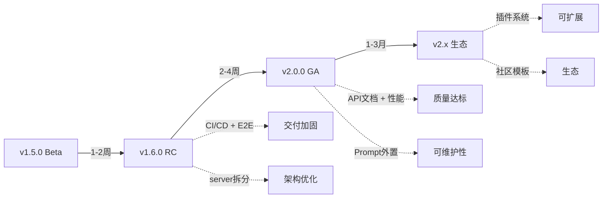

# 0617 NoFusion/InkOS 全量代码审查：进程判断与发展建议

> 审查日期：2026-06-17  
> 基线版本：v1.5.0 (commit `74b21cc`)  
> 审查范围：`packages/` 全部 384 个 TypeScript 源文件  
> 方法：实机代码阅读 + 目录结构分析 + 文件规模度量 + 历史报告交叉对照

---

## 一、项目规模全景

### 1.1 代码量度量

| 包 | 模块 | 文件数 | 核心文件规模 |
|---|------|:--:|------|
| **Core** | agents/ | 46 | 650KB（单个最大 `writer.ts` 66KB, `continuity.ts` 50KB） |
| | models/ | 25 | 80KB（Zod Schema 全覆盖） |
| | pipeline/ | 10 | 250KB（`runner.ts` 165KB ⚠️, `scheduler.ts` 18KB） |
| | llm/ | ~15 | 服务预设、提供商抽象、密钥管理 |
| | interaction/ | ~20 | 会话、消息、编辑控制器、意图路由 |
| | state/ | ~8 | 状态管理器、内存 DB、运行时持久化 |
| | style-library/ | ~8 | 作家档案、蒸馏管线、诊断存储 |
| | utils/ | ~30 | 文档读取、代理抓取、路径安全、数据一致性 |
| **Studio** | api/ | ~10 | `server.ts` **307KB (7710行)** 🔴 |
| | pages/ | 24 | 450KB（最大 `BookDetail.tsx` 66KB, `StyleManager.tsx` 49KB） |
| | components/ | ~15 | AI 元素、聊天组件、工具步骤 |
| | hooks/ | ~10 | API、SSE、路由、主题、国际化 |
| | store/ | ~8 | Zustand chat 状态管理 |
| **CLI** | commands/ | 29 | 完整命令体系（agent/book/write/audit/style...） |
| | tui/ | ~5 | 终端交互 UI |
| **测试** | | 193 文件 | 1861 测试全绿 |

### 1.2 关键文件规模热力图

| 文件 | 大小 | 评级 | 说明 |
|------|:---:|:--:|------|
| `studio/api/server.ts` | 307KB (7710行) | 🔴 | **最大单体**，路由+业务逻辑未拆分 |
| `core/pipeline/runner.ts` | 165KB (4100行) | 🔴 | 核心管线，需拆分 stage |
| `core/agents/writer.ts` | 66KB | 🟡 | 写作 Agent，合理的综合复杂度 |
| `core/agents/writer-prompts.ts` | 63KB | 🟡 | 提示词模板，可外置为 `.md` |
| `studio/pages/BookDetail.tsx` | 66KB | 🟡 | 书籍详情页，可拆分 sub-components |
| `core/agents/continuity.ts` | 50KB | 🟡 | 连续性审计，核心逻辑 |
| `studio/pages/StyleManager.tsx` | 49KB | 🟢 | 已拆分（P0-1 修复后从 2190 行缩减） |
| `core/agents/post-write-validator.ts` | 41KB | 🟡 | 写后验证 |
| `studio/pages/AuditView.tsx` | 38KB | 🟡 | 审计视图 |
| `core/agents/reviser.ts` | 33KB | 🟡 | 修订 Agent |

---

## 二、架构评估

### 2.1 优势

| 维度 | 评分 | 依据 |
|------|:--:|------|
| **Agent 体系完整性** | ⭐⭐⭐⭐⭐ | 46 个 Agent 覆盖写作全生命周期：规划→写作→长度归一→审计→修订→润色→AI检测→风格分析→雷达→Beta阅读 |
| **类型安全** | ⭐⭐⭐⭐⭐ | 25 个 Zod Schema 模型，从 BookConfig 到 RuntimeState 全覆盖 |
| **测试覆盖** | ⭐⭐⭐⭐ | 1861 测试，Core 1415 + Studio 277 + CLI 169，门禁全绿 |
| **LLM 抽象** | ⭐⭐⭐⭐ | 多提供商支持 (OpenAI/Anthropic/Google/DeepSeek/自定义)，服务预设+密钥管理+代理抓取 |
| **交互系统** | ⭐⭐⭐⭐ | 意图路由、NL 路由、编辑事务、会话持久化、SSE 事件广播 |
| **风格系统** | ⭐⭐⭐⭐⭐ | 风格分析→指纹→诊断→重写→对比→调整→蒸馏，完整闭环 |
| **CLI 完整性** | ⭐⭐⭐⭐⭐ | 29 个命令覆盖所有核心功能 |
| **前端页面** | ⭐⭐⭐⭐ | 24 个页面，书籍工作区 20 个子面板，完整的功能暴露 |

### 2.2 架构风险

| 风险 | 严重度 | 详情 |
|------|:--:|------|
| **server.ts 单体** | 🔴 高 | 7710 行单文件，包含所有路由+业务逻辑+LLM调用+文件操作。任何修改都需谨慎回归测试 |
| **runner.ts 单体** | 🔴 高 | 4100 行核心管线，导入 60+ 依赖。Stage 拆分不足，难以独立测试各阶段 |
| **prompt 内嵌** | 🟡 中 | `writer-prompts.ts`(63KB)、`planner-prompts.ts`(24KB) 将提示词硬编码在 TS 中，不利于非开发人员调优 |
| **前端大页面** | 🟡 中 | `BookDetail.tsx`(66KB)、`AuditView.tsx`(38KB)、`StyleManager.tsx`(49KB) 需要进一步组件化拆分 |
| **无 CI/CD** | 🟡 中 | 无 `.github/workflows/`，完全依赖本地 typecheck+test |

### 2.3 架构图

```
┌─────────────────────────────────────────────────────────┐
│                      CLI (29 commands)                    │
│  init → book → plan → write → audit → revise → export    │
└────────────────────┬────────────────────────────────────┘
                     │ workspace:*
┌────────────────────▼────────────────────────────────────┐
│              Core (@actalk/inkos-core)                    │
│  ┌──────────┐ ┌──────────┐ ┌───────────┐ ┌───────────┐  │
│  │ Pipeline │ │  Agents  │ │  Models   │ │    LLM    │  │
│  │ runner   │→│  46个    │→│ 25 Zod   │→│ 多提供商  │  │
│  │ scheduler│ │          │ │  Schema   │ │           │  │
│  └──────────┘ └──────────┘ └───────────┘ └───────────┘  │
│  ┌──────────┐ ┌──────────┐ ┌───────────┐ ┌───────────┐  │
│  │Interaction│ │  State   │ │Style-Lib │ │  Import   │  │
│  │ 会话/意图 │ │ 运行时态 │ │ 作家蒸馏 │ │ 基础源   │  │
│  └──────────┘ └──────────┘ └───────────┘ └───────────┘  │
└────────────────────┬────────────────────────────────────┘
                     │ workspace:*
┌────────────────────▼────────────────────────────────────┐
│            Studio (@actalk/inkos-studio)                  │
│  ┌──────────────────────────────────────────────────┐    │
│  │           server.ts (7710行 🔴)                    │    │
│  │  Hono + 80+ routes + SSE + broadcast + LLM       │    │
│  └──────────────────────────────────────────────────┘    │
│  ┌──────────┐ ┌──────────┐ ┌──────────┐ ┌──────────┐   │
│  │  Pages   │ │  Hooks   │ │  Store   │ │   API    │   │
│  │  24页面  │ │  SSR/API │ │ Zustand  │ │  client  │   │
│  └──────────┘ └──────────┘ └──────────┘ └──────────┘   │
└─────────────────────────────────────────────────────────┘
```

---

## 三、功能模块完成度矩阵

### 3.1 核心写作管线

| 模块 | 代码 | 测试 | API | 前端 | LLM集成 | 评级 |
|------|:--:|:--:|:--:|:--:|:--:|:--:|
| M1 书籍管理 | ✅ | ✅ | ✅ | ✅ | — | 完成 |
| M2 端点验证 | ✅ | ✅ | ✅ | ⚠️ | — | 核心完成 |
| M3 写作管线 | ✅ | ✅ | ✅ | ✅ | ✅ | **完成** |
| M4 审计系统 | ✅ | ✅ | ✅ | ✅ | ✅ | **完成** |
| M5 场景模板 | ✅ | ✅ | ✅ | ✅ | — | **P0-2已修复** |
| M6 角色声线 | ✅ | ✅ | ✅ | ✅ | ✅ | **P1-5已修复** |
| M7 文风分析 | ✅ | ✅ | ✅ | ✅ | ✅ | **完成** |
| M8 风格库 | ✅ | ✅ | ✅ | ✅ | ✅ | **完成** |
| M9 交互会话 | ✅ | ✅ | ✅ | ✅ | ✅ | **完成** |
| M10 状态变更 | ✅ | ✅ | ✅ | ⚠️ | — | **P1-3已修复** |
| 短篇小说 | ✅ | ✅ | — | — | ✅ | 管线就绪 |
| 封面生成 | ✅ | ✅ | ✅ | ✅ | ✅ | 完成 |
| 通知系统 | ✅ | ✅ | ✅ | ✅ | — | 完成 |
| 数据导入 | ✅ | ✅ | ✅ | ✅ | — | 完成 |
| 数据导出 | ✅ | ✅ | ✅ | ✅ | — | 完成 |

### 3.2 质量属性

| 属性 | 评分 | 证据 |
|------|:--:|------|
| 可测试性 | ⭐⭐⭐⭐ | 1861 测试，Vitest fork 模式，mock 完善 |
| 可维护性 | ⭐⭐⭐ | 大文件是主要问题（server.ts/runner.ts） |
| 可扩展性 | ⭐⭐⭐⭐ | Agent 基类、插件式提供商、Schema 驱动 |
| 可观测性 | ⭐⭐⭐ | SSE 事件广播、状态日志、Prompt Manifest，缺 OpenTelemetry |
| 安全性 | ⭐⭐⭐⭐ | API Key 独立存储、路径安全、BookId 校验 |
| 国际化 | ⭐⭐⭐⭐ | 298 键双语言，0 缺失 |
| 文档化 | ⭐⭐⭐ | 50+ 份报告但缺 API 文档和架构图 |

---

## 四、进程判断

### 4.1 当前阶段定位

```
概念验证 ──→ 原型 ──→ Alpha ──→ Beta ──→ RC ──→ GA
                                    ↑
                                 当前位置
```

**判定：Beta 阶段（v1.5.0）**

| 判定依据 | 满足情况 |
|---------|:--:|
| 核心功能闭环 | ✅ 建书→写章→审计→修订→导出 全链路 |
| 门禁全绿 | ✅ typecheck + build + 1861 tests |
| P0 阻断清零 | ✅ 4/4 |
| 前后端对齐 | ✅ 14 端点 ↔ 全实现 |
| 版本号统一 | ✅ v1.5.0 |
| CI/CD | ❌ 无 |
| 性能基准 | ❌ 未建立 |
| 生产部署 | ❌ 未经压测 |

### 4.2 距 RC（Release Candidate）差距

| 差距项 | 优先级 | 工时估算 |
|--------|:--:|:--:|
| server.ts 拆分 | P1 | 3d |
| runner.ts 拆分 | P1 | 3d |
| CI/CD 配置 | P0 | 0.5d |
| 真实 LLM E2E 全链路回归 | P0 | 4h |
| 性能基准测试 | P2 | 1d |
| API 文档 (OpenAPI) | P1 | 2d |
| 前端大页面组件化 | P2 | 2d |
| Prompt 外置化 | P2 | 1d |
| 错误监控集成 | P2 | 1d |

### 4.3 距 GA（General Availability）差距

除上述 RC 项外，还需：
- 生产部署文档
- 安全审计
- 用户手册
- 至少 3 本书的完整写作验证

---

## 五、发展建议

### 5.1 近期（1-2 周）：交付加固

| # | 任务 | 优先级 | 工时 |
|:--:|------|:--:|:--:|
| 1 | **CI/CD 配置**：GitHub Actions `typecheck → test → build` | P0 | 0.5d |
| 2 | **真实 LLM E2E**：完整建书→写3章→审计→修订→导出 | P0 | 4h |
| 3 | **server.ts 拆分**：按模块拆为 `routes/books.ts`, `routes/audit.ts`, `routes/style.ts` 等 | P1 | 3d |
| 4 | **runner.ts 拆分**：提取 `stages/plan.ts`, `stages/compose.ts`, `stages/review.ts` | P1 | 3d |
| 5 | **P1 残留闭合**：M2 端点验证接入 + P1-7 正式 E2E | P1 | 1d |

### 5.2 中期（2-4 周）：质量提升

| # | 任务 | 优先级 | 工时 |
|:--:|------|:--:|:--:|
| 6 | **API 文档生成**：从 Hono 路由自动生成 OpenAPI spec | P1 | 2d |
| 7 | **前端大页面拆分**：BookDetail、AuditView、StyleManager | P2 | 2d |
| 8 | **Prompt 外置化**：将 `.ts` 中的提示词迁移到 `.md` 文件，支持热加载 | P2 | 1d |
| 9 | **性能基准**：建立 3-5 本书规模的性能回归测试 | P2 | 1d |
| 10 | **错误监控**：Sentry/OpenTelemetry 集成 | P2 | 1d |

### 5.3 长期（1-3 月）：生态建设

| # | 方向 | 说明 |
|:--:|------|------|
| 11 | **插件系统** | Agent 和 Provider 的插件化注册机制 |
| 12 | **社区模板** | Genre/风格/场景模板的社区贡献体系 |
| 13 | **协作写作** | 多用户会话、版本合并、Review 流程 |
| 14 | **发布集成** | 与主流网文平台 (起点/番茄/晋江) 的 API 对接 |
| 15 | **移动端** | React Native 或 PWA 适配 |

### 5.4 架构演进路线图



---

## 六、风险矩阵

| 风险 | 概率 | 影响 | 缓解措施 |
|------|:--:|:--:|------|
| server.ts 继续膨胀导致维护困难 | 高 | 中 | 近期拆分（建议 5.1-#3） |
| runner.ts 单点故障影响全管线 | 中 | 高 | 近期拆分（建议 5.1-#4） |
| 缺乏 CI/CD 导致回归未被发现 | 中 | 高 | 立即配置（建议 5.1-#1） |
| LLM API 依赖导致 E2E 不稳定 | 高 | 低 | Mock 模式 + API key 轮换 |
| Windows 特定路径/编码问题 | 中 | 中 | CI 中增加 Windows runner |
| 大文件导致新开发者上手困难 | 中 | 中 | 架构文档 + 入职指南 |

---

## 七、一句话总结

> **NoFusion/InkOS v1.5.0 是一个架构完整、Agent 体系全面（46个Agent）、类型安全（25 Zod Schema）、测试充分（1861例）的 AI 写作引擎，当前处于 Beta 阶段。两大架构债务（server.ts 7710行 + runner.ts 4100行）是通往生产发布的主要障碍，建议在未来 2 周内通过模块化拆分进入 RC 阶段，4 周内达到 GA 标准。**

---

## 附录：数据来源

- 代码度量：实机 `dir` 文件大小测量（2026-06-17）
- 测试数据：实机 `pnpm typecheck` + `pnpm --filter test` 冷启动验证
- 报告对照：`reports/0614-0616` 系列 33 份报告
- Git 状态：`git log --oneline` + `git status` 确认工作区干净
