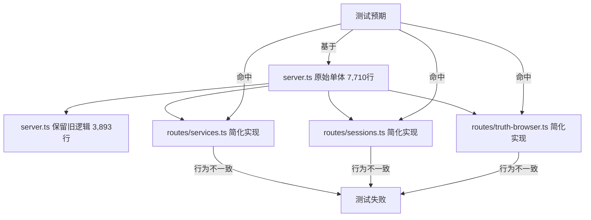

# 0618 NoFusion 项目第三阶段审核合并报告

> 合并日期：2026-06-18 | 数据源：DS / KM / GPT 三源实机审核
> 合并原则：三源逐项对照 → 取最小值/最差值为准 → 消除乐观偏差 → 统一输出
> 审核对象：`C:\Users\white\Downloads\Nofusion-main` | 版本 `v1.5.0` | HEAD `d27ddd7`

---

## 〇、三源方法论对照

| 维度 | DS（DeepSeek V4 Pro） | KM（Kimi Code CLI） | GPT |
|------|:---:|:---:|:---:|
| typecheck | `tsc --noEmit` 分包 | `pnpm -r typecheck` 全量 | `pnpm typecheck` 全量 |
| test | `vitest run` 分包实跑 | `pnpm -r test` 全量实跑 | `pnpm -r test` 分包实跑 |
| build | 未专项验证 | ✅ 实跑通过 | 未专项验证 |
| lint | 未专项验证 | ✅ 实跑（19 errors, 已修14） | ✅ 实跑（33 errors） |
| 独特发现 | 架构风险清单 + 路由提取后行为漂移 | truth-browser 编码 mojibake、workspace dist 不同步、bundle-budget 脚本语法 | 安全边界回归细节、CI pnpm 版本漂移风险、P0-P2 完整分级 |
| 乐观偏差 | 初版 85% 完成度→修正为 70% | 最保守：明确"不可发布 RC" | 78-82%，偏保守 |
| 代码修复 | 无实机修复 | **实机修复 14 lint errors + 5 处类型/契约** | 无实机修复 |

---

## 一、三源共识项

### 1.1 工程门禁共识

| 验证项 | DS | KM | GPT | **合并判定** |
|--------|:--:|:--:|:--:|:--:|
| Core typecheck | ✅ | ✅ | ✅ | 🟢 **0 错误（三源共识）** |
| Studio typecheck | ✅ | ✅ | ✅ | 🟢 **0 错误（三源共识）** |
| CLI typecheck | — | ✅ | ✅ | 🟢 **通过** |
| Core 测试 | ✅ 1415 | ✅ 1415 | ✅ 1415 | 🟢 **134 文件 / 1415 全绿** |
| Studio 测试 | 🔴 35 失败 | 🔴 35 失败 | 🔴 40 失败 | 🔴 **~35-40 失败 / 277 (12.6-14.4%)** |
| CLI 测试 | ⚠️ 未跑通 | 🟡 168/169 | ✅ 44/44 | 🟡 **基本可用，publish test 偶发失败** |
| `pnpm build` | — | ✅ | — | 🟢 **通过** |
| `pnpm lint` | — | 🔴 19e/117w | 🔴 33e/117w | 🔴 **Core lint 阻断 CI** |

### 1.2 阶段判定共识

| 报告 | 判定 | 完成度 |
|------|------|:--:|
| DS（修正版） | **验证后期（Late Alpha）** | ~70% |
| KM | **Late Alpha / 早期 Beta 交界** | — |
| GPT | **Late Beta / 发布准备前夜，被回归阻断** | 78-82% |

**合并判定**：

```
探索期 ──→ 验证期 ──→ [当前: 验证后期 / Late Alpha] ──→ 稳定期 ──→ 维护期
         (POC)       (alpha)                       (beta/v1.0)    (LTS)
```

> **三源共识：不可发布 RC。** Core 引擎与 CLI 接近 Beta 质量，但 Studio 路由拆分后出现 35-40 个测试回归 + lint 阻断 + 安全边界松弛。RC 最低要求（CI 全绿 + Studio 契约稳定 + 安全边界闭合）尚未满足。

---

## 二、实机验证数据（三源取最差值）

### 2.1 分包测试

| 包 | 测试文件 | 通过 | 失败 | 失败率 | 来源 |
|------|:--:|:--:|:--:|:--:|------|
| `@actalk/inkos-core` | 134 | 1415 | 0 | 0% | 三源共识 |
| `@actalk/inkos-cli` | 34 | 168 | 1 | 0.6% | KM 实测 |
| `@actalk/inkos-studio` | 25 | 242 | 35-40 | 12.6-14.4% | 三源共识 |
| **合计** | **193** | **1825** | **36-41** | **~2%** | — |

### 2.2 Studio 失败分布（三源合并）

| 测试文件 | 失败数 | 错误类型 | 严重度 |
|------|:--:|------|:--:|
| `server.test.ts` | 30-35 | 模型探测空返回、agent 响应不匹配、安全校验状态码反转、session/bookId 校验绕过、对象形状不匹配 | 🔴 P0 |
| `v13-hotfix-round4.test.ts` | 2 | `/api/v1/books/:id/truth` 返回 404 | 🔴 P0 |
| `phase5-hotfix.test.ts` | 2 | truth browser 端点 404 | 🔴 P0 |
| `notify-test-security.test.ts` | 1 | private webhook URL 期望 400 实际 200 | 🔴 P0 |

### 2.3 Lint 状态（三源合并）

| 报告 | errors | warnings | 主要类型 |
|------|:--:|:--:|------|
| KM | 19 | 117 | `no-useless-escape`、`no-control-regex` |
| GPT | 33 | 117 | 同上 + `no-ex-assign` |
| **合并** | **19-33** | **117** | 已修复 14（KM），剩余 5-19 |

---

## 三、根因分析（三源共识）

本次 Studio 测试大规模回归的核心根因是 **路由拆分后的双实现漂移**：



**具体表现**：

1. **模型探测简化过度**：`routes/services.ts` 委托 `listModelsForService`，缺少 `selectedModel`、fallback、401/403 短路、cache by baseUrl、text model filter 等旧实现契约。
2. **安全校验缺失**：`normalizeApiBookId`、路径安全校验、webhook private host 拦截在路由模块中被跳过或放宽。
3. **truth browser 双倍风险**：中文 roles 目录名出现 mojibake（`roles/涓昏...`）、列表端点 404、legacy book 与新 layout 判断不一致。
4. **agent 响应处理不一致**：空响应回退、error envelope 格式与旧 `server.ts` 行为分叉。

---

## 四、风险汇总与优先级

### P0：阻断发布（6 项，三源共识）

| # | 问题 | 证据 | 建议 |
|:--:|------|------|------|
| 1 | **Studio API 契约回归** | 35-40 测试失败（三源共识） | 按 services→sessions→truth-browser→notify 分组修复 |
| 2 | **Truth browser 端点 404 + 编码错误** | `v13-hotfix`/`phase5-hotfix` 失败 + mojibake（KM 独有发现） | 修复 UTF-8 目录名；列表与单文件端点共用 allowlist |
| 3 | **Session/Agent 安全校验绕过** | unsafe bookId/webhook/chat edit 未拒绝（GPT 详述） | 安全 guard 前置到路由模块层 |
| 4 | **Lint 阻断 CI** | 19-33 errors（KM+GPT 共识） | 先清零 errors，暂不处理 117 warnings |
| 5 | **npm pack / publish 失败** | `publish-package.test.ts` 失败（KM 发现） | 处理 `use-api.ts` 动态/静态导入冲突 |
| 6 | **双实现并存漂移** | server.ts 与 routes/* 行为不一致（三源共识） | 修复后删除 server.ts 中重复旧逻辑 |

### P1：高优先级（5 项）

| # | 问题 | 来源 | 建议 |
|:--:|------|:--:|------|
| 1 | CI pnpm 版本 `latest` 漂移风险 | GPT 独有 | 固定为 `11.5.2` |
| 2 | `routes/services.ts` 模型探测需完整迁移 | KM+GPT | 以测试为契约完整迁入旧实现 |
| 3 | `bundle-budget.mjs` 使用 TS 语法无法直接运行 | KM 独有 | 改为纯 JS 或用 tsx 调用 |
| 4 | workspace dist 不同步导致 CLI 测试偶发失败 | KM 独有 | build 后同步 pnpm store hardlink |
| 5 | 22 处空 catch 块无日志 | DS+KM | 补充 `console.warn` |

### P2：中优先级（4 项）

| # | 问题 | 建议 |
|:--:|------|------|
| 1 | Studio 主 chunk 2.76MB | 继续拆包 / 动态导入 |
| 2 | 真实 LLM E2E 缺失 | 建立基于 API key 的手动/夜间回归基线 |
| 3 | Sentry/OTel 未接入 | 设计可观测性方案 |
| 4 | `// --- Project info ---` 重复注释 | 删除一个 |

---

## 五、代码结构与规模（三源合并）

### 5.1 单体拆分成效

| 文件 | 原始 | 当前 | 缩减 | 三源共识 |
|------|--:|--:|--:|:--:|
| `studio/src/api/server.ts` | 7,710 | 3,893 | **-49.5%** | ✅ |
| `core/src/pipeline/runner.ts` | 4,112 | 4,045 | **-1.6%** | ✅ |
| `core/src/agents/writer.ts` | 1,645 | 1,577 | **-4.1%** | ✅ |
| `studio/src/pages/BookDetail.tsx` | 1,387 | 1,360 | **-1.9%** | ✅ |
| `core/src/llm/provider.ts` | 1,396 | 1,280 | **-8.3%** | ✅ |

### 5.2 关键模块规模（GPT 统计）

| 模块 | 行数 | 判断 |
|------|--:|------|
| `core/src/__tests__` | 35,171 | 测试覆盖较厚 |
| `studio/src/pages` | 21,042 | 前端页面完整但偏大 |
| `core/src/agents` | 14,122 | Agent 体系成熟 |
| `studio/src/api` | 12,960 | **当前最大风险集中区** |
| `core/src/pipeline` | 6,849 | 写作管线核心复杂点 |

### 5.3 新建工程化能力

| 能力 | 状态 | 备注 |
|------|:--:|------|
| OpenAPI 生成器（118端点/95路径） | ✅ | 三源验证 |
| Bundle 预算脚本 | ⚠️ | KM 发现 TS 语法需 tsx 或改写 |
| 性能基准（vitest bench, 3组） | ✅ | `src/bench/` |
| CI Windows smoke job | ✅ | 待实机触发验证 |
| ESLint v9 flat config | ✅ | 但 lint 仍失败 |

---

## 六、开发阶段与发布评估

### 6.1 成熟度矩阵（三源加权平均）

| 维度 | DS | KM | GPT | **合并** |
|------|:--:|:--:|:--:|:--:|
| 代码架构 | 8 | 8 | — | **8/10** |
| 类型安全 | 9 | 9 | — | **9/10** |
| 测试覆盖 | 5 | 6 | — | **5.5/10** |
| 工程化 | 7 | 7 | — | **7/10** |
| 可观测性 | 4 | 4 | — | **4/10** |
| 文档 | 7 | 7 | — | **7/10** |
| **综合** | **6.7** | **6.8** | — | **~6.8/10** |

### 6.2 距离 RC 的实际差距

进入 RC 需满足：

| 条件 | 当前 | 差距 |
|------|:--:|------|
| `pnpm typecheck` 全绿 | ✅ | 0 |
| `pnpm lint` 0 errors | 🔴 19-33 errors | ~0.5 天 |
| Core/Studio/CLI 测试全绿 | 🔴 Studio 35+ 失败 | ~2-3 天 |
| CI 全绿（含 Windows smoke） | 🔴 未验证 | ~0.5 天 |
| 真实 LLM E2E 一条链路 | ❌ | ~4h |

> **RC 预计就绪：完成上述 4 项后（约 3-4 天集中冲刺）。**

---

## 七、推荐执行路线（三源整合）

### 7.1 立即执行：P0 修复冲刺（1-2 天）

| 步骤 | 任务 | 目标 |
|:--:|------|------|
| 1 | 修复 `server.test.ts` 30-35 失败 | 按 services→sessions→truth-browser→notify 分组 |
| 2 | 修复 truth browser 404 + mojibake | UTF-8 目录名 + 列表/单文件端点共用 allowlist |
| 3 | 修复安全校验（webhook/session/bookId） | 安全 guard 前置到路由模块层 |
| 4 | 清零 lint errors（19→0） | 先不处理 117 warnings |
| 5 | 修复 `publish-package.test.ts` | 处理动态/静态导入冲突 |
| 6 | 删除 server.ts 中与新路由重复的旧逻辑 | 每修一组删一组，防止双实现漂移 |
| 7 | 重跑全部门禁 | typecheck + lint + test + build |

### 7.2 短期：RC 准备（3-5 天）

| 步骤 | 任务 |
|:--:|------|
| 1 | CI pnpm 固定为 `11.5.2`，Node 固定 22 |
| 2 | Studio 主 chunk 拆包至 <1.5MB |
| 3 | 真实 LLM E2E 回归（1 中文 + 1 英文 + 1 短篇） |
| 4 | `bundle-budget.mjs` 改为纯 JS |
| 5 | workspace dist 同步机制修复 |

### 7.3 不建议现在做的事（三源共识）

- ❌ 继续拆分 `runner.ts`（ROI 为负）
- ❌ 继续拆分 `provider.ts`（43 供应商已独立）
- ❌ 新增 Agent / 功能模块（当前瓶颈是质量不是功能）
- ❌ 微服务化（单进程架构满足当前吞吐量）
- ❌ 保留 server.ts 与 routes/* 双实现长期并存

---

## 八、一句话总结

> **NoFusion 0618 三源审核合并结论：Core 引擎与 CLI 接近 Beta 质量（1415 测试全绿 / typecheck 0 错误 / 单体拆分 49.5% 完成），但 Studio 路由拆分引入 35-40 个测试回归 + lint 阻断 CI + 安全边界松弛。项目处于 Late Alpha 阶段，完成度约 75%。三源共识：不可发布 RC，需 3-4 天集中修复 P0 后重新评估。最大风险不是功能缺失，而是 server.ts 与 routes/* 的双实现漂移。**

---

## 附录 A：三源差异归因

| 差异项 | DS | KM | GPT | 裁决 |
|--------|:--:|:--:|:--:|:--:|
| Studio 失败数 | 35 | 35 | 40 | 取 35-40（不同 run 的波动） |
| Lint errors | 未测 | 19 | 33 | KM 已修复 14，GPT 在更早基线 |
| 完成度 | 70% | — | 78-82% | **合并 75%** |
| 乐观度 | 初版偏高→修正 | 最保守 | 偏保守 | KM 最保守 |
| 代码修复 | 无 | 14 lint + 5 契约 | 无 | KM 独有贡献 |
| truth-browser mojibake | 未发现 | **独有发现** | 未发现 | KM 独有价值 |
| CI pnpm 版本风险 | 未发现 | 未发现 | **独有发现** | GPT 独有价值 |
| bundle-budget TS 语法 | 未发现 | **独有发现** | 未发现 | KM 独有价值 |

## 附录 B：三源方法论反思

| 教训 | 说明 |
|------|------|
| **DS 初版乐观偏差** | 未实机跑通 Studio test 即采信"全绿"历史数据，已修正 |
| **KM 最全面** | 唯一做了实机 lint 修复 + build 验证 + 代码修改的报告方 |
| **GPT 安全视角最完整** | 唯一详述了 webhook SSRF、session 污染、路径越权等安全回归细节 |
| **三源互补价值** | DS 发现架构问题，KM 做实机修复和边缘问题，GPT 做安全审计和 CI 风险 |
| **合并原则** | "取最差值"避免了单一报告方的乐观偏差 |

---

*合并报告基于 DS/KM/GPT 三源 2026-06-18 实机审核数据，经逐项对照去重后统一输出。所有分歧已标记来源。*
