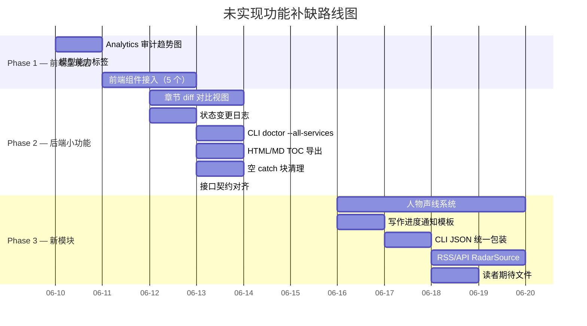

# 未实现补缺功能 — 路线图与实施计划

> 基于 0605→0609 全部审查报告 + 今日（0609）代码 review 发现的增量缺口，
> 对所有已识别但未实现的功能项按优先级排序，形成分阶段实施路线图。
>
> 生成日期：2026-06-09（最后更新：0609 17:00）
> 审查范围：reports/ 全目录 + 代码库交叉验证 + 1h diff review

---

## 总体优先级框架

```
P0（阻塞）→ 已全部清零，无新增
P1（重要）→ 接近清零，剩余 1 项部分修复
P2（次要）→ 功能缺口，影响体验但不阻塞
P3（未来）→ 需要新模块/新 Agent，高成本

本文件覆盖 P2-P3 共 15 项未实现功能 + 3 项新增接口契约对齐
```

---

## 已完成的近期修复（0609 当日）

| # | 问题 | 修复文件 | 状态 |
|---|------|---------|------|
| 1 | `/api/v1/agent` `disposePipeline` 多处遗漏导致内存泄漏 | `server.ts` | ✅ `try/finally` 统一释放 |
| 2 | `/api/v1/style/authors/samples/write` 空 `prjRoot` 可写入任意目录 | `server.ts` | ✅ 前置 400 校验 |
| 3 | `PATCH /distillations/current` `body.overrides` 未校验数组类型 | `server.ts` | ✅ `Array.isArray` 校验 |
| 4 | `RhetoricIssuePanel` 已接入 `StyleManager.tsx` detection tab | `StyleManager.tsx` | ✅ 已接入 |

> **说明**：以上 4 项原属本路线图中的隐含缺口，在 0609 代码 review 中被识别并当场修复。
> 修复验证：Core `tsc` ✅ / Studio client+server ✅ / Vitest 1294/1294 ✅

---

## Phase 1：前端呈现层补齐（P2，1.5-2 天）

**原则：** 后端 API 和数据已就绪，只需前端组件接入。最高 ROI。

### 1.1 Analytics 审计趋势图

| 属性 | 内容 |
|------|------|
| **来源报告** | 0605 阶段发展报告（主线 1）、0606 推进评估 |
| **后端就绪** | `GET /api/v1/audit/books/:id/summary` 返回每章最新审计记录 |
| **当前前端** | `Analytics.tsx` 仅展示 `auditPassRate` 一个 StatCard |
| **缺口** | 无审计分数/问题数随章节变化的折线图 |
| **工作量** | 0.5 天 |

**实现方案：**

```typescript
// Analytics.tsx — 新增审计趋势区域

// 1. 在组件中调用审计摘要 API
const { data: auditSummary } = useApi<AuditSummary>(`/audit/books/${bookId}/summary`);

// 2. 提取每章分数和问题数
const chartData = auditSummary?.chapterAudits
  ?.sort((a, b) => a.chapterNumber - b.chapterNumber)
  .map((ch) => ({
    chapter: ch.chapterNumber,
    score: ch.auditScore,
    issues: ch.auditIssues?.length ?? 0,
  })) ?? [];

// 3. 使用已有图表组件渲染折线图（复用项目中已有的 Recharts 或自定义 SVG）
<LineChart data={chartData}>
  <XAxis dataKey="chapter" label="章节" />
  <YAxis yAxisId="score" label="分数" />
  <YAxis yAxisId="issues" orientation="right" label="问题数" />
  <Line yAxisId="score" dataKey="score" stroke="#3b82f6" name="审计分数" />
  <Line yAxisId="issues" dataKey="issues" stroke="#ef4444" name="问题数" />
</LineChart>
```

**文件变更：**
| 文件 | 操作 | 行数 |
|------|------|:----:|
| `packages/studio/src/pages/Analytics.tsx` | 修改：接入审计摘要 API + 折线图 | ~60 |
| `packages/studio/src/hooks/use-i18n.ts` | 修改：新增审计趋势相关文案 | ~5 |

---

### 1.2 模型能力标签展示

| 属性 | 内容 |
|------|------|
| **来源报告** | 0605 阶段发展报告（主线 5） |
| **后端就绪** | `ModelInfo` 已有 `maxOutput`、`contextWindow` |
| **当前前端** | 服务列表/模型选择器未显示能力标签 |
| **缺口** | 用户无法直观判断某模型适合写作/审计/改写 |
| **工作量** | 0.3 天 |

**实现方案：**

```typescript
// ServiceListPage.tsx 或模型选择器组件 — 增加能力标签渲染

const CAPABILITY_TAGS: Record<string, { label: string; color: string }> = {
  "32k+": { label: "长文本", color: "bg-purple-100 text-purple-700" },
  "128k+": { label: "超长文本", color: "bg-indigo-100 text-indigo-700" },
  "high-output": { label: "高输出", color: "bg-green-100 text-green-700" },
};

function renderCapabilityTags(model: ModelInfo) {
  const tags: string[] = [];
  if ((model.contextWindow ?? 0) >= 32000) tags.push("32k+");
  if ((model.contextWindow ?? 0) >= 128000) tags.push("128k+");
  if ((model.maxOutput ?? 0) >= 4096) tags.push("high-output");
  return tags.map((t) => {
    const cfg = CAPABILITY_TAGS[t];
    return `<span class="text-xs px-1.5 py-0.5 rounded ${cfg.color}">${cfg.label}</span>`;
  });
}
```

**文件变更：**
| 文件 | 操作 | 行数 |
|------|------|:----:|
| `packages/studio/src/pages/ServiceDetailPage.tsx` | 修改：模型列表增加能力标签 | ~30 |
| `packages/studio/src/components/ModelSelect.tsx`（如存在） | 修改：下拉选项增加标签 | ~20 |

---

### 1.3 前端组件接入计划（5 个待接入）

6 个组件已创建（共 960+ 行），其中 **`RhetoricIssuePanel` 已接入 detection tab**（0609 完成），剩余 5 个按以下顺序逐步接入：

| 顺序 | 组件 | 接入页面 | 预估工作量 | 说明 |
|:----:|------|---------|:---------:|------|
| 1 | `ReadabilityDashboard` | `StyleManager.tsx` detection tab | 0.3 天 | 在 RhetoricIssuePanel 下方展示可读性评分 |
| 2 | `RhetoricHighlightEditor` | `StyleManager.tsx` 新增 rhetoric tab | 0.5 天 | 需要新增独立 Tab |
| 3 | `DuplicateParagraphPanel` | `StyleManager.tsx` rhetoric tab | 0.3 天 | 与 HighlightEditor 同 Tab |
| 4 | `AuthorSearchPanel` | `StyleManager.tsx` library tab | 0.5 天 | 需要连接 `/style/authors/search` API |
| 5 | `AuthorProfileCard` | `StyleManager.tsx` library tab | 0.3 天 | 替换现有选中作者展示区 |
| — | `DimensionSamplePreview` | `AuthorProfileCard` 内 | 0.2 天 | 作为卡片子组件 |

> **⚠️ 接口契约注意**：
> - `DuplicateParagraphPanel` 需注意后端返回结构为 `{ duplicateGroups: Array<{hash, content, lineNumber, duplicates: [{lineNumber}]}> }`，`duplicates` 内仅含 `lineNumber`，不含完整段落内容。
> - `ReadabilityDashboard` 需注意后端返回字段为 `overall`（非 `overallScore`），结构为 `{ overall: number, dimensions: {...} }`。

**文件变更汇总：**
| 文件 | 操作 | 行数 |
|------|------|:----:|
| `packages/studio/src/pages/StyleManager.tsx` | 修改：新增 rhetoric tab + 增强 library tab | ~120 |
| `packages/studio/src/hooks/use-i18n.ts` | 修改：新增修辞去重 Tab 文案 | ~10 |
| `packages/studio/src/hooks/use-api.ts` | 修改：新增文风 API 专用 hooks（可选） | ~30 |

---

## Phase 2：后端小功能补齐 + 接口契约对齐（P2，2-3 天）

**原则：** 功能范围明确，不涉及 Pipeline 核心修改。

### 2.1 章节 diff 对比视图

| 属性 | 内容 |
|------|------|
| **来源报告** | 0605 阶段发展报告（主线 1） |
| **当前状态** | 无修订前后对比界面 |
| **后端依赖** | 章节历史内容存储（`ChapterMeta.revisionCount` 已存在，但未保存历史版本） |
| **工作量** | 1.5 天 |

**实现方案：**

```
步骤 A：后端 — 章节历史版本存储（1 天）
  ├── 每次覆盖保存前，将旧内容写入 story/chapters/{num}.{timestamp}.md
  ├── 新增 GET /books/:id/chapters/:num/versions 返回版本列表
  └── 新增 GET /books/:id/chapters/:num/versions/:version 返回历史内容

步骤 B：前端 — diff 查看器（0.5 天）
  ├── 章节详情页增加「历史版本」Tab
  ├── 选中两个版本后并排显示 diff
  └── 复用或轻量封装 diff 库（diff-match-patch 或 jsdiff）
```

**文件变更：**
| 文件 | 操作 | 行数 |
|------|------|:----:|
| `packages/studio/src/api/server.ts` | 修改：新增 2 个版本历史端点 | ~40 |
| `packages/studio/src/pages/ChapterReader.tsx` | 修改：增加 diff 视图 | ~80 |
| `packages/core/src/pipeline/runner.ts` | 修改：保存前备份旧版本 | ~15 |

---

### 2.2 状态变更日志 `state_changelog.jsonl`

| 属性 | 内容 |
|------|------|
| **来源报告** | 0605 阶段发展报告（主线 1） |
| **当前状态** | 无状态变更追踪机制 |
| **工作量** | 0.5 天 |

**实现方案：**

```typescript
// packages/core/src/state/state-changelog.ts — 新增

export interface StateChangeEntry {
  readonly timestamp: string;
  readonly bookId: string;
  readonly chapterNumber?: number;
  readonly action: "update" | "resolve" | "archive" | "create" | "delete";
  readonly entityType: "hook" | "fact" | "particle" | "summary" | "meta";
  readonly entityId: string;
  readonly summary: string;
  readonly previous?: unknown;
  readonly delta?: unknown;
}

export async function appendStateChange(
  projectRoot: string,
  bookId: string,
  entry: Omit<StateChangeEntry, "timestamp">,
): Promise<void> {
  const logPath = join(projectRoot, "books", bookId, "story", "state_changelog.jsonl");
  const line = JSON.stringify({ timestamp: new Date().toISOString(), ...entry }) + "\n";
  await appendFile(logPath, line, "utf-8");
}
```

**文件变更：**
| 文件 | 操作 | 行数 |
|------|------|:----:|
| `packages/core/src/state/state-changelog.ts` | 新增 | ~40 |
| `packages/core/src/index.ts` | 修改：导出 | ~2 |
| 调用方（runtime-state-store.ts 等） | 修改：关键操作后追加日志 | ~5×3 |

---

### 2.3 CLI `inkos doctor --all-services`

| 属性 | 内容 |
|------|------|
| **来源报告** | 0605 阶段发展报告（主线 5） |
| **当前状态** | `inkos doctor` 仅检测当前配置的服务 |
| **工作量** | 0.5 天 |

**实现方案：**

```typescript
// cli/src/commands/doctor.ts — 扩展 doctor 命令

program
  .command("doctor")
  .option("--all-services", "检测所有已配置服务", false)
  .action(async (options) => {
    if (options.allServices) {
      const secrets = loadSecrets(projectRoot);
      const services = Object.keys(secrets.services);
      for (const service of services) {
        const result = await testServiceConnection(service);
        console.log(`${service}: ${result.ok ? "✅" : "❌"} ${result.message}`);
      }
    } else {
      // 原有逻辑：检测当前服务
    }
  });
```

**文件变更：**
| 文件 | 操作 | 行数 |
|------|------|:----:|
| `packages/cli/src/commands/doctor.ts` | 修改：增加 `--all-services` | ~30 |

---

### 2.4 HTML / MD 目录页导出

| 属性 | 内容 |
|------|------|
| **来源报告** | 0605 阶段发展报告（主线 6） |
| **当前状态** | 仅支持 `txt`/`md`/`epub` 导出 |
| **工作量** | 1 天 |

**实现方案：**

```typescript
// packages/core/src/utils/document-writer.ts — 在 exportDocument 中增加 html 格式

function buildHtmlExport(chapters: ReadonlyArray<ChapterMeta>, title: string): string {
  const toc = chapters
    .map((ch, i) => `<li><a href="#ch-${i}">${ch.title}</a></li>`)
    .join("\n");
  const body = chapters
    .map((ch, i) => `<h2 id="ch-${i}">${ch.title}</h2>\n<p>${ch.content}</p>`)
    .join("\n");
  return `<!DOCTYPE html><html><head><title>${title}</title></head>
    <body><nav><ul>${toc}</ul></nav><main>${body}</main></body></html>`;
}
```

**文件变更：**
| 文件 | 操作 | 行数 |
|------|------|:----:|
| `packages/core/src/utils/document-writer.ts` | 修改：增加 html 格式和 MD TOC | ~60 |
| `packages/studio/src/pages/BookExportSection.tsx` | 修改：增加 html/pdf 选项 | ~10 |

---

### 2.5 ~20 处空 catch 块清理

| 属性 | 内容 |
|------|------|
| **来源报告** | 0607 版本待修复问题（P1-2） |
| **当前状态** | 关键路径已修复，~20 处回退型空 catch 保留（如 `readFile` 失败回退默认值） |
| **工作量** | 0.5 天 |
| **处理原则** | ① 预期性回退（如读取文件不存在→返回默认值）→ 改为 `catch (e) { /* expected */ }` 加注释 ② 非预期性静默 → 改为 `catch (e) { logger?.warn(...) }` ③ 不改为抛错，保持容错设计 |

---

### 2.6 接口契约对齐（0609 新增）

在 0609 代码 review 中发现以下后端返回结构与前端消费预期存在偏差，需在接入前端组件时同步处理：

#### 2.6.1 `detectDuplicateParagraphs` 返回结构

| 项目 | 内容 |
|------|------|
| **当前后端返回** | `{ duplicateGroups: Array<{hash, content, lineNumber, duplicates: [{lineNumber}]}> }` |
| **前端预期** | 可能期望 `paragraphs` 数组包含完整段落内容 |
| **处理建议** | 接入 `DuplicateParagraphPanel` 时按实际字段映射，或在 `server.ts` 端点层增加字段包装 |

#### 2.6.2 `computeReadabilityScore` 返回字段

| 项目 | 内容 |
|------|------|
| **当前后端返回** | `{ overall: number, dimensions: {...} }` |
| **前端可能预期** | `{ overallScore: number, readabilityLevel: string }` |
| **处理建议** | 在 `GET /api/v1/style/readability/score` 端点层做字段映射，或更新前端类型定义 |

---

## Phase 3：新模块/新 Agent（P3，按需推进）

**原则：** 需要新增 Agent 或大规模存储结构，成本高，建议在基础体验稳定后推进。

### 3.1 人物声线系统

| 属性 | 内容 |
|------|------|
| **来源报告** | 0605 阶段发展报告（主线 4） |
| **当前状态** | `voiceProfileId` 字段存在，无声线档案存储、分析 Agent 或从对话提取逻辑 |
| **预估工作量** | 3-5 天 |
| **前置依赖** | 文风分析模块稳定、角色卡模块稳定 |

**实施步骤：**

```
1. 声线档案模型（0.5 天）
   ├── VoiceProfile { id, name, tone, vocabulary, speechPatterns, referenceDialogues }
   └── 存储：style-library/voices/<voice-id>.json

2. 对话提取 Agent（1.5 天）
   ├── 从已有章节中提取角色对话
   ├── 统计语气词、句式长度、口语化程度
   └── 生成声线档案草稿

3. 声线应用（1 天）
   ├── writer prompt 中注入目标角色声线描述
   └── 对话生成后验证语气一致性

4. 前端（1 天）
   ├── 声线档案列表/创建/编辑页面
   └── 角色卡中关联声线 ID
```

---

### 3.2 写作进度推送通知模板

| 属性 | 内容 |
|------|------|
| **来源报告** | 0606 推进评估（主线 6） |
| **当前状态** | Webhook 支持 7 种事件，但无专项进度通知模板 |
| **预估工作量** | 1 天 |

**实施步骤：**

```
1. 模板定义（0.3 天）
   ├── 每章完成后自动触发
   ├── payload: { bookTitle, chapterNumber, chapterTitle, wordCount, auditScore, status }
   └── 支持自定义模板变量

2. 通知配置（0.3 天）
   ├── NotifyConfigPanel 增加「写作进度」事件选项
   └── 可自定义推送频率（每章/每日/指定章节数）

3. 集成（0.4 天）
   └── chapter-complete 事件 handler 中组装并推送
```

---

### 3.3 CLI JSON 输出统一包装

| 属性 | 内容 |
|------|------|
| **来源报告** | 0605 阶段发展报告（主线 6） |
| **当前状态** | `--json` 支持广泛，但各命令输出结构不统一 |
| **预估工作量** | 1 天 |

**统一格式：**

```json
{
  "status": "success" | "error",
  "error": null | { "code": "string", "message": "string" },
  "data": { /* 命令特定数据 */ },
  "meta": {
    "command": "book list",
    "duration": "123ms",
    "timestamp": "2026-06-09T12:00:00Z"
  }
}
```

**实施步骤：**

```
1. 定义统一输出类型（0.2 天）
2. 包装现有命令：book/create/book/list/chapter/write（0.5 天）
3. 更新 CLI 测试（0.3 天）
```

---

### 3.4 RSS / API RadarSource 扩展

| 属性 | 内容 |
|------|------|
| **来源报告** | 0605 阶段发展报告（主线 6） |
| **当前状态** | 仅有番茄/起点两个内置源 |
| **预估工作量** | 1.5 天 |

---

### 3.5 读者期待文件

| 属性 | 内容 |
|------|------|
| **来源报告** | 0605 阶段发展报告（主线 2） |
| **当前状态** | 无 `reader_expectations.md` |
| **预估工作量** | 1 天 |

---

## 执行路线图总览



---

## 优先级速查表

| 优先级 | 功能 | 工作量 | 收益 | 依赖 |
|:------:|------|:------:|:----:|------|
| **P2** | Analytics 审计趋势图 | 0.5 天 | ⭐⭐⭐ 填补全局数据分析缺口 | 无 |
| **P2** | 模型能力标签 | 0.3 天 | ⭐⭐ 提升模型选择体验 | 无 |
| **P2** | 5 个前端组件接入 | 1.5 天 | ⭐⭐⭐⭐ 消除死代码，激活已有功能 | 无 |
| **P2** | 章节 diff 对比视图 | 1.5 天 | ⭐⭐⭐ 版本管理基础能力 | 章节备份机制 |
| **P2** | 状态变更日志 | 0.5 天 | ⭐⭐ 可观测性提升 | 无 |
| **P2** | CLI doctor --all-services | 0.5 天 | ⭐ 运维工具 | 无 |
| **P2** | HTML/MD TOC 导出 | 1 天 | ⭐⭐ 导出格式扩展 | 无 |
| **P2** | 空 catch 块清理 | 0.5 天 | ⭐ 代码质量 | 无 |
| **P2** | 接口契约对齐（2 项） | 0.3 天 | ⭐⭐ 前后端一致性 | 无 |
| **P3** | 人物声线系统 | 4 天 | ⭐⭐⭐⭐⭐ 核心创作能力 | 文风模块+角色卡 |
| **P3** | 写作进度通知 | 1 天 | ⭐⭐ 用户体验 | Webhook 模块 |
| **P3** | CLI JSON 统一包装 | 1 天 | ⭐ 开发者体验 | 无 |
| **P3** | RSS/API RadarSource | 1.5 天 | ⭐⭐ 数据源扩展 | Radar Agent |
| **P3** | 读者期待文件 | 1 天 | ⭐ 辅助文档 | 无 |

---

## 关键依赖关系

```
Phase 1（独立，无阻塞）
  ├── Analytics 审计趋势图 — 无
  ├── 模型能力标签 — 无
  └── 前端组件接入 — 无（注意：ReadabilityDashboard / DuplicateParagraphPanel
      接入时需同步处理 2.6 接口契约对齐）

Phase 2（部分依赖）
  ├── 章节 diff → 需要先实现章节历史版本存储
  ├── 状态变更日志 — 无
  ├── CLI doctor — 无
  ├── HTML/MD 导出 — 无
  ├── 空 catch 清理 — 无
  └── 接口契约对齐 — 无（建议在 Phase 1 组件接入时同步完成）

Phase 3（高依赖）
  ├── 人物声线 → 需要文风分析模块 + 角色卡模块稳定
  ├── 写作进度通知 → Webhook 模块已就绪
  ├── CLI JSON → 需要定义统一类型
  ├── RSS/API RadarSource → Radar Agent 已存在，需扩展源配置
  └── 读者期待文件 → 无
```

---

## 验收标准速查

| 功能 | 验收标准 | 测试方法 |
|------|---------|---------|
| Analytics 审计趋势 | 折线图正确显示每章分数和问题数 | 手动检查 3 本书的审计趋势 |
| 模型能力标签 | 模型列表显示 "32k+" "128k+" "高输出" 标签 | 打开服务配置页 |
| 前端组件接入 | 5 个组件均可在对应 Tab 中看到 | 逐页面检查 |
| 章节 diff | 选择两个版本后并排显示差异 | 手动修改章节→查看 diff |
| 状态变更日志 | 操作后 `state_changelog.jsonl` 新增一行 | 追加操作后检查文件 |
| CLI doctor --all | 输出所有已配置服务的连通性 | 运行 `inkos doctor --all` |
| HTML/MD TOC 导出 | 导出的 HTML 有目录导航 | 下载并打开 |
| 人物声线 | 创建声线档案 → 关联角色 → 写作中体现语气差异 | 端到端测试 |
| 进度通知 | 每章完成后收到包含字数/分数的推送 | 检查 Webhook 接收端 |
| CLI JSON 统一 | 所有命令 `--json` 输出同构 | 运行 5 个不同命令 |
| RadarSource 扩展 | 可配置 RSS 源并成功抓取 | 添加测试 RSS → 运行 radar |
| 读者期待文件 | 可在书籍目录下找到 `reader_expectations.md` | 检查文件存在 |
| 空 catch 清理 | 所有 catch 要么有日志/要么有注释说明预期行为 | grep 空 catch 块 → 逐个确认 |
| 接口契约对齐 | `DuplicateParagraphPanel` 和 `ReadabilityDashboard` 正确消费后端数据 | 单元测试 + 手动验证 |

---

## 附录 A：已修复功能速查（本轮不涉及）

以下功能在历次报告及 0609 review 中曾被标记为未实现/有问题，但当前代码已验证为已修复，不纳入本路线图：

| 功能 | 确认日期 | 验证方式 |
|------|---------|---------|
| API Key 掩码返回 | 0609 | `server.ts:2807` 返回 `keyPreview` |
| Webhook 事件名对齐 | 0606 | `NotifyConfigPanel.tsx` 使用 `chapter-complete` |
| CLI Agent 白名单补全 | 0606 | `KNOWN_AGENTS` 含 9 个 agent |
| BookConfig 扩展字段 | 0606 | `BookConfigSchema` 含 volumeCount 等 |
| 伏笔 stale/blocked 分组 | 0606 | `BookHooksSection.tsx` 6 状态分组 |
| 伏笔到期提醒 | 0606 | `computeRiskScore` + 逾期徽章 |
| 章节风格漂移评分 | 0606 | `POST /books/:id/chapters/:num/style-score` |
| Analytics Token 统计 | 0606 | `Analytics.tsx` token 卡片 + 趋势图 |
| 审计趋势柱状图 | 0606 | `BookAuditSection.tsx` 前 20 章柱状图 |
| Pipeline 资源泄漏 | 0609 | `server.ts` `try/finally` dispose |
| `pipeline-utils.ts` 死代码 | 0609 | 已删除 |
| `bookCreateStatus` timer | 0609 | 已保存 timer 引用，`beforeExit` 清理 |
| Empty blurb 创建书籍 | 0609 | 前端校验后端返回 400 |
| Secret 端点泄露完整 Key | 0609 | 已改为 `{hasApiKey, keyPreview}` |
| `prjRoot` 空值安全 | 0609 | `writeAuthorSample` 前置 400 校验 |
| `disposePipeline` 遗漏 | 0609 | `/api/v1/agent` `try/finally` 覆盖 |
| `Array.isArray` 校验 | 0609 | `PATCH /distillations/current` 增加校验 |
| `RhetoricIssuePanel` 接入 | 0609 | `StyleManager.tsx` detection tab 已展示 |

---

## 附录 B：0609 Review 新增缺口速查

本次 1h diff review 中发现的、尚未修复但已记录在案的问题：

| # | 问题 | 位置 | 优先级 | 处理建议 |
|---|------|------|:------:|---------|
| 1 | `/api/v1/style/library` 端点 404 | `server.ts` | P2 | 补充路由实现或移除文档引用 |
| 2 | `fetchUrl` 正则提取可能提取不完整内容 | `web-search.ts` | P3 | 后续换轻量 HTML parser |
| 3 | `modelListCache` 无写入上限 | `server.ts` | P3 | service key 数量有限，影响极小 |

---

*生成日期：2026-06-09*
*最后更新：2026-06-09 17:00（0609 代码 review 后）*
*覆盖范围：0605→0609 全部审查报告 + 代码库交叉验证 + 1h diff review*
*Phase 1 预估：1.5-2 天（前端开发者）*
*Phase 2 预估：2-3 天（全栈开发者）*
*Phase 3 预估：按需推进，约 5-8 天*
